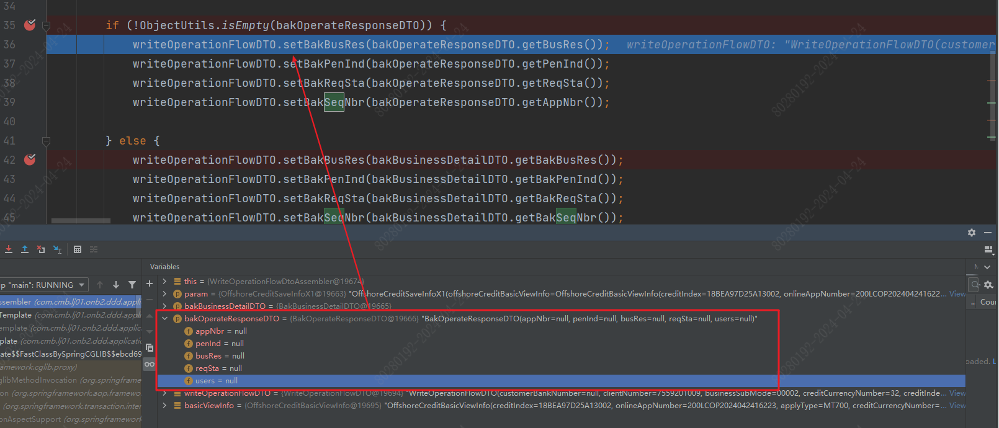

1) ObjectUtils.isEmpty

ObjectUtils.isEmpty 仅在对象为 null 时才会为 true。即时对象不为 null，而对象的属性都为 null，也会为 false。

2) mybatis-plus saveOrUpdate()  
若值为 null 不会入库，若值为 '' 空字符串会覆盖入库。

3) 为实现同一 Service 嵌套方法触发切面，用自己注入自己

4) 由于上例自己注入了自己，又引发了初始化时获取到的其他属性为 null

