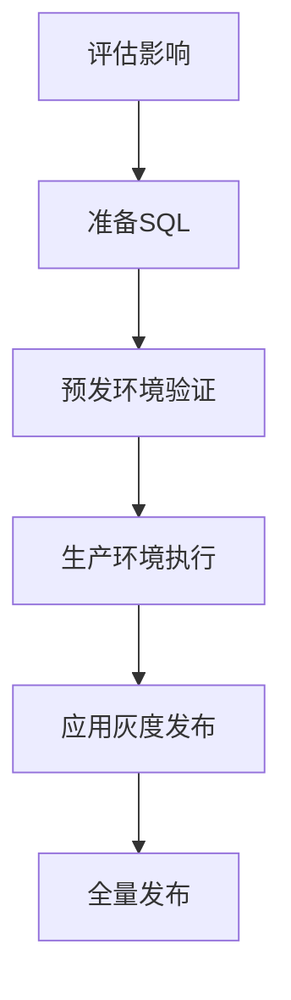
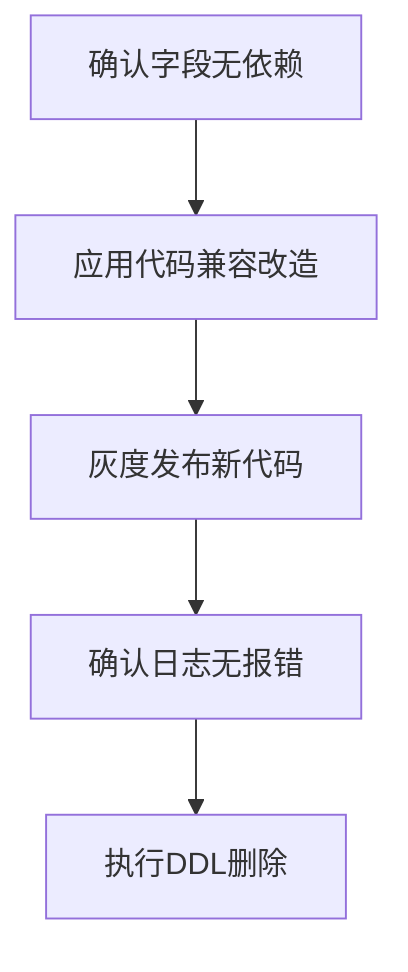

## 架构选型
### 三层架构 vs 四层架构核心区别

#### 1. 领域层纯度
- 三层：领域层混合业务逻辑与技术细节（如JPA注解、直接调用Redis），技术耦合度高。
- 四层：领域层完全纯净，仅含业务逻辑，技术实现通过接口抽象至基础设施层。

#### 2. 技术解耦方式
- 三层：隐式耦合（领域层依赖Repository接口或技术工具）。
- 四层：显式解耦（依赖倒置），领域层仅依赖抽象接口。

#### 3. 适用场景
- **三层**：业务简单、技术栈稳定的中小项目（如后台管理系统），追求开发效率。
- **四层**：业务复杂、需长期演进或技术可能变更的系统（如金融核心、电商平台），强调可维护性。

#### 总结
**本质差异**：四层通过严格分层实现领域模型与技术实现的完全隔离，代价是更高的设计成本；三层以技术耦合换取开发速度。选型取决于业务复杂度与技术灵活性需求。


## 业务建模
### 如何区分业务建模中的“任务”和“命令”？
在领域驱动设计（DDD）和业务建模中，任务（Task）和命令（Command）是两种不同的概念，它们的区别如下：

| **维度**       | **任务（Task）**                     | **命令（Command）**                 |
|---------------|------------------------------------|----------------------------------|
| **定义**       | 一个业务过程，可能包含多个步骤或子任务。 | 一个明确的动作，触发某个业务操作。       |
| **粒度**       | 较粗，通常涉及多个步骤或决策。         | 较细，通常对应一个原子操作。           |
| **执行方式**   | 可能涉及多个命令、事件或人工干预。     | 通常是自动执行的单一操作。             |
| **业务含义**   | 代表一个完整的业务目标（如“处理订单”）。 | 代表一个具体的业务动作（如“提交订单”）。 |
| **示例**       | “客户下单”任务可能包括：<br>1. 创建订单<br>2. 扣减库存<br>3. 支付处理 | “创建订单”命令仅执行订单创建逻辑。 |

#### 总结
   - 任务是宏观业务流程，命令是具体执行动作。
   - 任务由多个命令组成，命令是最小执行单元。
---

### 如何判断任务的最小化？
任务的最小化（Task Granularity）是指**将任务拆解到不可再分的业务单元**，确保每个任务：
1. **职责单一**：只做一件事（如“扣减库存”而非“处理订单”）。
2. **可独立执行**：不依赖其他任务的中间状态。
3. **可组合**：多个最小任务可以组合成更大的业务流程（如“下单”=“创建订单”+“扣库存”+“支付”）。

#### 判断标准
1. **能否再拆解？**
   - 如果能拆成更小的步骤，则当前任务不是最小化。
   - 例如：“处理订单”可拆解→非最小；“扣减库存”不可拆解→最小。

2. **是否依赖其他任务的状态？**
   - 最小任务应能独立执行，不依赖其他任务的中间结果。
   - 例如：“支付订单”依赖“订单已创建”→需组合为更高层任务。

3. **业务是否认可其原子性？**
   - 从业务视角看，该步骤是否不可再分？
   - 例如：财务系统中的“记账”是最小任务，而“生成财报”不是（可拆解为多个记账操作）。

#### 示例
- **非最小任务**：`完成电商订单`（可拆解为创建订单、扣库存、支付、发货）。
- **最小任务**：`扣减库存`（业务上不可再分，代码上对应一个事务）。

#### 总结
   - 拆解到业务认可的原子操作，确保单一职责和独立执行能力。
   - 通过“能否再拆分”和“是否依赖外部状态”判断。

**关键原则**：
> **“最小任务应是业务上的原子操作，技术上的事务边界。”**  
> 例如：
> - 数据库事务边界（如“扣库存”需在一个事务内完成）。
> - 业务规则边界（如“支付”必须完整执行，不能半途而废）。

---

### 为什么要最小化角色？
在业务建模和系统设计中，**最小化角色（Role Minimization）**的核心目标是：
1. **降低复杂度**：避免角色职责过多，导致权限混乱或功能耦合。
2. **提高灵活性**：细粒度角色更容易组合复用（如“审批人”+“提交人”=完整流程）。
3. **增强安全性**：遵循最小权限原则（Principle of Least Privilege），减少越权风险。

#### 典型问题（未最小化角色）
- **万能角色**：如“系统管理员”拥有所有权限，难以审计和管控。
- **职责混杂**：如“财务+HR”角色，违反单一职责原则。

---

### 如何判断角色是否最小化？
#### 1. 职责单一性检查
- **问题**：该角色是否只做一件事？
- **示例**：  
  ✅ **最小化角色**：`订单审批人`（仅审批）、`数据查看员`（仅读数据）。  
  ❌ **非最小化角色**：`订单管理员`（包含创建、审批、删除等权限）。

#### 2. 权限可组合性
- **问题**：该角色能否拆分为更小的、可复用的子角色？
- **示例**：
   - 原角色：`项目管理员`（管理成员+审批任务+删除项目）。
   - 拆解后：`成员管理员` + `任务审批人` + `项目删除人`。

#### 3. 业务场景验证
- **问题**：是否存在业务场景只需要该角色的部分权限？
- **示例**：
   - 某些用户只需“提交订单”但无需“审批订单”→ 需拆解为`提交人`和`审批人`角色。

#### 4. 变更影响分析
- **问题**：修改该角色的权限是否会影响无关功能？
- **示例**：
   - 若调整“订单审批人”的权限会影响“订单创建”→ 角色未最小化。

**核心原则**：
> **“一个角色应该小到不能再小，但又能完整支持一个业务操作。”**  
> 例如：`审批人`角色只需“同意/驳回”权限，无需关心“谁提交的订单”。

---

## 技术建模

## 代码落地
### 多线程拒绝策略

在多线程编程中，当线程池或任务队列达到其容量限制时，需要采用拒绝策略来处理新提交的任务。以下是常见的几种拒绝策略：

#### 1. AbortPolicy（中止策略）
- **默认策略**
- 直接抛出 `RejectedExecutionException` 异常
- 调用者可以捕获这个异常并处理

#### 2. CallerRunsPolicy（调用者运行策略）
- 让提交任务的线程自己执行该任务
- 这种策略会降低新任务的提交速度，起到简单的反馈控制作用

#### 3. DiscardPolicy（丢弃策略）
- 直接静默丢弃无法处理的任务
- 不抛出任何异常，也不执行任何操作

#### 4. DiscardOldestPolicy（丢弃最老策略）
- 丢弃队列中最老的任务（即最早进入队列的任务）
- 然后尝试重新提交当前任务

#### 5. 自定义拒绝策略
- 实现 `RejectedExecutionHandler` 接口
- 根据业务需求自定义拒绝逻辑

#### 使用示例（Java线程池）

```java
ThreadPoolExecutor executor = new ThreadPoolExecutor(
    corePoolSize,
    maximumPoolSize,
    keepAliveTime,
    TimeUnit.MILLISECONDS,
    new LinkedBlockingQueue<Runnable>(capacity),
    new ThreadPoolExecutor.AbortPolicy() // 设置拒绝策略
);
```

选择哪种拒绝策略取决于具体的应用场景和对任务丢失的容忍程度。


## 微服务部署
### 微服务是什么？
微服务（Microservices）是一种**软件架构风格**，其核心思想是将一个大型的单体应用（Monolithic Application）拆分为一组**小型、独立、松耦合**的服务。每个服务专注于完成**单一业务功能**，并通过轻量级的通信机制（如 HTTP/REST、消息队列等）协同工作，共同实现完整的系统功能。

---

#### 微服务与单体架构对比
| **维度**         | **单体架构**               | **微服务架构**               |
|------------------|--------------------------|---------------------------|
| **开发速度**      | 初期快，后期慢           | 初期复杂，长期迭代快       |
| **部署**          | 整体部署，风险高         | 独立部署，风险分散         |
| **技术栈**        | 单一技术                 | 混合技术（按需选择）       |
| **扩展性**        | 垂直扩展（提升单机性能） | 水平扩展（增加服务实例）   |
| **故障影响**      | 全局瘫痪                 | 局部故障，可降级处理       |

---

#### 总结
微服务不是“银弹”，适合中大型复杂系统，但对团队技术能力和运维要求较高。采用前需权衡业务需求、团队规模和基础设施条件。
>“银弹”是一个比喻，指能快速、彻底解决复杂问题的神奇方法，源自西方民间传说——传说中只有用银质子弹才能杀死狼人、吸血鬼等超自然生物。在技术或工程领域，“银弹”常被用来形容那些被认为可以“一劳永逸”解决所有难题的技术、工具或方法。


### 服务单元、发布单元、微服务有什么区别
- 服务单元：是**业务逻辑**上的功能模块划分，代表系统中一个高内聚、低耦合的业务能力。它强调职责的独立性，但不一定对应独立的部署实体。
- 发布单元：是**运维层面**可独立部署的最小实体，指一次部署操作中更新的代码或资源集合。它是运维层面的概念，关注部署的原子性。
- 微服务：是**同时满足服务单元和发布单元标准的架构实现**，即：业务上：独立的功能模块（服务单元）。技术上：独立进程、可单独部署（发布单元）。

---

#### 三者的关系对比
| **维度**       | **服务单元**               | **发布单元**               | **微服务**                 |
|----------------|--------------------------|--------------------------|--------------------------|
| **核心关注点** | 业务逻辑划分              | 部署和交付               | 业务+部署的完整独立性     |
| **物理形态**   | 代码/模块/组件            | 可执行包/容器/镜像       | 独立进程（容器/虚拟机）   |
| **通信方式**   | 本地调用或远程通信        | 无直接关系               | 必须远程通信（HTTP等）    |
| **典型示例**   | 单体中的`OrderService`类 | 单体应用的WAR包          | 独立的“订单服务”容器      |

---

#### 常见误区澄清
1. **“微服务一定是发布单元，但发布单元不一定是微服务”**
    - ✅ 正确：微服务必须独立部署（发布单元），但发布单元可能是一个单体应用的整体部署。

2. **“服务单元可以跨微服务存在”**
    - ❌ 错误：微服务内部可以包含多个服务单元（模块），但一个服务单元不能跨微服务，否则违背微服务的自治性原则。

3. **“所有服务单元都需要拆成微服务”**
    - ❌ 错误：只有需要独立扩展、迭代或技术异构的服务单元才适合拆为微服务，否则会导致过度拆分（Nanoserivce反模式）。

---

#### 总结
- **服务单元** = **“做什么”**（业务逻辑划分）
- **发布单元** = **“怎么交付”**（部署原子性）
- **微服务** = **“独立的全栈业务单元”**（业务+部署的双重独立）

理解这三者的区别，能帮助你在架构设计中更精准地定义服务边界，避免“为微服务而微服务”的陷阱。


## 数据库
### 数据库表变更灰度方案设计（字段新增/删除）
#### 一、灰度发布核心原则

1. **最小影响原则**：在满足需求的情况下，尽可能少变更字段
2. **可回滚原则**：确保每一步操作都可逆
3. **兼容性原则**：保证新旧版本代码兼容运行

#### 二、字段新增灰度方案

##### 标准流程（推荐）



##### 具体步骤

1. **评估阶段**
    - 确认字段必要性
    - 确定默认值策略（NULL/默认值）
    - 评估索引需求

2. **SQL准备**
   ```sql
   -- 标准添加语法（Oracle示例）
   ALTER TABLE 表名 ADD (
     新字段名 数据类型 [DEFAULT 默认值] [NULL/NOT NULL]
   );
   
   -- 示例：添加可空字段
   ALTER TABLE users ADD (
     mobile VARCHAR2(20) NULL
   );
   ```

3. **灰度策略**
    - **第一阶段**：仅执行DDL，不修改应用代码
    - **第二阶段**：10%流量使用新字段
    - **第三阶段**：50%流量使用新字段
    - **第四阶段**：全量使用新字段

4. **回滚方案**
   ```sql
   -- 如果发现严重问题
   ALTER TABLE 表名 DROP COLUMN 新字段名;
   ```

#### 三、字段删除灰度方案

##### 标准流程（必须谨慎）



##### 具体步骤

1. **评估阶段**
    - 确认所有应用不再使用该字段
    - 检查外键、索引、视图等依赖对象
    - 备份待删除字段数据（如需）

2. **代码改造**
    - 先修改代码不再使用该字段
    - 保持兼容读取（SELECT语句不报错）

3. **分阶段执行**
    - **阶段1**：发布不依赖该字段的应用版本
    - **阶段2**：监控至少2个完整业务周期
    - **阶段3**：确认无报错后执行删除

4. **删除SQL**
   ```sql
   -- Oracle删除语法
   ALTER TABLE 表名 DROP COLUMN 字段名 [CASCADE CONSTRAINTS];
   
   -- 示例（带约束检查）
   ALTER TABLE users DROP COLUMN old_phone CASCADE CONSTRAINTS;
   ```

5. **回滚方案**
   ```sql
   -- 只能通过备份恢复或重新添加字段
   ALTER TABLE 表名 ADD (
     已删字段名 原数据类型
   );
   -- 然后从备份恢复数据
   ```

##### 安全删除策略

**策略1**：标记废弃而非立即删除
```sql
-- 1. 先重命名字段（保留3个月）
ALTER TABLE 表名 RENAME COLUMN 待删字段名 TO 废弃_字段名;

-- 2. 确认无问题后再删除
```


#### 四、特殊场景处理

#### 场景1：大表变更（亿级数据）
**方案**：
1. 使用在线DDL工具（如Oracle的DBMS_REDEFINITION）
2. 分批次更新
3. 在从库先执行，然后主从切换

#### 场景2：关键业务表变更
**方案**：
1. 创建影子表进行双写
2. 逐步迁移读请求到新表
3. 最终切换表名

```sql
-- 最终切换示例
BEGIN
   EXECUTE IMMEDIATE 'RENAME 表名 TO 表名_old';
   EXECUTE IMMEDIATE 'RENAME 表名_new TO 表名';
END;
```


### Oracle数据库碎片化处理指南
Oracle数据库碎片化主要分为表碎片、索引碎片和表空间碎片三种类型。以下是针对Oracle数据库的碎片化处理方法：

#### 一、碎片检测方法

##### 1. 表碎片检测
```sql
-- 检查表的高水位线(HWM)和实际使用情况
SELECT table_name, 
       ROUND((blocks * 8), 2) "高水位线(KB)",
       ROUND((num_rows * avg_row_len / 1024), 2) "实际使用(KB)",
       ROUND((blocks * 8), 2) - ROUND((num_rows * avg_row_len / 1024), 2) "浪费空间(KB)"
FROM user_tables 
WHERE table_name = '表名';
```

##### 2. 索引碎片检测
```sql
-- 检查索引碎片情况
SELECT index_name, 
       ROUND(100 * del_lf_rows / lf_rows, 2) "碎片率(%)" 
FROM index_stats 
WHERE lf_rows > 0;
```

##### 3. 表空间碎片检测
```sql
-- 检查表空间碎片情况
SELECT tablespace_name, 
       COUNT(*) "碎片数量",
       MAX(block_id) - MIN(block_id) + 1 "总块数",
       SUM(bytes)/1024/1024 "总大小(MB)",
       (MAX(block_id) - MIN(block_id) + 1 - COUNT(*)) / (MAX(block_id) - MIN(block_id) + 1) * 100 "碎片率(%)"
FROM dba_free_space
GROUP BY tablespace_name
ORDER BY 5 DESC;
```

#### 二、碎片处理方法

##### 1. 表碎片处理
```sql
-- 方法1：移动表重建(会重建所有索引)
ALTER TABLE 表名 MOVE TABLESPACE 表空间名;

-- 方法2：在线重定义(不影响业务)
BEGIN
  DBMS_REDEFINITION.start_redef_table(
    uname => '用户名',
    orig_table => '原表名',
    int_table => '中间表名');
  DBMS_REDEFINITION.finish_redef_table(
    uname => '用户名',
    orig_table => '原表名',
    int_table => '中间表名');
END;
/

-- 方法3：收缩表(需要开启行移动)
ALTER TABLE 表名 ENABLE ROW MOVEMENT;
ALTER TABLE 表名 SHRINK SPACE CASCADE;
```

##### 2. 索引碎片处理
```sql
-- 方法1：重建索引
ALTER INDEX 索引名 REBUILD TABLESPACE 表空间名;

-- 方法2：联机重建索引(10g及以上)
ALTER INDEX 索引名 REBUILD ONLINE;

-- 方法3：合并索引碎片
ALTER INDEX 索引名 COALESCE;
```

##### 3. 表空间碎片处理
```sql
-- 方法1：重组表空间(需要停机)
-- 导出所有对象，删除表空间，重建表空间，导入数据

-- 方法2：使用可传输表空间
-- 适用于大表空间的重组
```

#### 三、自动维护策略

##### 1. 定期收集统计信息
```sql
-- 自动收集统计信息(默认已开启)
-- 手动收集：
EXEC DBMS_STATS.GATHER_SCHEMA_STATS('用户名', estimate_percent=>DBMS_STATS.AUTO_SAMPLE_SIZE);
```

##### 2. 设置自动段空间管理
```sql
-- 创建表空间时指定自动段空间管理
CREATE TABLESPACE 表空间名 
DATAFILE '数据文件路径' SIZE 大小
EXTENT MANAGEMENT LOCAL 
SEGMENT SPACE MANAGEMENT AUTO;
```

##### 3. 定期执行碎片整理脚本
```sql
-- 自动检测并重建高碎片率对象
-- 可结合DBMS_SCHEDULER创建定期任务
```

#### 四、注意事项

1. **操作时间窗口**：MOVE和REBUILD操作会锁表，建议在维护窗口进行
2. **空间需求**：重建操作需要额外空间，确保有足够空间
3. **权限要求**：需要相应系统权限
4. **依赖对象**：重建表会导致所有依赖对象失效，需要重新编译
5. **RAC环境**：在RAC环境中需特别注意锁定机制

#### 五、预防措施

1. 合理设置PCTFREE和PCTUSED参数
2. 使用本地管理的表空间(LMT)
3. 启用自动段空间管理(ASSM)
4. 定期维护和监控
5. 对大表考虑使用分区表

通过以上方法可以有效管理和减少Oracle数据库中的碎片，保持数据库性能稳定。

### 数据库大事务和长事务
在数据库中，**大事务**（Large Transaction）和**长事务**（Long Transaction）是两个不同的概念，它们有不同的关注点和影响。

#### 1. 大事务（Large Transaction）

大事务通常是指那些涉及大量数据操作的事务，通常是 **数据量较大** 或 **操作复杂的事务**。这类事务可能包含很多更新、插入、删除等操作，或者涉及很多表的数据。常见的特点包括：

* **数据量大**：涉及的数据行数多，或者单个操作的数据量非常大。
* **I/O 开销高**：因为处理的数据量大，导致磁盘读写操作频繁。
* **锁资源多**：会占用更多的锁资源，可能会影响并发执行，导致其他事务的等待。
* **可能导致性能瓶颈**：事务的执行过程中，需要消耗较多的系统资源（CPU、内存、I/O等），可能会导致系统性能下降。

例如，大规模的批量数据迁移或更新操作，或者复杂的报表生成操作，通常都会形成大事务。

#### 2. 长事务（Long Transaction）

长事务是指事务 **持续的时间较长**，通常由于某些原因，该事务未能及时提交或回滚。长事务的特点是：

* **执行时间长**：事务可能会占用数据库连接和资源很长时间，造成阻塞。
* **资源占用**：长时间持有锁，可能会阻止其他事务的执行，导致**死锁**或**锁竞争**问题。
* **日志文件增大**：由于事务没有及时提交，会增加数据库的日志文件大小，可能影响数据库的性能和存储空间。
* **影响可用性**：长事务会影响数据库的响应时间，降低并发能力，可能导致性能瓶颈。

长事务的原因有很多，可能是业务逻辑复杂、网络延迟、用户交互时间长等。例如，用户在提交表单时，如果操作中断了，导致提交操作被长时间挂起，或者长时间执行的数据查询没有及时提交。

#### 总结区别

* **大事务**侧重于**操作的数据量**，它可能包含大量的数据更新或插入，且通常会消耗大量的系统资源。
* **长事务**侧重于**事务的持续时间**，即事务占用数据库资源的时间较长，可能是由于网络延迟、业务逻辑复杂或人为因素导致事务未及时提交。

#### 对系统的影响

* **大事务**可能会造成数据库的I/O瓶颈，并发性能下降，且会消耗大量的内存和CPU资源。
* **长事务**则可能导致锁资源长时间被占用，进而影响并发操作的效率，并可能导致日志文件过大，增加数据库的恢复难度。

管理和优化这些事务通常需要根据具体情况采取合适的策略，例如：分批处理大事务，避免事务过长时间占用资源等。

