# 应用架构设计
云开发范式中的应用架构设计方法是一套将非结构化业务需求进行结构化和抽象，最终落地“符合面向对象编程(Object Oriented Programming，OOP) 思想、微服务拆分合理”的程序的方法论。

## 概念
### 微服务、发布单元、服务单元
微服务（Microservice） 是指“一个基本的、独立的运行单元”。

- 从研发视角来说，一个微服务对应一个发布单元。
  >- **发布单元**通常不能直接运行，需要在目标服务器（物理机、虚机、容器）上提供一个环境（又称为本地依赖）供发布单元运行，包括：操作系统、应用容器（如Tomcat）、第三方软件（如数据库驱动、命令行等）、配置文件等。
  >- **服务单元**包含运行发布单元需要的本地依赖，一个发布单元通常会对应一到多个服务单元，这些服务单元分别对应不同的运行环境（DEV、ST、UAT、PRD）、部署平台（X86 VM、Docker）或网络分区（OA、BIZ、DMZ）。因此，
- 从运维视角来说，一个微服务可对应一到多个服务单元，微服务的资源申请、部署及运维以服务单元为单位。

### 架构定义
- **业务架构**：企业各类业务的运作模式及业务之间的关系结构。一般由业务部门的专家负责，属于顶层设计，会影响到组织结构。例如，零售、对公的业务划分。

- **应用架构**：代码的组织模式和结构。具体地，“应用架构”描述了如何通过分层、分包、依赖关系等机制对代码结构提供合理约束。其目标是设计功能易扩展、业务易测试、代码逻辑易读懂的应用系统。

- **系统架构**：根据可用性、安全性、稳定性、性能等非功能特性所做出的技术选型，例如对云服务、数据库、灰度策略等进行的选型和决策。其目标是设计高可用、高稳定、高性能的应用系统。

- **数据架构**：数据的组织形式和结构。例如在大数据场景中，数据架构定义了如何将各业务系统的数据汇聚在一起，给业务提供整体视图。

- **物理架构**：计算机硬件设备、传输媒介和物理连接方式等组成的计算机系统的结构和布局。

### MECE 原则
MECE：Mutually Exclusive，Collectively Exhaustive
- Mutually Exclusive：模型中的各个元素（如实体、值对象、聚合、子域、限界上下文、概念分类等）之间应该有清晰、无重叠的边界。一个概念或职责只能归属于一个元素。
- Collectively Exhaustive：模型中的元素组合起来，应该能够完整地覆盖问题域的所有相关方面。没有重要的业务概念、规则或场景被遗漏。
## 架构选型
### 简单应用架构 or 复杂应用架构选哪个？
1. （**业务变更频率** * **规则复杂度**）> 团队学习成本 且（**系统生命周期价值**）> 架构升级成本，选择四层架构。
2. 如果不能很确定选哪种，则选择“简单应用架构设计”和三层架构。

### 传统三层架构和云开发范式三层架构的区别？
1. 思想上：传统mvc本质上是一种面向数据的设计，主要关注数据，是一种自低向上的思想；DDD的开发模式：是领域驱动，自顶向下，关注业务活动。
2. 实施过程上：传统MVC过程为需求分析-研发人员设计库表结构-编写代码。云开发范式的三层架构和四层架构一样，需要完整的业务建模-技术建模-代码落地。
3. 代码实现上：云开发范式三层架构强调充血实体与接口防腐。

### 三层架构 vs 四层架构
#### 为什么简单应用选择三层架构？
1. 简单应用场景的业务逻辑较简单，一般仅涉及一个较小的问题域。
2. 简单应用场景的数据持久化逻辑和需求也较为简单。
3. 简单应用场景与外部系统的交互很少，可在服务层通过专门的接口处理外部系统的交互，防止外部系统的变更腐化本系统。

#### 为什么复杂应用选择四层架构？
1. 复杂应用场景的业务较复杂，通常包含多个子问题域。
   > 部分业务操作或校验规则涉及多个领域对象，任何一个领域对象均无法独立承载。如果采用三层架构，这部分业务逻辑将散落在服务层。如果采用四层架构，可从应用层（在三层架构叫服务层）将这部分逻辑剥离出来，沉淀到领域服务。领域服务与领域对象一起内聚到领域层（Domain），更显性化内聚业务逻辑。
2. 复杂应用场景的数据持久化逻辑和需求也较为复杂。
   > 如果采用三层架构，服务层需分别针对三个月内（如存储在GaussDB）、历史数据（如存储在ECS，Elastic Cloud Storage）实现不同的数据操作逻辑，存储方式的变更需调整服务层的代码逻辑。如果采用四层架构，领域层只需要定义数据持久化接口，应用层调用领域层定义的接口，基础设施层实现领域层定义的接口，屏蔽持久化的复杂逻辑，这样分层职责更清晰。
3. 复杂应用场景与外部系统的交互也较为复杂。
   > 如果采用三层架构，与外部系统的交互逻辑散落在服务层，与本系统的功能代理交织在一起，代码难以维护。外部系统的变更，需同步修改服务层逻辑代码，同时可能直接影响本系统已有功能的可用性。如果采用四层架构，领域层定义与外部系统交互的接口，应用层调用领域层定义的接口，与外部系统交互的逻辑在基础设施层实现。通过四层架构的基础设施层将本系统的业务逻辑（即领域层、应用层）与外部系统解藕，起到防腐的作用。

#### 三层架构和四层架构对比

两个方法的主要差异点如下：  
1.**梳理需求**： 两个方法均通过“用户故事”梳理需求，初步结构化业务需求。但两者对任务（即用户故事的"what"，详见两种方法的业务建模部分）细节要求不同。  
（1）对于简单的业务场景，梳理的任务粒度较细，可以较清晰完整地描述业务需求。即使存在部分任务描述不够清晰，也可以使用少量“命令”和“规则”进一步细化。  
（2）对于复杂的业务场景，梳理的任务粒度较粗，对需求的描述较宽泛，需使用较多“命令”和“规则”才能细化任务的时序细节。用户故事地图的目标是展现业务全景，不需要关注每个细节，因此，这里只需使用任务细节补充任务的关键信息，后续在识别领域对象阶段再用“事件风暴”细化每个任务的时序流程及规则细节。  

2.**识别领域对象**：“复杂应用架构设计方法”利用“事件风暴”细化每个任务的事件、命令、规则，然后识别领域对象。而“简单应用架构设计方法”可直接根据“梳理需求”的产物识别领域对象。

3.**划分聚合**：“复杂应用架构设计方法”可选“划分聚合”，将具有强业务一致性、生命周期相同的领域对象划分到一个聚合。

4.**识别实体**：“复杂应用架构设计方法”会区分实体和值对象，而“简单应用架构设计方法”可以不做区分。

5.**分配职责**：“复杂应用架构设计方法”会考虑将模块内涉及多个实体的具有明确业务语义的方法沉淀到领域服务。

6.**ORM表设计**：“复杂应用架构设计方法”中实体与持久化模型（Persistence Object，简称PO）通常不一致，因此实体与ORM表应分开设计；而“简单应用架构设计方法”中，实体与PO基本保持一致，ORM表设计可参考实体的设计。

划分微服务的方法、流程、原则及要求基本是一样的，均强调合理地拆分微服务，以更高效地利用云优势。

### 三层架构如何向四层架构演进
最核心的两点：充血和防腐
第一阶段局部重构：防腐层解藕、实体逐步充血、划分模块
第二阶段整体重构：划分微服务、技术建模、完整建模路径

### ddd四层业务建模在落地阶段，或者是有新业务需求时，业务模型怎么保鲜？
在DDD（领域驱动设计）四层业务建模的落地阶段，或在面临新业务需求时，保持业务模型的“保鲜”是至关重要的。保持模型的活力、灵活性和准确性，可以让团队更好地应对复杂的业务需求和变化。以下是一些具体的策略和方法：

#### 1. **持续的领域建模与业务专家合作**

* **定期与业务专家沟通**：领域模型是随着业务需求的变化而变化的。与业务专家（如产品经理、业务分析师）保持紧密沟通，定期回顾业务需求和目标，确保业务模型能够反映最新的业务现实。
* **反馈环路**：在项目实施过程中，业务专家的反馈尤为重要。通过定期的需求讨论、模型审查和迭代，可以及时发现领域模型的潜在问题并进行修正。

#### 2. **模型迭代与演化**

* **领域模型的演化**：DDD的核心理念之一是领域模型应随着业务的发展和变化而不断演化。每次新增业务需求时，都需要对模型进行审查和修改。如果某个领域存在复杂的业务变化，可能需要拆分、合并或者调整领域实体、值对象等。
* **通过重构保持模型的简洁与清晰**：在每个开发周期或版本发布时，进行必要的模型重构。比如，原先的某些实现可能已经不再适应新的业务需求，这时候需要调整领域对象的设计，优化代码架构，确保模型的表达能力与业务需求对接。

#### 3. **建立测试和验证机制**

* **业务规则自动化验证**：确保领域模型和业务逻辑能够通过自动化测试进行验证。例如，使用单元测试来确保领域模型的行为符合业务规则，使用集成测试来确保整体的业务流程有效运行。
* **用例驱动开发**：在业务需求发生变化时，可以通过重新梳理用例，来验证领域模型的正确性。通过用例来确保模型仍然能够覆盖所有业务流程，并且没有遗漏新的需求或约束。

#### 4. **模块化和解耦**

* **合理划分边界上下文（Bounded Context）**：随着业务需求的增加，新的功能模块往往需要和现有模块进行集成。此时，可以通过清晰划分领域模型的边界上下文，避免不同子系统之间的过度耦合和复杂依赖。每个边界上下文应当具有独立的领域模型，减少跨领域模型的变化影响。
* **领域服务与应用服务解耦**：确保应用服务和领域模型之间的解耦。应用服务主要关注业务流程的协调和事务控制，而领域模型则集中精力处理核心业务逻辑。通过将领域模型和应用服务分离，可以在引入新需求时，避免直接影响核心业务模型的设计。

#### 5. **使用事件驱动架构（EDA）应对复杂业务**

* **事件源（Event Sourcing）与CQRS**：事件驱动架构和命令查询责任分离（CQRS）可以帮助管理复杂的业务逻辑和模型的变化。当业务需求复杂且变化频繁时，CQRS可以将读操作与写操作分离，优化查询的性能，而事件源则可以提供业务状态的历史追溯，有助于保证业务模型的持续一致性。
* **领域事件与集成事件**：随着业务需求的变化，可以定义新的领域事件，并通过消息总线（例如Kafka、RabbitMQ等）进行事件的发布和订阅。这种方式使得业务模型可以更灵活地适应不同的业务需求。

#### 6. **保持模型的高内聚和低耦合**

* **内聚性高、耦合度低的设计**：在面对新需求时，尽量保持模型的高内聚性，确保每个模块只负责特定的领域职能。同时，避免过度耦合其他领域的模型，使得新的业务需求可以独立地加入，而不影响已有的业务逻辑。
* **领域驱动的设计原则**：尽量遵循DDD的设计原则，如聚合根、实体、值对象等的正确使用，避免模型设计中出现不必要的复杂性。

#### 7. **重视技术与工具的支持**

* **支持领域建模的工具**：使用UML、事件建模、领域建模工具等，帮助团队在面对新需求时，能够清晰地表达和调整领域模型。通过这些工具，可以减少模型复杂度，帮助开发人员更好地理解和实现领域模型。
* **文档与模型共享**：保持领域模型文档的实时更新和共享。无论是业务团队还是开发团队，大家需要对领域模型有共同的理解。随着新需求的加入，要确保文档能够及时反映出最新的模型变化。

#### 8. **团队文化和持续学习**

* **鼓励领域建模的持续学习**：业务模型的“保鲜”不仅仅是技术上的问题，还与团队的文化和实践息息相关。鼓励团队成员参与领域建模的培训，分享实践经验，定期进行领域建模的复盘，能够不断提高团队对业务需求的敏感性和对模型的理解。
* **反思与调整**：在项目实施的过程中，定期进行回顾，反思当前的模型设计是否有效，是否符合业务需求。通过持续的反思和调整，确保模型的健康。

#### 总结：

要保持DDD四层业务模型的“保鲜”，需要关注领域模型的持续演化与业务需求的紧密对接，保持模型的灵活性和简洁性，并通过合适的架构和技术手段支持业务模型的变化。同时，团队内部的沟通、协作和持续学习也是确保领域模型能够随着业务发展而不断优化的关键。


## 业务建模
### 概念定义
#### 业务建模目标
业务建模的目标是实现业务需求的结构化描述，输出用户故事地图、领域对象及业务模块。

#### 业务建模的流程
简单应用架构：
1) 梳理需求：梳理用户故事、补充命令、确认需求
2) 识别领域对象：识别名词、分配业务知识到领域对象
3) 划分模块：建立关联关系、模块化

复杂应用架构：
1) 梳理需求：梳理用户故事地图、确认需求
2) 识别领域对象：事件风暴、识别名词、分配业务知识到领域对象
3) 划分模块：建立关联关系、根据关联关系划分模块
4) 划分聚合：根据业务强一致性划分模块（可选）

#### 用户故事及用户故事地图
#### 用户故事（User Story）
用户故事是软件开发过程中用符合特定格式（或者称结构化）的自然语言描述业务需求的常用方式。用户故事内容通常包括“角色(who)”、“用户执行的动作(what)”以及“价值(why)”，如果价值是显而易见的，或者没有那么重要，也可以不写。

##### 用户故事地图（User Story Mapping）

按照时间线，将多个用户故事串起来组成的业务全景图，即用户故事地图。用户故事地图包含以下6要素，实践过程中应使用不同的卡片区分：

- 角色（Role）：将用户故事里的"who"单独抽出来，用户故事地图更清晰。角色是故事的发起方，可以是人，也可以是外部系统。
- 主线（Backbone）：领域或场景的主线，一般是从左往右的时间轴。
- 活动（Activity）：表示用户故事地图的主干，用于组织关联性强的任务。通常以动词短语的形式，并使其足以涵盖所有类似任务要表达的意思。
- 任务（Task）：这里重点记录用户故事里的"what"。如果用户故事里的"why"很关键，对理解业务需求有重大意义，也可以在任务里写出来。
- 命令（Command）：命令是任务的细化。根据系统建设的角度，按照时序先后逻辑对任务进行拆分、细化，要求使用“动词+名词”的形式。对于业务逻辑简单的任务，可以不识别命令。
- 规则（Rule）：拆分任务时，关键命令对应的规则（比如具体的校验、判断等逻辑）也应该记录下来。

#### 领域对象识别流程
以用户故事地图为基础，识别或抽象与任务或命令最相关或隐含的业务概念，即领域对象。将用户故事地图中的命令分配到对应领域对象，进一步结构化业务需求。具体流程：

（1) 通常领域对象是命令中的名词，可根据命令“动词+名词”的形式直接抽取。根据命令识别领域名词后，应进一步分析哪些领域名词属于领域对象、哪些属于领域对象的属性。比如“锁定订单状态”中的“订单状态”是名词，但是“订单状态”是“订单”的一个属性，因此这里识别的领域对象应该是“订单”。

（2）检查领域对象、命令在业务概念（包括业务属性、业务含义等）上的一致性，针对具有相同业务概念的领域对象、命令要采用统一术语，消除二义性。

（3）围绕领域对象，贴出相关命令及其他相关产出，划分职责边界。

（4）如果在讨论过程中，有任何因为问题澄清或知识增长带来的对于之前各种产出物的共识性调整，应及时进行调整和优化。

#### 划分模块流程
根据领域对象的关系划分模块。详细流程如下：

（1）画出所有领域对象之间的关系，如聚合、组合、关联、依赖等关系。

（2）根据领域对象间关系的紧密程度，结合领域对象的业务相关性划分模块。

#### 领域对象之间的关系
| 关系类型 | 说明                                                                            |
|------|-------------------------------------------------------------------------------|
| 关联   | 一种结构化关系，用于表示一类对象与另一类对象之间有联系。关联关系一般表示非聚合、组合的其它关联关系，如师傅和徒弟。                     |
| 聚合   | 表示整体与部分的关联关系，但是成员对象可以脱离整体对象独立存在。如：汽车和发动机。                                     |
| 组合   | 表示整体与部分的关联关系，且一旦整体对象不存在，成员对象也不复存在，如：人的头和嘴巴。                                   |
| 依赖   | 表示使用关系。依赖关系表示一个类使用了另一个类的某些功能，但彼此之间并没有较强的耦合性。这种关系是一种短期的、临时的连接，如：教师和他上课时使用的投影仪。 |
| 泛化   | 即继承关系。如教师、学生均可泛化为人。                                                           


#### 实体分配属性

设计实体的属性时，可参考以下几种方式：

- 通过对业务人员进行访谈，从业务知识中获取实体的属性。
- 参考相关系统或需求，获取实体属性。此方法获取到的属性需与业务人员确认。
- 根据开发经验识别出一些技术支撑类的实体属性，如修改人、修改时间等。

#### 实体、领域服务分配方法

根据业务建模阶段识别出来的命令识别方法。具体规则如下：

- 如果命令仅涉及一个实体，可考虑将该命令转化为该实体的方法。但识别出的命令一般来说是超出实体职责范围的，因此不能直接将所有命令映射为实体方法。实体的方法通常仅需操作本实体的属性，不包含CRUD。
- 如果命令涉及模块内的多个实体，可先考虑找到某个实体承载，如果该方式会破坏该实体的“高内聚、低耦合”或SOLID原则，则可考虑将该命令转化为领域服务的方法。
- 如果命令涉及跨模块、跨微服务的多个实体，则将该命令转化为应用服务的方法。
>【建议】不推荐使用领域服务，优先考虑实体行为和应用服务，领域服务作为最后折衷考虑。 需折衷考虑的情况：涉及多实体的事务一致性逻辑，且属于重要业务概念（也就是与业务聊需求，经常会提及）。

> 实际设计中，并不追求一开始就把实体的属性和方法完全识别出来，实现完全充血。在程序演进过程中，可识别具有业务语意、可复用、集中在某个实体上的操作或行为，可将它们沉淀为实体的方法，逐步充血。实体的属性在程序演进过程中也可按需补充。这样做的好处是，所有沉淀到实体上的操作都是有收益的，能够在实体中内聚业务逻辑，显性化地表达业务语义。业务知识得到了尊重和表达，这就是所谓的"Knowledge Rich Design"。


#### 实体和值对象
**实体(Entity)**: 领域对象承载了明显的业务行为（比如校验、审批等）和业务属性，则可映射为实体。  
**值对象(Value Object):** 领域对象有业务属性，无业务行为或者有少量业务行为，且在整个业务的生命周期中不可变，则可映射为值对象。

常见识别为实体的流程： 
- 是否具备唯一标识：实体必须具备唯一标识，但是具备唯一标识的不一定实体
- 判断领域对象是否可变：可变的识别为实体，不可变的识别为值对象
- 判断领域对象是否具备生命周期：可以被创建、修改、删除，而值对象通常只作为实体的属性存在
- 短时间内识别不出来的，优先识别为实体（因为实体被错误识别为值对象是有代价的：性能损耗、无法适应需求调整）

> 若领域对象承载了明显的业务行为（比如校验、审批等）和业务属性，则可映射为实体；若领域对象有业务属性，无业务行为或者有少量业务行为，且在整个业务的生命周期中不可变，则可映射为值对象。若短时间内无法确定映射为实体还是值对象，可先直接映射为实体。

### 如何区分业务建模中的“任务”和“命令”？
在领域驱动设计（DDD）和业务建模中，任务（Task）和命令（Command）是两种不同的概念，它们的区别如下：

| **维度**       | **任务（Task）**                     | **命令（Command）**                 |
|---------------|------------------------------------|----------------------------------|
| **定义**       | 一个业务过程，可能包含多个步骤或子任务。 | 一个明确的动作，触发某个业务操作。       |
| **粒度**       | 较粗，通常涉及多个步骤或决策。         | 较细，通常对应一个原子操作。           |
| **执行方式**   | 可能涉及多个命令、事件或人工干预。     | 通常是自动执行的单一操作。             |
| **业务含义**   | 代表一个完整的业务目标（如“处理订单”）。 | 代表一个具体的业务动作（如“提交订单”）。 |
| **示例**       | “客户下单”任务可能包括：<br>1. 创建订单<br>2. 扣减库存<br>3. 支付处理 | “创建订单”命令仅执行订单创建逻辑。 |

#### 总结
   - 任务是宏观业务流程，命令是具体执行动作。
   - 任务由多个命令组成，命令是最小执行单元。
---

### 如何判断任务的最小化？
任务的最小化（Task Granularity）是指**将任务拆解到不可再分的业务单元**，确保每个任务：
1. **职责单一**：只做一件事（如“扣减库存”而非“处理订单”）。
2. **可独立执行**：不依赖其他任务的中间状态。
3. **可组合**：多个最小任务可以组合成更大的业务流程（如“下单”=“创建订单”+“扣库存”+“支付”）。

#### 判断标准
1. **能否再拆解？**
   - 如果能拆成更小的步骤，则当前任务不是最小化。
   - 例如：“处理订单”可拆解→非最小；“扣减库存”不可拆解→最小。

2. **是否依赖其他任务的状态？**
   - 最小任务应能独立执行，不依赖其他任务的中间结果。
   - 例如：“支付订单”依赖“订单已创建”→需组合为更高层任务。

3. **业务是否认可其原子性？**
   - 从业务视角看，该步骤是否不可再分？
   - 例如：财务系统中的“记账”是最小任务，而“生成财报”不是（可拆解为多个记账操作）。

#### 示例
- **非最小任务**：`完成电商订单`（可拆解为创建订单、扣库存、支付、发货）。
- **最小任务**：`扣减库存`（业务上不可再分，代码上对应一个事务）。

#### 总结
   - 拆解到业务认可的原子操作，确保单一职责和独立执行能力。
   - 通过“能否再拆分”和“是否依赖外部状态”判断。

**关键原则**：
> **“最小任务应是业务上的原子操作，技术上的事务边界。”**  
> 例如：
> - 数据库事务边界（如“扣库存”需在一个事务内完成）。
> - 业务规则边界（如“支付”必须完整执行，不能半途而废）。

---

### 为什么要最小化角色？
在业务建模和系统设计中，**最小化角色（Role Minimization）**的核心目标是：
1. **降低复杂度**：避免角色职责过多，导致权限混乱或功能耦合。
2. **提高灵活性**：细粒度角色更容易组合复用（如“审批人”+“提交人”=完整流程）。
3. **增强安全性**：遵循最小权限原则（Principle of Least Privilege），减少越权风险。

#### 典型问题（未最小化角色）
- **万能角色**：如“系统管理员”拥有所有权限，难以审计和管控。
- **职责混杂**：如“财务+HR”角色，违反单一职责原则。

---

### 如何判断角色是否最小化？
#### 1. 职责单一性检查
- **问题**：该角色是否只做一件事？
- **示例**：  
  ✅ **最小化角色**：`订单审批人`（仅审批）、`数据查看员`（仅读数据）。  
  ❌ **非最小化角色**：`订单管理员`（包含创建、审批、删除等权限）。

#### 2. 权限可组合性
- **问题**：该角色能否拆分为更小的、可复用的子角色？
- **示例**：
   - 原角色：`项目管理员`（管理成员+审批任务+删除项目）。
   - 拆解后：`成员管理员` + `任务审批人` + `项目删除人`。

#### 3. 业务场景验证
- **问题**：是否存在业务场景只需要该角色的部分权限？
- **示例**：
   - 某些用户只需“提交订单”但无需“审批订单”→ 需拆解为`提交人`和`审批人`角色。

#### 4. 变更影响分析
- **问题**：修改该角色的权限是否会影响无关功能？
- **示例**：
   - 若调整“订单审批人”的权限会影响“订单创建”→ 角色未最小化。

**核心原则**：
> **“一个角色应该小到不能再小，但又能完整支持一个业务操作。”**  
> 例如：`审批人`角色只需“同意/驳回”权限，无需关心“谁提交的订单”。

---

### 常问到的点
1. 去除调用某某系统的描述，如调用通知系统，改为发送通知。
2. 如果状态改变关联的操作比较多，可拆为为两个任务。如果影响不太大，改为规则描述。
3. 领域对象多对多的关系。班级和老师，是多对多。引入任课老师和课程，解藕为一对多、多对一的关系。

## 技术建模
技术建模的目标是将业务建模的成果转化为指导项目实施落地的系统设计。

### 概念定义
#### 技术建模的流程
简单应用架构：
1. 划分微服务：合并模块、设计微服务间数据转换和通信方式（可选）
2. 识别实体：映射领域对象到实体
3. 分配职责：设计实体的属性及方法
4. ORM表设计：设计实体对应的数据库表

复杂应用架构：
1. 划分微服务：合并模块、设计微服务间数据转换和通信方式
2. 识别实体：映射领域对象到实体、值对象
3. 分配职责：设计实体的属性及方法、设计领域服务
4. ORM表设计：设计实体和值对象对应的数据库表

#### 微服务间数据转换和通信方式的设计原则
设计微服务间数据转换和通信方式时，可参考以下原则：
- 如果微服务业务复杂并演进迅速，需要实现微服务间的解耦，则采用防腐层。
- 如果微服务对性能有严苛要求，且协调多个微服务同步修改的代价可以接受，可考虑共享内核。但共享内核导致微服务间高度耦合，实践中不推荐采用此方式。

### 云开发范式小课堂

### 短时间内无法确定是实体还是值对象，先映射为实体。举例说明
比如附件的存储，有些场景附件是有独立的生命周期，可以作为实体。

### 【非常高频】领域对象关系的处理，技术建模或业务建模一定会问

### 领域服务的例子，以及不推荐使用领域服务的原因

### 注意点
注意准备例子
4～7：高频
10：注意论文实体->表的映射表述，实体->PO->表
赋能例子：附件类型判断，加密

## 代码落地
### 数据校验
通用技术校验在适配器层，业务满足性校验在应用层，强业务属性校验沉淀到实体。

### 异常处理
哪些层可以抛出异常

### 代码检视的问题收集
1. 组里新人，Assemble不止做了转换，还调用repository的查询、存储

### 架构守护遇到的问题
历史代码或者此前未开启架构守护的应用，开启架构守护

### 架构守护的自定义例子
Assemble的转换，不允许调用repository

### 多线程拒绝策略

在多线程编程中，当线程池或任务队列达到其容量限制时，需要采用拒绝策略来处理新提交的任务。以下是常见的几种拒绝策略：

#### 1. AbortPolicy（中止策略）
- **默认策略**
- 直接抛出 `RejectedExecutionException` 异常
- 调用者可以捕获这个异常并处理

#### 2. CallerRunsPolicy（调用者运行策略）
- 让提交任务的线程自己执行该任务
- 这种策略会降低新任务的提交速度，起到简单的反馈控制作用

#### 3. DiscardPolicy（丢弃策略）
- 直接静默丢弃无法处理的任务
- 不抛出任何异常，也不执行任何操作

#### 4. DiscardOldestPolicy（丢弃最老策略）
- 丢弃队列中最老的任务（即最早进入队列的任务）
- 然后尝试重新提交当前任务

#### 5. 自定义拒绝策略
- 实现 `RejectedExecutionHandler` 接口
- 根据业务需求自定义拒绝逻辑

#### 使用示例（Java线程池）

```java
ThreadPoolExecutor executor = new ThreadPoolExecutor(
    corePoolSize,
    maximumPoolSize,
    keepAliveTime,
    TimeUnit.MILLISECONDS,
    new LinkedBlockingQueue<Runnable>(capacity),
    new ThreadPoolExecutor.AbortPolicy() // 设置拒绝策略
);
```

选择哪种拒绝策略取决于具体的应用场景和对任务丢失的容忍程度。

### 如何处理模块间互调问题
若出现module1的service调用module2的service，但一般情况ddd下module1是不允许调用module2。以下是系统性解决方案和最佳实践：

---

#### 一、问题诊断与应对策略
##### 场景分析

```mermaid
flowchart LR
    A[module1.ServiceA] -->|直接调用| B[module2.ServiceB]
```

**违反的原则**：
1. 破坏模块自治性
2. 产生双向依赖风险
3. 导致分布式事务复杂度

---

#### 二、标准解决方案

##### 方案1：通过领域事件解耦（最终一致性）
```java
// module1 发布事件（无需知道module2）
public class OrderService {
    public void confirmOrder(Order order) {
        order.confirm();
        eventPublisher.publish(new OrderConfirmedEvent(order.getId()));
    }
}

// module2 订阅事件
public class InventoryEventHandler {
    @EventListener
    public void handle(OrderConfirmedEvent event) {
        inventoryService.adjustStock(event.getOrderId()); // 内部处理
    }
}
```
**优势**：
- 完全解耦，module1无需感知module2
- 天然支持分布式场景

**适用场景**：订单-库存、支付-通知等异步流程

##### 方案2：通过防腐层（ACL）隔离
```java
// module1 定义防腐接口（领域层）
public interface InventoryService {
    boolean reserveStock(OrderId orderId, List<Item> items);
}

// module1 基础设施层实现（调用module2的API）
public class InventoryServiceHttpClient implements InventoryService {
    private final InventoryApiClient client; // Feign/Retrofit

    @Override
    public boolean reserveStock(OrderId orderId, List<Item> items) {
        ReserveRequest request = convertToRequest(orderId, items);
        return client.reserve(request); // HTTP调用module2
    }
}
```
**优势**：
- 业务逻辑不依赖具体实现
- 可替换为其他实现（如Mock测试）

**适用场景**：需要实时响应的强一致性操作

##### 方案3：Saga模式（长事务管理）
```java
// 在module1启动Saga
public class OrderSaga {
    private final SagaCoordinator coordinator;

    public void createOrder(Order order) {
        coordinator.begin()
            .step("reserve_stock", 
                () -> inventoryProxy.reserve(order), 
                () -> inventoryProxy.cancel(order))
            .step("process_payment",
                () -> paymentProxy.charge(order),
                () -> paymentProxy.refund(order))
            .end();
    }
}
```
**优势**：
- 维护跨模块事务一致性
- 显式定义补偿机制

**适用场景**：跨多服务的订单履约、资金转账等

---

#### 三、架构验证规则
使用ArchUnit禁止直接调用：
```java
@ArchTest
public static final ArchRule no_cross_module_direct_call = 
    noClasses()
        .that().resideInAPackage("..module1..")
        .should().dependOnClassesThat()
        .resideInAPackage("..module2..");
```

当出现违规时，测试会报错：
```
Architecture Violation: Method <module1.OrderService.placeOrder()> 
calls method <module2.InventoryService.reserve()> in (OrderService.java:25)
```

---

#### 四、决策树：选择合适方案

```mermaid
graph TD
    A[需要实时响应?] -->|是| B{强一致性要求?}
    A -->|否| C[使用领域事件]
    B -->|是| D[防腐层+分布式锁]
    B -->|否| E[防腐层+重试机制]
    D --> F[考虑Saga补偿]
```


---

#### 五、错误处理规范
##### 1. 同步调用（防腐层）的异常处理
```java
public class InventoryServiceHttpClient implements InventoryService {
    @Override
    public boolean reserveStock(OrderId orderId, List<Item> items) {
        try {
            return client.reserve(convertToRequest(orderId, items));
        } catch (FeignException e) {
            throw new InventoryUnavailableException(e); // 转换为领域异常
        }
    }
}
```

##### 2. 异步事件（最终一致性）的补偿
```java
public class OrderConfirmedEventHandler {
    @EventListener
    @TransactionalEventListener(phase = AFTER_COMMIT)
    public void handle(OrderConfirmedEvent event) {
        try {
            inventoryService.adjustStock(event.getOrderId());
        } catch (Exception e) {
            eventPublisher.publish(new StockAdjustmentFailedEvent(event)); // 触发补偿流程
        }
    }
}
```

---

#### 六、演进建议
1. **初期**：使用防腐层快速实现
2. **中期**：逐步替换为领域事件
3. **复杂场景**：引入Saga模式
4. **监控**：通过Metrics记录跨模块调用：
   ```java
   @Timed("module1.inventory.reserve")
   public boolean reserveStock(OrderId orderId) {
       // ...
   }
   ```

---

通过以上方法，可在保持DDD模块化设计的同时，安全地实现跨模块协作。关键点是：**永远不要让你的领域层直接依赖另一个限界上下文的实现细节**。

### 自定义架构守护
如何写一个单元测试规则，只允许module1和module2依赖common，不允许common依赖module1和module2，以及只允许module1下的service依赖executor，不允许executor依赖同包下的service。以下是基于 ArchUnit 的单元测试规则实现，可严格约束您描述的模块依赖关系：

---

#### 一、测试环境准备（Maven 配置）
```xml
<!-- pom.xml -->
<dependency>
    <groupId>com.tngtech.archunit</groupId>
    <artifactId>archunit</artifactId>
    <version>1.0.1</version>
    <scope>test</scope>
</dependency>
```

---

#### 二、完整的测试类实现
```java
import com.tngtech.archunit.core.domain.JavaClasses;
import com.tngtech.archunit.core.importer.ClassFileImporter;
import com.tngtech.archunit.lang.ArchRule;
import org.junit.Test;

import static com.tngtech.archunit.lang.syntax.ArchRuleDefinition.*;

public class ModuleDependencyTest {

    private final JavaClasses classes = new ClassFileImporter()
            .importPackages("com.yourcompany");

    // 规则1：仅允许module1/module2依赖common，禁止反向依赖
    @Test
    public void common_module_dependency_rule() {
        ArchRule rule = noClasses()
                .that().resideInAPackage("..common..")
                .should().dependOnClassesThat()
                .resideInAnyPackage(
                    "..module1..", 
                    "..module2.."
                );

        rule.check(classes);
    }

    // 规则2：module1内仅允许service依赖executor，禁止反向依赖
    @Test
    public void module1_internal_dependency_rule() {
        ArchRule rule = noClasses()
                .that().resideInAPackage("..module1..executor..")
                .should().dependOnClassesThat()
                .resideInAPackage("..module1..service..");

        rule.check(classes);
    }

    // 增强规则：禁止common包被外部非指定模块依赖
    @Test
    public void common_access_control_rule() {
        ArchRule rule = noClasses()
                .that().resideOutsideOfPackages(
                    "..module1..", 
                    "..module2..",
                    "..common.."
                )
                .should().dependOnClassesThat()
                .resideInAPackage("..common..");

        rule.check(classes);
    }
}
```

---

#### 三、规则详解

##### 1. **Common包依赖约束**
```java
noClasses()
    .that().resideInAPackage("..common..")  // common包下的类
    .should().dependOnClassesThat()         // 不能依赖
    .resideInAnyPackage("..module1..", "..module2..");  // module1/module2的类
```
**效果**：  
✅ 允许：
- `module1` → `common`
- `module2` → `common`

❌ 禁止：
- `common` → `module1`
- `common` → `module2`
- 其他模块（如`module3`）→ `common`

##### 2. **Module1内部Service-Executor约束**
```java
noClasses()
    .that().resideInAPackage("..module1..executor..")  // executor包下的类
    .should().dependOnClassesThat()                    // 不能依赖
    .resideInAPackage("..module1..service..");         // service包的类
```
**效果**：  
✅ 允许：
- `module1.service` → `module1.executor`

❌ 禁止：
- `module1.executor` → `module1.service`
- `module1.executor` → `module1.repository`（可通过额外规则约束）

---

#### 四、执行效果验证

##### 当出现违规时，测试会报错：
```
java.lang.AssertionError: Architecture Violation [Priority: MEDIUM]...
Rule 'no classes that reside in a package '..common..' should depend on classes that reside in any package ['..module1..', '..module2..']' was violated:
Method <com.yourcompany.common.CommonUtil.doSomething()> calls method <com.yourcompany.module1.Service.process()> in (CommonUtil.java:10)
```

---

#### 五、进阶增强方案

##### 1. 使用分层架构检测（更严格）
```java
@ArchTest
public static final ArchRule layer_dependencies = layeredArchitecture()
    .layer("Common").definedBy("..common..")
    .layer("Module1").definedBy("..module1..")
    .layer("Module2").definedBy("..module2..")

    .whereLayer("Common").mayOnlyBeAccessedByLayers("Module1", "Module2")
    .whereLayer("Module1").mayNotBeAccessedByAnyLayer()
    .whereLayer("Module2").mayNotBeAccessedByAnyLayer();
```

##### 2. 禁止Executor包外泄（可选）
```java
@ArchTest
public static final ArchRule executor_visibility = classes()
    .that().resideInAPackage("..executor..")
    .should().onlyBeAccessed().byClassesThat()
    .resideInAPackage("..service..");
```

---

#### 六、CI集成建议

在`pom.xml`中配置构建失败：
```xml
<plugin>
    <groupId>org.apache.maven.plugins</groupId>
    <artifactId>maven-surefire-plugin</artifactId>
    <configuration>
        <includes>
            <include>**/*ArchTest*</include>
        </includes>
    </configuration>
</plugin>
```

---

通过以上规则，您的架构约束将得到自动化保障，每次代码提交都会触发依赖关系校验，有效防止架构退化。

# 系统架构设计
## 微服务部署
### 微服务是什么？
微服务（Microservices）是一种**软件架构风格**，其核心思想是将一个大型的单体应用（Monolithic Application）拆分为一组**小型、独立、松耦合**的服务。每个服务专注于完成**单一业务功能**，并通过轻量级的通信机制（如 HTTP/REST、消息队列等）协同工作，共同实现完整的系统功能。

---

#### 微服务与单体架构对比
| **维度**         | **单体架构**               | **微服务架构**               |
|------------------|--------------------------|---------------------------|
| **开发速度**      | 初期快，后期慢           | 初期复杂，长期迭代快       |
| **部署**          | 整体部署，风险高         | 独立部署，风险分散         |
| **技术栈**        | 单一技术                 | 混合技术（按需选择）       |
| **扩展性**        | 垂直扩展（提升单机性能） | 水平扩展（增加服务实例）   |
| **故障影响**      | 全局瘫痪                 | 局部故障，可降级处理       |

---

#### 总结
微服务不是“银弹”，适合中大型复杂系统，但对团队技术能力和运维要求较高。采用前需权衡业务需求、团队规模和基础设施条件。
>“银弹”是一个比喻，指能快速、彻底解决复杂问题的神奇方法，源自西方民间传说——传说中只有用银质子弹才能杀死狼人、吸血鬼等超自然生物。在技术或工程领域，“银弹”常被用来形容那些被认为可以“一劳永逸”解决所有难题的技术、工具或方法。


### 服务单元、发布单元、微服务有什么区别
- 服务单元：是**业务逻辑**上的功能模块划分，代表系统中一个高内聚、低耦合的业务能力。它强调职责的独立性，但不一定对应独立的部署实体。
- 发布单元：是**运维层面**可独立部署的最小实体，指一次部署操作中更新的代码或资源集合。它是运维层面的概念，关注部署的原子性。
- 微服务：是**同时满足服务单元和发布单元标准的架构实现**，即：业务上：独立的功能模块（服务单元）。技术上：独立进程、可单独部署（发布单元）。

---

#### 三者的关系对比
| **维度**       | **服务单元**               | **发布单元**               | **微服务**                 |
|----------------|--------------------------|--------------------------|--------------------------|
| **核心关注点** | 业务逻辑划分              | 部署和交付               | 业务+部署的完整独立性     |
| **物理形态**   | 代码/模块/组件            | 可执行包/容器/镜像       | 独立进程（容器/虚拟机）   |
| **通信方式**   | 本地调用或远程通信        | 无直接关系               | 必须远程通信（HTTP等）    |
| **典型示例**   | 单体中的`OrderService`类 | 单体应用的WAR包          | 独立的“订单服务”容器      |

---

#### 常见误区澄清
1. **“微服务一定是发布单元，但发布单元不一定是微服务”**
    - ✅ 正确：微服务必须独立部署（发布单元），但发布单元可能是一个单体应用的整体部署。

2. **“服务单元可以跨微服务存在”**
    - ❌ 错误：微服务内部可以包含多个服务单元（模块），但一个服务单元不能跨微服务，否则违背微服务的自治性原则。

3. **“所有服务单元都需要拆成微服务”**
    - ❌ 错误：只有需要独立扩展、迭代或技术异构的服务单元才适合拆为微服务，否则会导致过度拆分（Nanoserivce反模式）。

---

#### 总结
- **服务单元** = **“做什么”**（业务逻辑划分）
- **发布单元** = **“怎么交付”**（部署原子性）
- **微服务** = **“独立的全栈业务单元”**（业务+部署的双重独立）

理解这三者的区别，能帮助你在架构设计中更精准地定义服务边界，避免“为微服务而微服务”的陷阱。

### 微服务划分的原则
1. 应根据实际需求进行微服务拆分，避免不必要的拆分和合并，确保其相互独立、高内聚低耦合。
2. 不仅要考虑到业务职责的划分，还需要慎重考虑微服务拆分后可能带来的数据一致性问题以及网络调用带来的性能损耗问题。
3. 微服务数量应尽可能少，如非必要，不要增加微服务。
4. 应注意避免微服务之间出现环状依赖关系。
5. 微服务的划分不是一成不变的，而是应该随着业务需求渐进式演进，同时应定期回检划分的合理性。

### 微服务划分的方法
1. 首先考虑模块间调用关系
   - 如果两个模块之间存在高频的相互调用，可划分至同一微服务，以减少调用的通信损耗。
2. 其次考虑“高频-重要”四象限原则
   - 将“高频重要”（即访问量大且重要）象限的所有模块划分为一个或少数（控制数量）几个微服务。
   - 在保障非功能性需求的前提下，经过审慎考量可将“重要不高频”（即访问量不大但重要）和“高频不重要”（即访问量大但不重要）两个象限的所有模块划分至一个微服务。
   - 可将“不高频不重要”（即访问量不大且不重要）象限的模块划分至业务相关性强的微服务（由其他象限划分得到）中，若该象限的模块较多，也可将该象限的模块划分至一个微服务。
3. 最后遵循“数量尽可能少”原则
   - 在实践中，如果一组模块“划分至一个微服务”和“划至两个微服务”都有一定依据，则建议划分至一个微服务。

### 过度微服务化
问题定义：  
过度微服务化会导致应用访问层次多、调用链路复杂、交易响应时间过长，增加业务超时、不可用的概率。同时，子系统拆分微服务过多、过细，也会导致资源使用率较低。为提高各研发团队对过度微服务化问题的重视，有效降低此类风险，现启动过度微服务化问题常态化治理工作。

统计口径：  
服务单元满足下述两种特征之一，即会被识别为问题服务单元（数据源为30天内的北斗链路调用情况）：  
（1）服务单元的北斗链路特征为仅被一个调用方调用，且未调用其他服务单元。  
（2）服务单元的北斗链路特征为仅被两个调用方调用，且未调用其他服务单元。

### 微服务拆分不合理
问题定义：  
两个或多个服务单元间的调用链路形成有向环，易扩大生产事件的影响范围、提高投产异常概率。

统计口径：  
若系统或子系统下微服务存在环状依赖问题，则该系统或子系统存在环状依赖问题。

### 灰度发布时，涉及到定时任务修改，需要注意什么？
框架版本为1.8.0及以上，@FrameworkScheduled注解新增executeWhenIsolated属性，支持在实例隔离后不执行，默认true，设置为false则隔离不执行。

### 环状依赖举例
比如
- 柜面出口信用证登记 -> 网银出口信用证交单明细 -> 查询信用证通知通知

- GRS明细 -> 柜面明细 -> 企银明细 -> GRS信贷编号信息

### 微服务环状依赖引发的问题
微服务架构中出现\*\*环状依赖（circular dependency）\*\*会导致一系列严重问题，具体包括：

---

#### ❌ 1. 启动顺序混乱或死锁

* 服务 A 依赖服务 B，B 又依赖 A；
* 启动时可能进入“你等我、我等你”的死锁状态；
* 即使配置服务注册中心，也可能因延迟或不一致导致启动失败或异常。

---

#### ❌ 2. 服务耦合严重，无法独立部署

* 每个服务都被其他服务反向依赖；
* 无法单独开发、测试、上线某个服务；
* 一改一个服务，其他几个服务也要改，丧失微服务的灵活性。

---

#### ❌ 3. 引发连锁故障，系统稳定性差

* 一个服务挂掉，可能导致多个服务连锁异常；
* 环形依赖扩大了故障传播路径；
* 难以实现降级、限流、熔断等容错机制。

---

#### ❌ 4. 调用链难以追踪与治理

* 服务之间调用路径错综复杂；
* 影响日志追踪、链路追踪（如 Zipkin、Jaeger）；
* 也增加了运维排障的复杂度。

---

#### 📌 总结：

> **“微服务一旦形成依赖环，会让微服务变得像“多点耦合的单体”，轻则部署受限，重则全局崩溃。”**


### 如何解决环状依赖

---

#### ✅ 1. 引入消息队列（MQ）打破同步依赖

**关键词：异步解耦、事件驱动架构（EDA）**

* 替代服务之间的直接调用；
* 发布/订阅机制打断调用链，避免循环依赖；
* 提高系统弹性，支持削峰和解耦。

📌 适用：服务 A、B、C 互相通知处理结果或状态更新的场景。

---

#### ✅ 2. 重构服务边界（基于 DDD 的限界上下文）

**关键词：领域职责清晰、服务边界收敛**

* 使用领域驱动设计（DDD）分析业务；
* 将多个互相依赖的服务拆分出核心职责、共享职责；
* 减少交叉访问和逻辑重叠。

📌 适用：服务职责模糊、耦合严重的老旧系统或复杂业务系统。

---

#### ✅ 3. 引入中介服务（协调器/Mediator）

**关键词：流程编排、协调器模式**

* 把多个服务之间的复杂调用逻辑集中到协调服务；
* 参与服务只暴露能力接口，业务流程交给协调器统一处理；
* 避免“你调我我调你”的混乱调用链。

📌 适用：订单处理、审批流、信贷流程等需要编排的业务。

---

#### ✅ 4. 抽取公共服务（共性逻辑下沉）

**关键词：去重逻辑、共享组件**

* 将多个服务都依赖的通用功能（如客户信息、通知推送）抽出来；
* 提供只读接口或最小业务能力，供各服务单向调用；
* 减少互相访问、逻辑交叉。

📌 适用：多个服务依赖相似基础模块的情况（客户中心、通知中心等）。

---

#### 🔚 总结口诀：

> **MQ 解耦、DDD 拆界、中介协调、公共下沉。**

需要我结合你的业务（如融资、授信、报文处理）做个落地示例图吗？

### 设计阶段
#### 什么时候需要拆分微服务
新建系统：依据云开发范式规范
存量系统：
1. 跨室组、跨团队，维护一个微服务，并行开发困难
2. 模块内API流量，在核心链路中的地位越来越重要，将这些API进行分拆

同时也需考虑的问题：数据一致性问题、通讯成本、安全问题、运维成本

#### 拆分路径是怎么样的
新建系统：依据云开发范式规范，如重要高频四象限
存量系统：
1. 增量拆分：小批量增量拆分，难度小、更容易操作风险
2. 拆分顺序：先代码后数据、先数据后代码，结合实际情况
3. 拆分方法：原有微服务充血/模块化划分，或新微服务上重构代码
4. 流量迁移：两套微服务并行，做开关，拦截分发

#### 如何评估微服务拆分的合理性
1. 微服务是否高度自治，是否高内聚、低耦合
2. 微服务是否存在循环依赖
3. 微服务拆分的目的是否达到（生产事件数、跨室组API降低）
4. 微服务拆分后是否引起其他问题（如上文提到数据一致性问题、通讯成本、安全问题、运维成本）

### 落地阶段
#### 数据一致性怎么保证
1. 设计阶段尽量避免数据一致性问题
2. 确认是实时一致性，还是最终一致性问题。最终一致性可以利用Kafka等中间件来控制。
3. 实时一致性，不推荐二阶段提交会产生阻塞，建议TCC模式（Try-Confirm-Cancel）、Saga模式。

#### 存量系统对调用方、服务方怎么做屏蔽？上下游依赖梳理？
1. 上下游系统为不同产品：通过网关对协议、路由屏蔽
2. 上下游系统为同一产品：版本号、服务注册发现
#### 上下游梳理
1. 认证登记，如API应用市场订阅服务登陆
2. 全链路，日志清洗
3. 数据中心网络抓包

#### 公共能力应该以SDK，还是服务暴露？
根据实际场景，
1. 如有性能要求可以使用SDK，但依赖的产品多时升级困难。
2. 如没有性能要求，没有相关依赖、也符合微服务的高度自治，可以暴露微服务。

#### 实际项目中微服务之间的协作方式是什么样的？
1. 对性能和处理市场没有特别大的要求，走HTTP+ZA21、ZZ1+ZA24标准规范报文
2. 对性能要求比较高的要求，可以走Absocket（A Better Socket）、JIBC（Java Inter-Blockchain Communication）
3. 处理起来比较耗时，可以引入异步或Kafka削峰平谷

#### 结合具体场景，如何进行容错设计？熔断、限流、降级、弹性伸缩
1. 结合实际场景是否限流（如手机银行承接所有外部流量），但需要过滤攻击性流量
2. 弹性伸缩基于报备

#### 微服务拆分完后，微服务和数据库的连接数会暴增，如何处理
设计阶段，微服务拆分，做好连接数配置评估。其次考虑：
1. 拆库拆表
2. 牺牲一些性能，MyCache数据库代理服务

#### 存量系统的微服务划分
1. 业务维度：考虑将一些支线业务先拆分，循序渐进到主业务
2. 技术维度：先拆基础数据到微服务，以API的形式调用
3. 重新建模：云开发范式业务建模、技术建模全方位的评估
4. 考虑成本：不要为了拆分而拆分

## 数据库
### 数据库产品选型方法
1. 首先考虑单库性能
   - 如果单库数据规模超过5TB，并且不属于A/B类系统1/2级子系统的1/2级服务单元，直接选择TiDB。
2. 其次考虑业务场景
   - 存在分库分表困难，需要支持复杂SQL，选择GaussDB。
对于简单增删查改场景，无复杂SQL、无批处理，且单库规模在500GB内，优先选择TDSQL。

### 数据库架构选型方法
1. 首先考虑业务可用性要求
   - 如果可接受因数据库故障导致业务100%中断超过30分钟，则可选择单库、读写分离；如果不可接受，则可选择随机多活、切片分库、读写分离。
2. 其次考虑业务场景
   - 根据读写比例是否超过4:1、是否是无状态数据等要求，确定最终的架构。

- 单库：可接受因数据库故障时导致业务100%中断超过30分钟。

- 读写分离：读写比例估计超过4：1，可接受数据最终一致性，对事务一致性要求不高。

- 切片分库：无法接受数据库故障时导致业务100%中断超过30分钟，承载客户、账户、账务交易、账务协议等实时交易数据，对事务一致性要求极高。

- 随机多活：无法接受数据库故障时导致业务100%中断超过30分钟，适合于无状态类数据（如业务流水、业务日志、渠道类业务等），业务数据可以随机写入任意一个数据库中。

### 数据库实例划分原则
1. 原则上，避免一个微服务独占一个数据库实例，需采用多个微服务共用一个数据库实例的方式（每个微服务对应一个Schema，多个Schema共用一个数据库实例）。
2. 若微服务对数据库性能（比如CPU使用率、内存使用率、磁盘使用率）、可用性（比如业务保障性、隔离性）要求较高，Schema方式无法满足业务要求，经审慎考虑后可独占一个数据库实例。

### 实例规格估算方法
1. 根据业务性能要求预估性能指标（例如TPS），初步确认数据库规格。
2. 进行性能压测评估，最终确认数据库规格。

### 数据库访问架构类型
在随机多活、切片分库、读写分离架构下，微服务需访问多个数据库实例读写数据，根据微服务访问数据库的方式不同，可分为全连接访问架构和单元化访问架构。

#### 原则
原则上，各系统/子系统优先选择单元化访问架构，FTC联机应用必须使用单元化访问架构。

#### 全连接访问架构
全连接访问架构是指每个微服务实例访问多个数据库。  

该架构存在两个明显的缺点：

- 当微服务实例数量不断增多时，单个数据库的连接数会呈倍数增加，容易超出连接数限制，导致数据库不可用，进而影响业务；

- 由于每个微服务实例连接了所有数据库，当某一数据库故障时，可能会影响到所有的微服务，导致系统不可用。

#### 单元化访问架构
单元化访问架构指每个微服务实例只连接一个数据库。  

该架构可有效解决全连接访问架构存在的问题：

- 各个微服务实例之间互相隔离，形成独立部署单元，某一分库故障，只会影响访问该分库的服务，系统整体仍可用，故障隔离效果好；

- 由于连接数据库的实例数变少，在微服务实例个数不变的情况下，可有效降低单个数据库的总连接数。

### 数据库灰度模型
应用做灰度发布过程中涉及到数据库的变更，是比较常见的行为。此时我们建议，当数据库层面变更较小时，可以参考下列方法做灰度变更。而当数据库层面变更较大时，如执行灰度发布较为困难，可不采用灰度发布。

当应用发布的范围涉及到了数据库层面的变化，例如数据库表新增了一个字段，使得新旧版本数据库的表字段不一致，如果新版本的SQL语句使用到了新的字段，那么对新版本做灰度验证时，不能在老版本的数据库进行修改。

为了解决该问题可以采用两类方案：
#### 方案一：变更向后兼容

该方案较容易实现，需要数据库的变更兼容旧版本应用。此时，旧版本应用依然可以正常访问新版本数据库。在数据库接收灰度应用流量前完成数据库变更，灰度应用部署后也可以正常访问新版本数据库。

不是所有数据库变更都可以向后兼容，需要具体分析变更内容。以常见的新增字段、删除字段、修改字段为例，新增字段场景一般向后兼容，需要注意"INSERT "语句如果未声明插入的字段可能会引入问题；删除字段时，可在灰度发布阶段暂缓，等灰度发布完成后再行删除；修改字段可以拆分为新增字段和删除字段两个步骤，同样可以解决。

#### 方案二：灰度数据独立
该方案实现较为复杂，需要单独维护一份灰度数据，例如灰度库或者灰度表。

使用灰度库时，需要单独维护一套独立的灰度库，灰度应用会连接灰度库去访问，以达到数据和正式库的隔离效果；灰度表与灰度库方案较为相似，只是将维护的粒度缩小到具体的表。

两类方案中更推荐采用第一类方案，变更向后兼容的实现方式更为简单。其他查询类云服务也可以采用类似的方式来实现灰度能力。

### 数据库表变更灰度方案设计（字段新增/删除）
#### 一、灰度发布核心原则

1. **最小影响原则**：在满足需求的情况下，尽可能少变更字段
2. **可回滚原则**：确保每一步操作都可逆
3. **兼容性原则**：保证新旧版本代码兼容运行

#### 二、字段新增灰度方案

##### 标准流程（推荐）

```mermaid
graph TD
    A[评估影响] --> B[准备SQL]
    B --> C[预发环境验证]
    C --> D[生产环境执行]
    D --> E[应用灰度发布]
    E --> F[全量发布]
```



##### 具体步骤

1. **评估阶段**
    - 确认字段必要性
    - 确定默认值策略（NULL/默认值）
    - 评估索引需求

2. **SQL准备**
   ```sql
   -- 标准添加语法（Oracle示例）
   ALTER TABLE 表名 ADD (
     新字段名 数据类型 [DEFAULT 默认值] [NULL/NOT NULL]
   );
   
   -- 示例：添加可空字段
   ALTER TABLE users ADD (
     mobile VARCHAR2(20) NULL
   );
   ```

3. **灰度策略**
    - **第一阶段**：仅执行DDL，不修改应用代码
    - **第二阶段**：10%流量使用新字段
    - **第三阶段**：50%流量使用新字段
    - **第四阶段**：全量使用新字段

4. **回滚方案**
   ```sql
   -- 如果发现严重问题
   ALTER TABLE 表名 DROP COLUMN 新字段名;
   ```

#### 三、字段删除灰度方案

##### 标准流程（必须谨慎）

```mermaid
graph TD
    A[确认字段无依赖] --> B[应用代码兼容改造]
    B --> C[灰度发布新代码]
    C --> D[确认日志无报错]
    D --> E[执行DDL删除]
```



##### 具体步骤

1. **评估阶段**
    - 确认所有应用不再使用该字段
    - 检查外键、索引、视图等依赖对象
    - 备份待删除字段数据（如需）

2. **代码改造**
    - 先修改代码不再使用该字段
    - 保持兼容读取（SELECT语句不报错）

3. **分阶段执行**
    - **阶段1**：发布不依赖该字段的应用版本
    - **阶段2**：监控至少2个完整业务周期
    - **阶段3**：确认无报错后执行删除

4. **删除SQL**
   ```sql
   -- Oracle删除语法
   ALTER TABLE 表名 DROP COLUMN 字段名 [CASCADE CONSTRAINTS];
   
   -- 示例（带约束检查）
   ALTER TABLE users DROP COLUMN old_phone CASCADE CONSTRAINTS;
   ```

5. **回滚方案**
   ```sql
   -- 只能通过备份恢复或重新添加字段
   ALTER TABLE 表名 ADD (
     已删字段名 原数据类型
   );
   -- 然后从备份恢复数据
   ```

##### 安全删除策略

**策略1**：标记废弃而非立即删除
```sql
-- 1. 先重命名字段（保留3个月）
ALTER TABLE 表名 RENAME COLUMN 待删字段名 TO 废弃_字段名;

-- 2. 确认无问题后再删除
```


#### 四、特殊场景处理

#### 场景1：大表变更（亿级数据）
**方案**：
1. 使用在线DDL工具（如Oracle的DBMS_REDEFINITION）
2. 分批次更新
3. 在从库先执行，然后主从切换

#### 场景2：关键业务表变更
**方案**：
1. 创建影子表进行双写
2. 逐步迁移读请求到新表
3. 最终切换表名

```sql
-- 最终切换示例
BEGIN
   EXECUTE IMMEDIATE 'RENAME 表名 TO 表名_old';
   EXECUTE IMMEDIATE 'RENAME 表名_new TO 表名';
END;
```


### Oracle数据库碎片化处理指南
Oracle数据库碎片化主要分为表碎片、索引碎片和表空间碎片三种类型。以下是针对Oracle数据库的碎片化处理方法：

#### 一、碎片检测方法

##### 1. 表碎片检测
```sql
-- 检查表的高水位线(HWM)和实际使用情况
SELECT table_name, 
       ROUND((blocks * 8), 2) "高水位线(KB)",
       ROUND((num_rows * avg_row_len / 1024), 2) "实际使用(KB)",
       ROUND((blocks * 8), 2) - ROUND((num_rows * avg_row_len / 1024), 2) "浪费空间(KB)"
FROM user_tables 
WHERE table_name = '表名';
```

##### 2. 索引碎片检测
```sql
-- 检查索引碎片情况
SELECT index_name, 
       ROUND(100 * del_lf_rows / lf_rows, 2) "碎片率(%)" 
FROM index_stats 
WHERE lf_rows > 0;
```

##### 3. 表空间碎片检测
```sql
-- 检查表空间碎片情况
SELECT tablespace_name, 
       COUNT(*) "碎片数量",
       MAX(block_id) - MIN(block_id) + 1 "总块数",
       SUM(bytes)/1024/1024 "总大小(MB)",
       (MAX(block_id) - MIN(block_id) + 1 - COUNT(*)) / (MAX(block_id) - MIN(block_id) + 1) * 100 "碎片率(%)"
FROM dba_free_space
GROUP BY tablespace_name
ORDER BY 5 DESC;
```

#### 二、碎片处理方法

##### 1. 表碎片处理
```sql
-- 方法1：移动表重建(会重建所有索引)
ALTER TABLE 表名 MOVE TABLESPACE 表空间名;

-- 方法2：在线重定义(不影响业务)
BEGIN
  DBMS_REDEFINITION.start_redef_table(
    uname => '用户名',
    orig_table => '原表名',
    int_table => '中间表名');
  DBMS_REDEFINITION.finish_redef_table(
    uname => '用户名',
    orig_table => '原表名',
    int_table => '中间表名');
END;
/

-- 方法3：收缩表(需要开启行移动)
ALTER TABLE 表名 ENABLE ROW MOVEMENT;
ALTER TABLE 表名 SHRINK SPACE CASCADE;
```

##### 2. 索引碎片处理
```sql
-- 方法1：重建索引
ALTER INDEX 索引名 REBUILD TABLESPACE 表空间名;

-- 方法2：联机重建索引(10g及以上)
ALTER INDEX 索引名 REBUILD ONLINE;

-- 方法3：合并索引碎片
ALTER INDEX 索引名 COALESCE;
```

##### 3. 表空间碎片处理
```sql
-- 方法1：重组表空间(需要停机)
-- 导出所有对象，删除表空间，重建表空间，导入数据

-- 方法2：使用可传输表空间
-- 适用于大表空间的重组
```

#### 三、自动维护策略

##### 1. 定期收集统计信息
```sql
-- 自动收集统计信息(默认已开启)
-- 手动收集：
EXEC DBMS_STATS.GATHER_SCHEMA_STATS('用户名', estimate_percent=>DBMS_STATS.AUTO_SAMPLE_SIZE);
```

##### 2. 设置自动段空间管理
```sql
-- 创建表空间时指定自动段空间管理
CREATE TABLESPACE 表空间名 
DATAFILE '数据文件路径' SIZE 大小
EXTENT MANAGEMENT LOCAL 
SEGMENT SPACE MANAGEMENT AUTO;
```

##### 3. 定期执行碎片整理脚本
```sql
-- 自动检测并重建高碎片率对象
-- 可结合DBMS_SCHEDULER创建定期任务
```

#### 四、注意事项

1. **操作时间窗口**：MOVE和REBUILD操作会锁表，建议在维护窗口进行
2. **空间需求**：重建操作需要额外空间，确保有足够空间
3. **权限要求**：需要相应系统权限
4. **依赖对象**：重建表会导致所有依赖对象失效，需要重新编译
5. **RAC环境**：在RAC环境中需特别注意锁定机制

#### 五、预防措施

1. 合理设置PCTFREE和PCTUSED参数
2. 使用本地管理的表空间(LMT)
3. 启用自动段空间管理(ASSM)
4. 定期维护和监控
5. 对大表考虑使用分区表

通过以上方法可以有效管理和减少Oracle数据库中的碎片，保持数据库性能稳定。

### 数据库大事务和长事务
在数据库中，**大事务**（Large Transaction）和**长事务**（Long Transaction）是两个不同的概念，它们有不同的关注点和影响。

#### 1. 大事务（Large Transaction）

大事务通常是指那些涉及大量数据操作的事务，通常是 **数据量较大** 或 **操作复杂的事务**。这类事务可能包含很多更新、插入、删除等操作，或者涉及很多表的数据。常见的特点包括：

* **数据量大**：涉及的数据行数多，或者单个操作的数据量非常大。
* **I/O 开销高**：因为处理的数据量大，导致磁盘读写操作频繁。
* **锁资源多**：会占用更多的锁资源，可能会影响并发执行，导致其他事务的等待。
* **可能导致性能瓶颈**：事务的执行过程中，需要消耗较多的系统资源（CPU、内存、I/O等），可能会导致系统性能下降。

##### 判断条件
基于过去24小时数据，对OLTP系统事务执行使用回滚段超过6400块（即对于默认8k的数据块大小，事务产生超过50M的回滚记录）的SQL语句将生成大事务问题。

##### 优化建议：
- 将复杂大事务拆分为多个小的批处理事务，比如每1万条记录就提交一次；
- GCH结合业务事务特性控制批处理事务的大小。

#### 2. 长事务（Long Transaction）

长事务是指事务 **持续的时间较长**，通常由于某些原因，该事务未能及时提交或回滚。长事务的特点是：

* **执行时间长**：事务可能会占用数据库连接和资源很长时间，造成阻塞。
* **资源占用**：长时间持有锁，可能会阻止其他事务的执行，导致**死锁**或**锁竞争**问题。
* **日志文件增大**：由于事务没有及时提交，会增加数据库的日志文件大小，可能影响数据库的性能和存储空间。
* **影响可用性**：长事务会影响数据库的响应时间，降低并发能力，可能导致性能瓶颈。

##### 判断条件：
基于过去24小时数据，对OLTP系统事务执行超过2分钟的SQL语句将生成长事务问题。

##### 优化建议
- 事务及时提交；
- 对被阻塞的事务，结合应用分析处理阻塞源头（KILL掉阻塞的会话或催促阻塞会话提交等方式），释放阻塞资源；
- 如果事务执行的确需要较长时间，请结合业务的事务特性，通过拆分事务、优化事务SQL、优化事务对象等方式提高事务执行效率。

#### 总结区别

* **大事务**侧重于**操作的数据量**，它可能包含大量的数据更新或插入，且通常会消耗大量的系统资源。
* **长事务**侧重于**事务的持续时间**，即事务占用数据库资源的时间较长，可能是由于网络延迟、业务逻辑复杂或人为因素导致事务未及时提交。

### 慢SQL问题
#### 判断条件
基于T-1日业务时段（08:00-20:00）的数据，对OLTP系统平均执行时间超过2秒且执行超过100次的高频SQL语句，或单次执行时间超过50秒的SQL语句，将生成慢SQL问题。

#### 问题级别
- 高（总执行次数>=100000）；
- 中（总执行次数>=10000 且 总执行次数<100000）；
- 低（总执行次数<10000）。

#### 优化建议
- 如果SQL有多个执行计划，执行计划发生变化，可考虑绑定执行计划或使用hint等优化方式；
- 优化数据库对象设计、改写SQL、优化业务逻辑。

### 平均返回行数过多
#### 问题判断条件
基于T-1日业务时段（08:00-20:00）的数据，分析OLTP系统执行较频繁的SQL（执行次数超过100次且平均执行时间超过100ms），对于平均返回行数超过100的SQL语句将生成平均返回行数过多问题。

#### 问题级别
- 高（平均返回行数>=100000）；
- 中（平均返回行数>=10000 且 平均返回行数<100000）；
- 低（平均返回行数>100 且 平均返回行数<10000）。

#### 优化建议
对于此类高频、高数据返回的SQL，需分析业务场景，进行合理的业务设计。如果无法避免一次查询大量数据，可考虑分页查询。

### 绑定变量过多（语句过长）问题
#### 判断条件
基于过去24小时数据，监控查询视图V$SQLTEXT，SQL语句的长度达到500分片将生成绑定变量过多或语句过长问题。

#### 优化建议
- 应用程序避免在同一个绑定变量中传入不同数据类型或同数据类型不同长度的值，从而导致SQL语句产生不必要的过多子游标；
- 应用程序修改SQL语句处理方式，规避在SQL中使用大量绑定变量以及PGA使用过多问题。例如，insert into xx(…) (select … from xxx …)可以考虑采用insert into xx(…) values(…)的方式，结合PreparedStatement的addBatch()方法，并合理控制批次大小来进行处理；
- 应用程序避免在代码中根据大量不同条件拼接SQL，导致SQL语句过多问题。

### 产生全表扫描的原因？
#### 1. **缺乏有效索引**
   - 查询条件列没有建立索引
   - 现有索引不匹配查询条件(如未遵循最左前缀原则)

#### 2. **SQL编写问题**
   - 使用了`!=`、`NOT IN`、`NOT EXISTS`等否定操作符
   - 对索引列使用了函数或运算：`WHERE UPPER(name) = 'ABC'`
   - 使用了`OR`条件但未优化：`WHERE col1 = 1 OR col2 = 2`
   - 隐式类型转换：`WHERE varchar_col = 123`(数字与字符串比较)

#### 3. **查询需求特性**
   - 确实需要访问大部分数据(如报表查询)
   - 小表查询(优化器认为全表扫描比索引更快)

#### 4. **统计信息不准确**
   - 表数据量变化但统计信息未更新
   - 直方图缺失导致优化器误判


### 如何解决全表扫描问题

#### 一、索引优化
1. **创建合适索引**
   - 为高频查询条件创建索引
   - 对复合查询创建组合索引，注意列顺序

2. **使用覆盖索引**
   ```sql
   -- 原查询
   SELECT id, name FROM users WHERE age > 20;
   
   -- 创建覆盖索引
   CREATE INDEX idx_age_name ON users(age, name);
   ```

#### 二、SQL重写
1. **避免否定操作**
   ```sql
   -- 不佳
   SELECT * FROM orders WHERE status != 'COMPLETED';
   
   -- 改进
   SELECT * FROM orders WHERE status IN ('PENDING', 'CANCELLED');
   ```

2. **避免索引列运算**
   ```sql
   -- 不佳(索引失效)
   SELECT * FROM sales WHERE YEAR(sale_date) = 2023;
   
   -- 改进
   SELECT * FROM sales 
   WHERE sale_date BETWEEN '2023-01-01' AND '2023-12-31';
   ```

#### 三、数据库优化
1. **使用查询提示(Hint)**
   ```sql
   -- 强制使用索引
   SELECT /*+ INDEX(users idx_age) */ * FROM users WHERE age > 20;
   ```

2. **分区表设计**
   - 对大表按范围/列表分区，减少扫描范围

3. **更新统计信息**
   ```sql
   ANALYZE TABLE users COMPUTE STATISTICS;
   -- 或
   EXEC DBMS_STATS.GATHER_TABLE_STATS('SCHEMA', 'TABLE');
   ```

### 何时允许全表扫描？

1. 查询需要访问超过20-30%的表数据时
2. 表本身数据量很小（如小于1000行）
3. 数据仓库/报表查询等分析型场景

通过`EXPLAIN`或执行计划工具可确认是否发生全表扫描，应重点关注高频查询和大表的全表扫描情况。

### 什么是回表？
数据库回表（又称“回主表”）是指在使用非覆盖索引进行查询时，数据库先通过索引查找到记录的主键或 rowid，然后再根据这个主键或 rowid 去主表中查找完整的数据行的过程。

与全表扫描对比如下：

| 对比项    | 回表             | 全表扫描            |
| ------ | -------------- | --------------- |
| 定位方式   | 通过索引定位，再查主表    | 顺序扫描整张表         |
| 读取数据量  | 只读取满足条件的记录     | 扫描所有行           |
| 触发条件   | 查询字段未包含在索引中    | 无索引可用 / 查询数据太多  |
| 典型适用场景 | 索引过滤精确、小批量数据访问 | 表小、或返回大批量数据时更合适 |
| 性能（大表） | 快（小量访问）        | 慢（需扫整个表）        |

### 数据库大表定义是什么？
在OracleDB和GaussDB中，大表的定义与优化策略因架构设计及功能特性的不同而有所差异。以下是两者的对比分析：

---

#### **一、OracleDB对大表的定义**
##### **1. 核心标准**
- **数据量阈值**：
  - 传统经验值认为，记录数超过 **100万行** 的表可视为大表，超过 **1000万行** 则可能需分区优化性能。
  - 物理存储大小超过 **10GB** 的表通常也被归类为大表。
- **内部参数**：
  - Oracle通过 `_small_table_threshold` 参数动态界定大小表，该参数默认值为 **Buffer Cache总量的2%**。若表大小超过此阈值，则视为大表，其全表扫描会被标记为“Long Table Scan”，并可能触发不同的缓存管理策略。

##### **2. 性能影响**
- **全表扫描风险**：大表的全表扫描可能导致 `db file scattered read` 等待事件显著增加，影响整体数据库性能。
- **维护成本**：大表的DDL操作（如ALTER TABLE）耗时较长，且备份恢复困难。

##### **3. 优化策略**
- **分区表**：按范围、列表或哈希分区，减少单分区数据量。
- **索引设计**：优先使用复合索引或覆盖索引，减少回表操作。
- **多缓冲池管理**：通过设置 `KEEP` 或 `RECYCLE` 缓冲池，优化内存使用。

---

#### **二、GaussDB对大表的定义**
##### **1. 核心标准**
- **分布式架构特性**：
  - GaussDB作为分布式数据库（MPP架构），大表定义与数据分布策略强相关。通常采用 **哈希分布（Hash）** 的表被视为大表，而 **复制表（Replication）** 适用于小表。
  - 哈希分布表的典型场景是 **数据量大的事实表**（如订单表），需通过分片分散到多个节点处理。
- **存储模型**：
  - **行存储表**：适用于频繁更新或点查询的大表。
  - **列存储表**：适用于统计分析类大表（如数仓场景），通过列压缩和向量化计算提升性能。

##### **2. 性能影响**
- **数据倾斜问题**：若哈希分布列选择不当，可能导致节点间数据分布不均，影响并行效率。
- **存储冗余**：复制表虽然避免跨节点通信，但会导致全量数据冗余，仅适用于小维度表。

##### **3. 优化策略**
- **分布列选择**：优先选择离散度高且常用于关联查询的列作为哈希分布列，避免数据倾斜。
- **局部聚簇（Partial Cluster Key）**：在列存表中通过稀疏索引加速过滤，适用于高频过滤字段。
- **Delta表**：针对列存表的小批量写入场景，通过行存Delta表减少小CU生成，提升写入性能。

---

#### **三、对比总结**
| **维度**         | **OracleDB**                            | **GaussDB**                              |
|------------------|----------------------------------------|------------------------------------------|
| **定义依据**     | 行数（100万+）、物理大小、内部缓存参数  | 分布策略（哈希表为主）、存储模型（行/列存） |
| **典型场景**     | OLTP高频事务处理                       | 分布式分析型场景（如数仓）               |
| **优化核心**     | 分区、索引、缓冲池                     | 分布列设计、局部聚簇、Delta表            |
| **数据分布**     | 单机存储，依赖分区                     | 多节点哈希分布，支持横向扩展             |

---

#### **四、实践建议**
1. **OracleDB**：
   - 监控 `V$SYSSTAT` 中的 `table scans (long tables)` 统计，识别大表扫描频率。
   - 对超过1000万行的表优先采用分区，并结合复合索引减少回表。

2. **GaussDB**：
   - 使用 `SELECT xc_node_id, COUNT(1) FROM 表名 GROUP BY xc_node_id` 检查数据倾斜，偏差超过5%需调整分布列。
   - 混合使用行存与列存表，分别处理点查询和分析型查询。

通过上述策略，可有效管理大表性能问题。具体实施需结合业务场景和实际数据特征进一步调整。

## 性能调优
### 支持一户多币
- 客户的户口信息存储在户口层，币种信息存储在账号层。一个客户存在多个户口号，一个户口号下又存在多个账号。

- 最开始只有户口层支持批量查户口号，查账号层信息是循环遍历去查的，非常的慢。
  - 一方面，找业务提需求给账号层，支持使用批量户口查批量账号。
  - 另一方面，提供本地缓存，支持查询缓存数据。

### SQL性能调优
- 代码层面 分页、缓存

- 数据库层面 合适的索引，比如列表查询多条件

- sql层面 善用explain 避免索引失效

- 性能监测工具？QPS、TPS

## 云服务
### redis
#### redis 常见问题
##### 缓存穿透
**问题说明：**
缓存击穿指的是大量请求查询缓存中不存在的数据，导致这些请求直接访问备用数据源（如数据库或外部服务），从而造成系统资源浪费和性能问题。

**解决方案：**
1) 参数校验：通过校验拦截非法请求，避免不必要的查询。
2) 缓存空值：当数据源查询结果为空时，将Redis缓存值设置为特殊值（如`NULL`），标识记录不存在。
3) 布隆过滤器：检测记录ID是否存在，但实现较复杂，建议优先考虑前两种方案。
>布隆过滤器（Bloom Filter） 是一种高效的空间数据结构，用于快速判断某个元素是否一定不存在于一个集合中。它通过极小的存储空间和常数级时间复杂度（O(k)，k为哈希函数数量）实现大规模数据的检索，但存在一定的误判率（可能误报存在，但绝不会漏报不存在）。

##### 缓存击穿
**问题说明：**
指在高并发情况下，一个热点key失效或未缓存时，大量请求同时访问备用数据源（如数据库、外部服务等），导致备用数据源压力过大甚至岩机的情况。  

**解决方案：**
“控制并发量”、“二级缓存”、“后台刷新热数据”等。优先考虑控制并发量，对响应时间较敏感的情况可考虑二级缓存。  
1) 控制并发量：分布式锁、java互斥锁、控制连接数  
2) 二级缓存：本地缓存和分布式缓存按需设置先后  
3) 后台刷新热数据：通过定时任务后台刷新，避免热点数据丢失。该方案需考虑区分业务上的热点数据和非热点数据，且要设置合理的过期时间，不推荐使用。

##### 缓存雪崩
**问题说明：**
指因Redis故障、操作不当等原因导致缓存中大量的键同时失效，导致所有相关的请求都落到了备用数据源（比如数据库），从而造成备用数据源瞬间压力过大甚至岩机的情况。

**解决方案：**
有“控制并发量”、“设置适当的过期时间”、“拷贝缓存”、“熔断”4种方案。通常采用“熔断”方案，对于采用双活实例部署架构的场景可同时考虑双活实例的“拷贝缓存”。 具体方案如下：  
1) “控制并发量”：参考“缓存击穿”部分中的“控制并发量”方案，控制请求备用数据源的并发量;  
2) "设置适当的过期时间”：为Key的过期时间合理设置随机偏移量以打散过期时间;  
3) "拷贝缓存”：对于采用“双活实例”部署架构提升Redis缓存层高可用的场景，可考虑拷贝缓存以降低Redis雪崩的概率；  
4) “熔断"：可根据错误率、响应时间等设置熔断机制。  

### kafka
#### Kafka如何保证消息只能被消费一次呢？

##### 核心逻辑：记笔记 + 防手抖**
1. **记笔记（Offset）**  
   Kafka 用 `__consumer_offsets` 这个“笔记本”记录每个消费者组（Consumer Group）的消费进度。  
   **下次消费时，直接翻笔记接着读，不会重读旧消息。**

2. **防手抖（Exactly-Once 配置）**
   - **生产者防重发**：开启 `enable.idempotence=true`（默认开），相同消息只发一次。
   - **消费者防重复**：
      - **手动提交 Offset**（代码中调用 `commitSync()`）
      - 配置 `isolation.level=read_committed`（只读已提交的消息）

---

##### 首次消费时怎么办？
- **`auto.offset.reset=earliest`**：从最早的消息开始读（可能读到历史数据）
- **`auto.offset.reset=latest`**：只读**新消息**（忽略历史，推荐常用）

---

##### 一句话总结
Kafka 通过记录消费进度（Offset）+ 生产者/消费者的防重配置，保证消息只被消费一次。首次启动时，用 `latest` 可避免消费旧数据。

### 云服务灰度策略
#### 查询类云服务
##### 灰度方案总体架构图


##### 主要步骤
1. **部署新实例**：根据需求部署新的云服务实例。

2. **数据同步**：若无需同步则跳过,否则可使用云服务方提供的数据同步方案。
3. **实现双写**：双写方案核心步骤，确保写入数据时同时写入新旧ES或Redis。
4. **灰度流量切换**：将读流量分批进行迁移。例如，可先切换百分之十流量到灰度云服务实例，验证无误后再逐步增大流量比例。
5. **关闭双写**：当所有应用程序流量已百分百切换到新ES或Redis实例后，可停止双写策略，并关闭旧实例。

##### 关键点
在实施双写方案时，需要考虑以下四点以确保迁移的成功：

- **逐步切换**：逐步切换读请求并监控新实例性能，降低灰度ES或Redis故障时的影响范围。

- **降级方案**：设计好相应查询类云服务的降级方案，防范生产事故。
- **双写数据一致性**：确保双写数据一致性，发现不一致时排查原因并进行修复。
- **应对读写压力**：提前布局以应对双写给应用程序带来的读写压力。

#### 消息类云服务
##### 灰度方案总体架构图


##### 原生缺陷
需要指出的是，在消息队列场景中，灰度迁移方案存在一定的原生缺陷，主要原因有以下几点：

1. **顺序性**：许多消息队列场景要求保持消息的顺序性。迁移中若同时操作新旧消息队列，很难保证消息的顺序性，可能导致消费者消费消息时出现问题。

2. **消费者状态**：迁移时消费者通常需要维护自身的消费状态（如Kafka的消费者位移），从而增加了迁移的复杂性。

3. **数据一致性**：由于消息队列的实时性和动态特点，很难保证在迁移过程中数据完全一致，可能导致消费者收到重复或丢失的消息。

4. **生产者与消费者的协同**：如果生产者和消费者分别连接到新旧队列系统，可能导致消息处理延迟或消息堆积，影响系统性能。

5. **特定场景下的限制**：在一些特定场景下，如Kafka的事务处理和RabbitMQ的死信队列，灰度迁移可能会导致更复杂的问题，需要额外的处理和维护。

因此，在消息队列场景下，灰度迁移方案可能不适合所有场景。但通过谨慎规划和实施迁移策略，仍然可以实现灰度迁移。在进行迁移时，需要充分评估可能的风险，并确保在迁移过程中尽可能减小对系统性能和可用性的影响。

##### 主要步骤
1. **准备绿环境**：部署新的云服务实例（绿环境），确保其配置、网络、性能与原生产环境（蓝环境）相匹配。

2. **模拟流量测试**：对绿环境云服务实例进行模拟流量读写测试，确保绿环境实例可用性。

3. **先切换写**：更新生产者应用程序配置，先一次切换生产者应用流量到绿环境。

4. **后切换读**： 等待蓝环境云服务实例消费完成后，再更新消费者应用程序配置，一次切换消费者应用流量到绿环境，然后验证应用和业务是否正常，也可联系云服务方帮忙协助确认消息类云服务的服务端流量状态。

5. **监控与验证**：关注绿环境的性能和稳定性，确保新实例能正常处理消息读写压力，并确保消息一致性和顺序性。

6. **关闭蓝环境**：当所有生产者和消费者应用都切换到绿环境后，经严格检查旧消息队列没有应用使用的情况下，一段时间（例如一周）后可关闭蓝环境，节省资源。

注意：该方案中最大风险点为，确认蓝环境云服务实例消费完成后需尽快完成切换，以避免绿环境中消息堆积。

## 架构红线
### 一、牵引项
要求 1：办公环境 30 分钟内定位设备级故障  
要求 2：应遵守重要系统架构红线

### 二、强制项
要求 3：【监控】应规范对接北斗  
要求 4：【切流】重要系统应使用灰度发布和迁移  
要求 5：【容错】部署架构应符合分级部署原则  
要求 6：【解耦】避免等级不匹配的依赖  
要求 7：【其他】遵循数据库开发规范，完成高级别问题的整改

### 三、观察项
要求 8：【切流】应设计合理的灰度发布和迁移方案，确保灰度流量覆盖高频调用的 API  
要求 9：【切流】发布、迁移异常时，应在尽可能短的时间内完成回退并生效  
要求 10：【切流】重要系统每年均应开展充分的应急切换演练  
要求 11：【容错】数据库、云服务单个节点切换后应用要能正常访问数据库、云服务  
要求 12：【容错】有必要的数据库、云服务访问异常处理机制  
要求 13：【解耦】项目发布要解耦  
要求 14：【解耦】避免非必要的跨区域（DMZ、BIZ、Region）访问数据库、云服务  
要求 15：【解耦】避免非必要的跨环境访问应用服务单元、数据库、云服务  
要求 16：【解耦】避免“业务代码”紧耦合外部技术组件  
要求 17：【解耦】避免跨多个系统、多个团队的复杂循环依赖

（架构）须充分检视直接依赖D 类系统和3 级服务单元的降级策略。
（代码）严格控制事务时间，避免出现长事务抢占数据库连接，影响其他交易。
（代码）自建线程池应合理设置线程池等待队列大小和拒绝策略。
（代码）所有日志均须对接统一日志平台，错误码须上报北斗且应根据业务处理结果区分成功或失败，两者均不可阻塞系统正常运行。
（运维）须全面梳理系统中的所有切换开关等技术参数，规范这类参数的修改流程，定期对参数进行核对校验。

## 赋能
### 数据库赋能
GCH 迁移
- 关键字不区分大小写
- 表名、schema名区分大小写，大写注意用双引号引起来，否则会被自动转为小写
- GaussDB没有systimestamp这个函数，建议以current_timestamp(n)，其中n代表时间位数
- pageHelper问题

### SQL性能调优赋能
长事务治理：下游调用失败
全表扫描：代码层面、索引层面、SQL层面

# 赋能相关
## 如何赋能（观点1）
### 做好赋能准备工作
#### 被赋能方系统
先梳理好当前存在的问题、重构的目标
对云应用开发范式要有一些基本的学习和理解
#### 云应用架构师
提前了解相关的业务背景、系统痛点和赋能的诉求

### 清晰定位
云应用架构师应该做“引导师”而不是“决策者”
- 赋能过程中以云开发范式为指引，注重系统的痛点和赋能诉求的解决
- 引导项目组一步步做好业务建模、技术建模和代码实现
过程中有任何设计上的选择，由项目组的开发同学作出决策

### 授人以渔
做云上思想的传播者，赋能以具体的项目着手
- 既要关注云开发范式的实施，技能的传授
- 又要关注思维模式的转变，培养和依赖项目组内的种子选手来落地整个项目目标

### 持续赋能
做好多阶段赋能的计划和回检计划，一个模块的代码实现不是赋能的结束。架构守护和模型优化需要持续的进行，需要在多个阶段的关键节点做好回检。

## 如何赋能（观点2）
1) 告诉项目组云开发范式能带来的好处、解决什么问题
   > 一种新思想的引入，必然会产生一定的抗拒。强行推广，容易适得其反。所以首先要告诉项目组云开发范式能带来的好处、解决什么问题，从心理上开发组接受云开发范式。
2) 解决思想上的问题，再讨论如何快速落地（CtrlC + CtrlV）
   > 给项目组一个简单、可以复刻的例子
3) 协助开发组从过程式的思维转变成面向对象思维
   > 思维的改变不是一蹴而就的，对领域对象的识别、实体充血、防腐解藕等重点环节需要定期回检

## 赋能的一些技巧
1) 在赋能过程中制定一些规范清单
业务建模不能讨论技术点，一个业务流程多少分钟无法达成一致，则加入待确认清单，让领域专家会后确认
2) 在赋能过程中有不理解的地方，可以用相关简单易懂的示例来解释
3) 在建模过程中让开发同事有充分的参与感，自己不用称为主角
4) 实在很难解释就用打样的方式指导