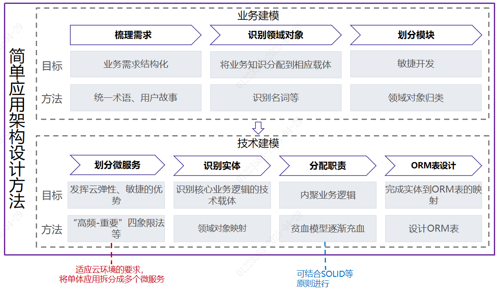
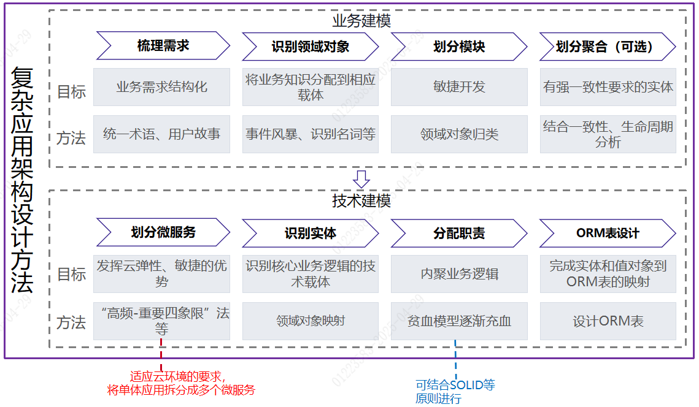
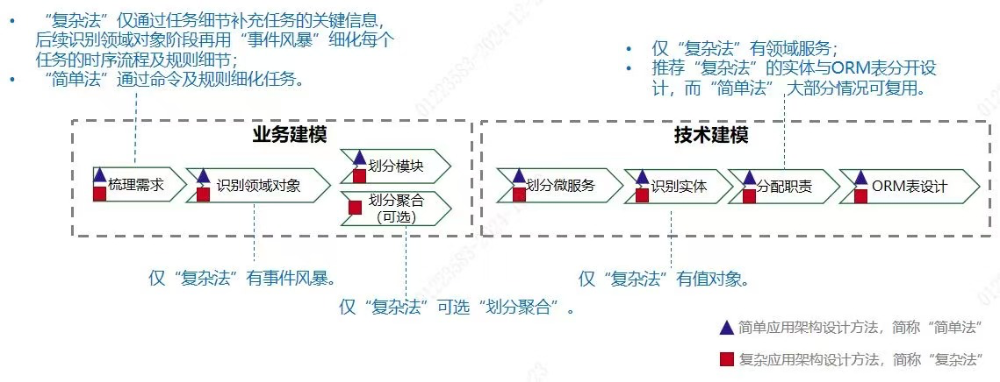
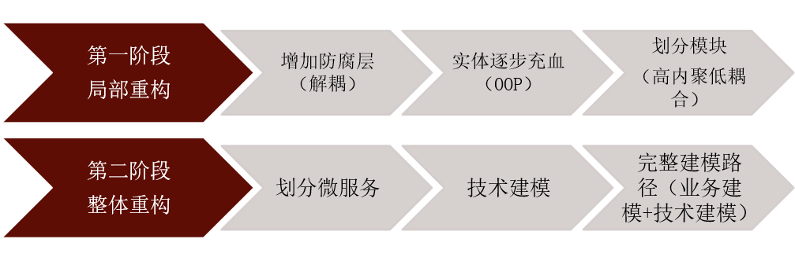
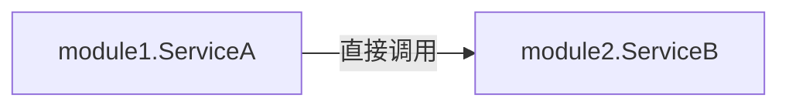
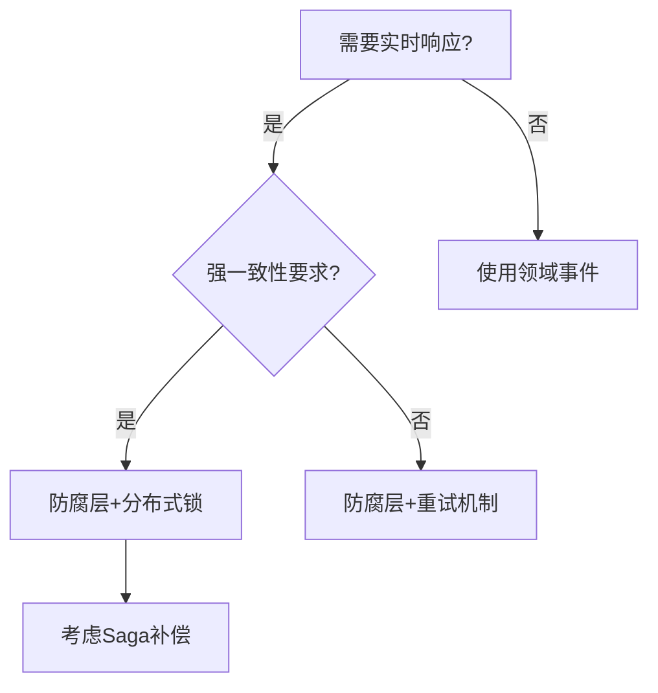

# 应用架构设计
云开发范式中的应用架构设计方法是一套将非结构化业务需求进行结构化和抽象，最终落地“符合面向对象编程(Object Oriented Programming，OOP) 思想、微服务拆分合理”的程序的方法论。

## 概念
### 架构定义
- **业务架构**：企业各类业务的运作模式及业务之间的关系结构。一般由业务部门的专家负责，属于顶层设计，会影响到组织结构。例如，零售、对公的业务划分。

- **应用架构**：代码的组织模式和结构。具体地，“应用架构”描述了如何通过分层、分包、依赖关系等机制对代码结构提供合理约束。其目标是设计功能易扩展、业务易测试、代码逻辑易读懂的应用系统。

- **系统架构**：根据可用性、安全性、稳定性、性能等非功能特性所做出的技术选型，例如对云服务、数据库、灰度策略等进行的选型和决策。其目标是设计高可用、高稳定、高性能的应用系统。

- **数据架构**：数据的组织形式和结构。例如在大数据场景中，数据架构定义了如何将各业务系统的数据汇聚在一起，给业务提供整体视图。

- **物理架构**：计算机硬件设备、传输媒介和物理连接方式等组成的计算机系统的结构和布局。

### SOLID原则
| 中文全称 | 英文全称 | 缩写    | 含义                             |
| ----- |------|-------|--------------------------------|
| 单一职责原则 |	Single Responsibility Principle | SRP   | 一个类应该有且只有一个改变的原因。              | 
| 开闭原则 | Open Close Principle | OCP   | 对扩展开放，对修改封闭。                   |
| 里氏替换原则 | Liskov Substitution Principle | 	LSP	 | 子类可以扩展父类的功能，但不能改变父类原有的功能。      |
| 接口分离原则 | Interface Segregation Principle | ISP   | 	不能强制客户端实现它不使用的接口，应该把接口拆的尽可能小。 |
| 依赖倒置原则 | Dependency Inversion Principle | DIP   | 	抽象不依赖于细节，而细节依赖于抽象。            |

### 怎么判断是一个好的架构设计
应用架构：提供合理的业务建模和技术建模，将非结构化业务需求进行结构化进行结构和抽象，设计出代码易理解、测试易测试、业务易拓展的应用系统。
系统架构：根据可用性、稳定性、安全性等非功能特性所做出的技术选型，例如对云服务、数据库、灰度策略等进行的选型和决策，设计出高可用、高稳定、高性能的应用系统。

## 架构选型
### 简单应用架构 or 复杂应用架构选哪个？
1. （**业务变更频率** * **规则复杂度**）> 团队学习成本 且（**系统生命周期价值**）> 架构升级成本，选择四层架构。
2. 如果不能很确定选哪种，则选择“简单应用架构设计”和三层架构。

### 传统三层架构和云开发范式三层架构的区别？
1. 思想上：传统mvc本质上是一种面向数据的设计，主要关注数据，是一种自低向上的思想；DDD的开发模式：是领域驱动，自顶向下，关注业务活动。
2. 实施过程上：传统MVC过程为需求分析-研发人员设计库表结构-编写代码。云开发范式的三层架构和四层架构一样，需要完整的业务建模-技术建模-代码落地。
3. 代码实现上：云开发范式三层架构强调充血实体与接口防腐。

### 三层架构 vs 四层架构
#### 为什么简单应用选择三层架构？
1. 简单应用场景的业务逻辑较简单，一般仅涉及一个较小的问题域。
2. 简单应用场景的数据持久化逻辑和需求也较为简单。
3. 简单应用场景与外部系统的交互很少，可在服务层通过专门的接口处理外部系统的交互，防止外部系统的变更腐化本系统。

#### 为什么复杂应用选择四层架构？
1. 复杂应用场景的业务较复杂，通常包含多个子问题域。
   > 部分业务操作或校验规则涉及多个领域对象，任何一个领域对象均无法独立承载。如果采用三层架构，这部分业务逻辑将散落在服务层。如果采用四层架构，可从应用层（在三层架构叫服务层）将这部分逻辑剥离出来，沉淀到领域服务。领域服务与领域对象一起内聚到领域层（Domain），更显性化内聚业务逻辑。
2. 复杂应用场景的数据持久化逻辑和需求也较为复杂。
   > 如果采用三层架构，服务层需分别针对三个月内（如存储在GaussDB）、历史数据（如存储在ECS，Elastic Cloud Storage）实现不同的数据操作逻辑，存储方式的变更需调整服务层的代码逻辑。如果采用四层架构，领域层只需要定义数据持久化接口，应用层调用领域层定义的接口，基础设施层实现领域层定义的接口，屏蔽持久化的复杂逻辑，这样分层职责更清晰。
3. 复杂应用场景与外部系统的交互也较为复杂。
   > 如果采用三层架构，与外部系统的交互逻辑散落在服务层，与本系统的功能代理交织在一起，代码难以维护。外部系统的变更，需同步修改服务层逻辑代码，同时可能直接影响本系统已有功能的可用性。如果采用四层架构，领域层定义与外部系统交互的接口，应用层调用领域层定义的接口，与外部系统交互的逻辑在基础设施层实现。通过四层架构的基础设施层将本系统的业务逻辑（即领域层、应用层）与外部系统解耦，起到防腐的作用。

### 应用架构设计方法
#### 简单应用架构设计方法（三层架构）


#### 复杂应用架构设计方法（四层架构）


#### 简单/复杂应用构架设计方法对比
  
两个方法的主要差异点如下：  
1.**梳理需求**： 两个方法均通过“用户故事”梳理需求，初步结构化业务需求。但两者对任务（即用户故事的"what"，详见两种方法的业务建模部分）细节要求不同。  
（1）对于简单的业务场景，梳理的任务粒度较细，可以较清晰完整地描述业务需求。即使存在部分任务描述不够清晰，也可以使用少量“命令”和“规则”进一步细化。  
（2）对于复杂的业务场景，梳理的任务粒度较粗，对需求的描述较宽泛，需使用较多“命令”和“规则”才能细化任务的时序细节。用户故事地图的目标是展现业务全景，不需要关注每个细节，因此，这里只需使用任务细节补充任务的关键信息，后续在识别领域对象阶段再用“事件风暴”细化每个任务的时序流程及规则细节。  

2.**识别领域对象**：“复杂应用架构设计方法”利用“事件风暴”细化每个任务的事件、命令、规则，然后识别领域对象。而“简单应用架构设计方法”可直接根据“梳理需求”的产物识别领域对象。
> 事件风暴由意大利软件咨询师阿尔贝托・布奇（Alberto Brandolini） 于 2012 年左右提出，是他在实践领域驱动设计时，为解决传统建模方法效率低、跨角色协作难等问题而创造的协作式建模技术。其核心流程如下：
> - 聚焦领域事件：参与者（领域专家、开发者等）通过贴纸列出业务中发生的所有关键事件（如“订单已提交”）。
> - 探索流程：按时间顺序排列事件，可视化业务流程全景。
> - 挖掘要素：围绕事件识别触发命令、决策角色、读写数据（聚合）、业务规则及外部系统。
> - 划定边界：通过事件簇聚，自然涌现出聚合、限界上下文等关键DDD设计边界。

目标：快速建立统一语言，暴露核心领域逻辑与结构，为精准建模奠定基础（通常1-2天完成复杂领域探索）。

3.**划分聚合**：“复杂应用架构设计方法”可选“划分聚合”，将具有强业务一致性、生命周期相同的领域对象划分到一个聚合。

4.**识别实体**：“复杂应用架构设计方法”会区分实体和值对象，而“简单应用架构设计方法”可以不做区分。

5.**分配职责**：“复杂应用架构设计方法”会考虑将模块内涉及多个实体的具有明确业务语义的方法沉淀到领域服务。

6.**ORM表设计**：“复杂应用架构设计方法”中实体与持久化模型（Persistence Object，简称PO）通常不一致，因此实体与ORM表应分开设计；而“简单应用架构设计方法”中，实体与PO基本保持一致，ORM表设计可参考实体的设计。

划分微服务的方法、流程、原则及要求基本是一样的，均强调合理地拆分微服务，以更高效地利用云优势。

### 三层架构如何向四层架构演进


最核心的两点：防腐和充血。  
第一阶段局部重构：防腐层解耦、实体逐步充血、划分模块。  
第二阶段整体重构：划分微服务、技术建模、完整建模路径。  

## 业务建模
### 概念定义
#### 业务建模目标
业务建模的目标是实现业务需求的结构化描述，输出用户故事地图、领域对象及业务模块。

#### 业务建模的流程
##### 简单应用架构

1) 梳理需求：梳理用户故事、补充命令、确认需求
2) 识别领域对象：识别名词、分配业务知识到领域对象
3) 划分模块：建立关联关系、模块化

##### 复杂应用架构

1) 梳理需求：梳理用户故事地图、确认需求
2) 识别领域对象：事件风暴、识别名词、分配业务知识到领域对象
3) 划分模块：建立关联关系、根据关联关系划分模块
4) 划分聚合：根据业务强一致性划分模块（可选）

#### 用户故事及用户故事地图
#### 用户故事（User Story）
用户故事是软件开发过程中用符合特定格式（或者称结构化）的自然语言描述业务需求的常用方式。用户故事内容通常包括“角色(who)”、“用户执行的动作(what)”以及“价值(why)”，如果价值是显而易见的，或者没有那么重要，也可以不写。

##### 用户故事地图（User Story Mapping）

按照时间线，将多个用户故事串起来组成的业务全景图，即用户故事地图。用户故事地图包含以下6要素，实践过程中应使用不同的卡片区分：

- 角色（Role）：将用户故事里的"who"单独抽出来，用户故事地图更清晰。角色是故事的发起方，可以是人，也可以是外部系统。
- 主线（Backbone）：领域或场景的主线，一般是从左往右的时间轴。
- 活动（Activity）：表示用户故事地图的主干，用于组织关联性强的任务。通常以动词短语的形式，并使其足以涵盖所有类似任务要表达的意思。
- 任务（Task）：这里重点记录用户故事里的"what"。如果用户故事里的"why"很关键，对理解业务需求有重大意义，也可以在任务里写出来。
- 命令（Command）：命令是任务的细化。根据系统建设的角度，按照时序先后逻辑对任务进行拆分、细化，要求使用“动词+名词”的形式。对于业务逻辑简单的任务，可以不识别命令。
- 规则（Rule）：拆分任务时，关键命令对应的规则（比如具体的校验、判断等逻辑）也应该记录下来。

#### 领域对象识别流程
以用户故事地图为基础，识别或抽象与任务或命令最相关或隐含的业务概念，即领域对象。将用户故事地图中的命令分配到对应领域对象，进一步结构化业务需求。具体流程：

（1) 通常领域对象是命令中的名词，可根据命令“动词+名词”的形式直接抽取。根据命令识别领域名词后，应进一步分析哪些领域名词属于领域对象、哪些属于领域对象的属性。比如“锁定订单状态”中的“订单状态”是名词，但是“订单状态”是“订单”的一个属性，因此这里识别的领域对象应该是“订单”。

（2）检查领域对象、命令在业务概念（包括业务属性、业务含义等）上的一致性，针对具有相同业务概念的领域对象、命令要采用统一术语，消除二义性。

（3）围绕领域对象，贴出相关命令及其他相关产出，划分职责边界。

（4）如果在讨论过程中，有任何因为问题澄清或知识增长带来的对于之前各种产出物的共识性调整，应及时进行调整和优化。

#### 划分模块
##### 目标
将业务相关性强的领域对象划分为同一个模块，模块满足独立穷尽（MECE）原则。
> MECE：Mutually Exclusive，Collectively Exhaustive
> - Mutually Exclusive：模型中的各个元素（如实体、值对象、聚合、子域、限界上下文、概念分类等）之间应该有清晰、无重叠的边界。一个概念或职责只能归属于一个元素。
> - Collectively Exhaustive：模型中的元素组合起来，应该能够完整地覆盖问题域的所有相关方面。没有重要的业务概念、规则或场景被遗漏。

##### 详细流程
根据领域对象的关系划分模块。详细流程如下：  
（1）画出所有领域对象之间的关系，如聚合、组合、关联、依赖等关系。  
（2）根据领域对象间关系的紧密程度，结合领域对象的业务相关性划分模块。

#### 领域对象之间的关系
| 关系类型 | 说明                                                                            |
|------|-------------------------------------------------------------------------------|
| 关联   | 一种结构化关系，用于表示一类对象与另一类对象之间有联系。关联关系一般表示非聚合、组合的其它关联关系，如师傅和徒弟。                     |
| 聚合   | 表示整体与部分的关联关系，但是成员对象可以脱离整体对象独立存在。如：汽车和发动机。                                     |
| 组合   | 表示整体与部分的关联关系，且一旦整体对象不存在，成员对象也不复存在，如：人的头和嘴巴。                                   |
| 依赖   | 表示使用关系。依赖关系表示一个类使用了另一个类的某些功能，但彼此之间并没有较强的耦合性。这种关系是一种短期的、临时的连接，如：教师和他上课时使用的投影仪。 |
| 泛化   | 即继承关系。如教师、学生均可泛化为人。                                                           


#### 实体分配属性

设计实体的属性时，可参考以下几种方式：

- 通过对业务人员进行访谈，从业务知识中获取实体的属性。
- 参考相关系统或需求，获取实体属性。此方法获取到的属性需与业务人员确认。
- 根据开发经验识别出一些技术支撑类的实体属性，如修改人、修改时间等。

#### 实体、领域服务分配方法

根据业务建模阶段识别出来的命令识别方法。具体规则如下：

- 如果命令仅涉及一个实体，可考虑将该命令转化为该实体的方法。但识别出的命令一般来说是超出实体职责范围的，因此不能直接将所有命令映射为实体方法。实体的方法通常仅需操作本实体的属性，不包含CRUD。
- 如果命令涉及模块内的多个实体，可先考虑找到某个实体承载，如果该方式会破坏该实体的“高内聚、低耦合”或SOLID原则，则可考虑将该命令转化为领域服务的方法。
- 如果命令涉及跨模块、跨微服务的多个实体，则将该命令转化为应用服务的方法。
>【建议】不推荐使用领域服务，优先考虑实体行为和应用服务，领域服务作为最后折衷考虑。 需折衷考虑的情况：涉及多实体的事务一致性逻辑，且属于重要业务概念（也就是与业务聊需求，经常会提及）。

> 实际设计中，并不追求一开始就把实体的属性和方法完全识别出来，实现完全充血。在程序演进过程中，可识别具有业务语意、可复用、集中在某个实体上的操作或行为，可将它们沉淀为实体的方法，逐步充血。实体的属性在程序演进过程中也可按需补充。这样做的好处是，所有沉淀到实体上的操作都是有收益的，能够在实体中内聚业务逻辑，显性化地表达业务语义。业务知识得到了尊重和表达，这就是所谓的"Knowledge Rich Design"。


#### 实体和值对象
**实体(Entity)**: 领域对象承载了明显的业务行为（比如校验、审批等）和业务属性，则可映射为实体。  
**值对象(Value Object):** 领域对象有业务属性，无业务行为或者有少量业务行为，且在整个业务的生命周期中不可变，则可映射为值对象。

常见识别为实体的流程： 
- 是否具备唯一标识：实体必须具备唯一标识，但是具备唯一标识的不一定实体
- 判断领域对象是否可变：可变的识别为实体，不可变的识别为值对象
- 判断领域对象是否具备生命周期：可以被创建、修改、删除，而值对象通常只作为实体的属性存在
- 短时间内识别不出来的，优先识别为实体（因为实体被错误识别为值对象是有代价的：性能损耗、无法适应需求调整）

> 若领域对象承载了明显的业务行为（比如校验、审批等）和业务属性，则可映射为实体；若领域对象有业务属性，无业务行为或者有少量业务行为，且在整个业务的生命周期中不可变，则可映射为值对象。若短时间内无法确定映射为实体还是值对象，可先直接映射为实体。

### ddd四层业务建模在落地阶段，或者是有新业务需求时，业务模型怎么保鲜？
在DDD（领域驱动设计）四层业务建模的落地阶段，或在面临新业务需求时，保持业务模型的“保鲜”是至关重要的。保持模型的活力、灵活性和准确性，可以让团队更好地应对复杂的业务需求和变化。以下是一些具体的策略和方法：

#### 1. **持续的领域建模与业务专家合作**

* **定期与业务专家沟通**：领域模型是随着业务需求的变化而变化的。与业务专家（如产品经理、业务分析师）保持紧密沟通，定期回顾业务需求和目标，确保业务模型能够反映最新的业务现实。
* **反馈环路**：在项目实施过程中，业务专家的反馈尤为重要。通过定期的需求讨论、模型审查和迭代，可以及时发现领域模型的潜在问题并进行修正。

#### 2. **模型迭代与演化**

* **领域模型的演化**：DDD的核心理念之一是领域模型应随着业务的发展和变化而不断演化。每次新增业务需求时，都需要对模型进行审查和修改。如果某个领域存在复杂的业务变化，可能需要拆分、合并或者调整领域实体、值对象等。
* **通过重构保持模型的简洁与清晰**：在每个开发周期或版本发布时，进行必要的模型重构。比如，原先的某些实现可能已经不再适应新的业务需求，这时候需要调整领域对象的设计，优化代码架构，确保模型的表达能力与业务需求对接。

#### 3. **建立测试和验证机制**

* **业务规则自动化验证**：确保领域模型和业务逻辑能够通过自动化测试进行验证。例如，使用单元测试来确保领域模型的行为符合业务规则，使用集成测试来确保整体的业务流程有效运行。
* **用例驱动开发**：在业务需求发生变化时，可以通过重新梳理用例，来验证领域模型的正确性。通过用例来确保模型仍然能够覆盖所有业务流程，并且没有遗漏新的需求或约束。

#### 4. **模块化和解耦**

* **合理划分边界上下文（Bounded Context）**：随着业务需求的增加，新的功能模块往往需要和现有模块进行集成。此时，可以通过清晰划分领域模型的边界上下文，避免不同子系统之间的过度耦合和复杂依赖。每个边界上下文应当具有独立的领域模型，减少跨领域模型的变化影响。
* **领域服务与应用服务解耦**：确保应用服务和领域模型之间的解耦。应用服务主要关注业务流程的协调和事务控制，而领域模型则集中精力处理核心业务逻辑。通过将领域模型和应用服务分离，可以在引入新需求时，避免直接影响核心业务模型的设计。

#### 5. **使用事件驱动架构（EDA）应对复杂业务**

* **事件源（Event Sourcing）与CQRS**：事件驱动架构和命令查询责任分离（CQRS）可以帮助管理复杂的业务逻辑和模型的变化。当业务需求复杂且变化频繁时，CQRS可以将读操作与写操作分离，优化查询的性能，而事件源则可以提供业务状态的历史追溯，有助于保证业务模型的持续一致性。
* **领域事件与集成事件**：随着业务需求的变化，可以定义新的领域事件，并通过消息总线（例如Kafka、RabbitMQ等）进行事件的发布和订阅。这种方式使得业务模型可以更灵活地适应不同的业务需求。

#### 6. **保持模型的高内聚和低耦合**

* **内聚性高、耦合度低的设计**：在面对新需求时，尽量保持模型的高内聚性，确保每个模块只负责特定的领域职能。同时，避免过度耦合其他领域的模型，使得新的业务需求可以独立地加入，而不影响已有的业务逻辑。
* **领域驱动的设计原则**：尽量遵循DDD的设计原则，如聚合根、实体、值对象等的正确使用，避免模型设计中出现不必要的复杂性。

#### 7. **重视技术与工具的支持**

* **支持领域建模的工具**：使用UML、事件建模、领域建模工具等，帮助团队在面对新需求时，能够清晰地表达和调整领域模型。通过这些工具，可以减少模型复杂度，帮助开发人员更好地理解和实现领域模型。
* **文档与模型共享**：保持领域模型文档的实时更新和共享。无论是业务团队还是开发团队，大家需要对领域模型有共同的理解。随着新需求的加入，要确保文档能够及时反映出最新的模型变化。

#### 8. **团队文化和持续学习**

* **鼓励领域建模的持续学习**：业务模型的“保鲜”不仅仅是技术上的问题，还与团队的文化和实践息息相关。鼓励团队成员参与领域建模的培训，分享实践经验，定期进行领域建模的复盘，能够不断提高团队对业务需求的敏感性和对模型的理解。
* **反思与调整**：在项目实施的过程中，定期进行回顾，反思当前的模型设计是否有效，是否符合业务需求。通过持续的反思和调整，确保模型的健康。

#### 总结：

要保持DDD四层业务模型的“保鲜”，需要关注领域模型的持续演化与业务需求的紧密对接，保持模型的灵活性和简洁性，并通过合适的架构和技术手段支持业务模型的变化。同时，团队内部的沟通、协作和持续学习也是确保领域模型能够随着业务发展而不断优化的关键。


### 如何区分业务建模中的“任务”和“命令”？
在领域驱动设计（DDD）和业务建模中，任务（Task）和命令（Command）是两种不同的概念，它们的区别如下：

| **维度**       | **任务（Task）**                     | **命令（Command）**                 |
|---------------|------------------------------------|----------------------------------|
| **定义**       | 一个业务过程，可能包含多个步骤或子任务。 | 一个明确的动作，触发某个业务操作。       |
| **粒度**       | 较粗，通常涉及多个步骤或决策。         | 较细，通常对应一个原子操作。           |
| **执行方式**   | 可能涉及多个命令、事件或人工干预。     | 通常是自动执行的单一操作。             |
| **业务含义**   | 代表一个完整的业务目标（如“处理订单”）。 | 代表一个具体的业务动作（如“提交订单”）。 |
| **示例**       | “客户下单”任务可能包括：<br>1. 创建订单<br>2. 扣减库存<br>3. 支付处理 | “创建订单”命令仅执行订单创建逻辑。 |

#### 总结
   - 任务是宏观业务流程，命令是具体执行动作。
   - 任务由多个命令组成，命令是最小执行单元。
---

### 如何判断任务的最小化？
任务的最小化（Task Granularity）是指**将任务拆解到不可再分的业务单元**，确保每个任务：
1. **职责单一**：只做一件事（如“扣减库存”而非“处理订单”）。
2. **可独立执行**：不依赖其他任务的中间状态。
3. **可组合**：多个最小任务可以组合成更大的业务流程（如“下单”=“创建订单”+“扣库存”+“支付”）。

#### 判断标准
1. **能否再拆解？**
   - 如果能拆成更小的步骤，则当前任务不是最小化。
   - 例如：“处理订单”可拆解→非最小；“扣减库存”不可拆解→最小。

2. **是否依赖其他任务的状态？**
   - 最小任务应能独立执行，不依赖其他任务的中间结果。
   - 例如：“支付订单”依赖“订单已创建”→需组合为更高层任务。

3. **业务是否认可其原子性？**
   - 从业务视角看，该步骤是否不可再分？
   - 例如：财务系统中的“记账”是最小任务，而“生成财报”不是（可拆解为多个记账操作）。

#### 示例
- **非最小任务**：`完成电商订单`（可拆解为创建订单、扣库存、支付、发货）。
- **最小任务**：`扣减库存`（业务上不可再分，代码上对应一个事务）。

#### 总结
   - 拆解到业务认可的原子操作，确保单一职责和独立执行能力。
   - 通过“能否再拆分”和“是否依赖外部状态”判断。

**关键原则**：
> **“最小任务应是业务上的原子操作，技术上的事务边界。”**  
> 例如：
> - 数据库事务边界（如“扣库存”需在一个事务内完成）。
> - 业务规则边界（如“支付”必须完整执行，不能半途而废）。

---

### 为什么要最小化角色？
在业务建模和系统设计中，**最小化角色（Role Minimization）**的核心目标是：
1. **降低复杂度**：避免角色职责过多，导致权限混乱或功能耦合。
2. **提高灵活性**：细粒度角色更容易组合复用（如“审批人”+“提交人”=完整流程）。
3. **增强安全性**：遵循最小权限原则（Principle of Least Privilege），减少越权风险。

#### 典型问题（未最小化角色）
- **万能角色**：如“系统管理员”拥有所有权限，难以审计和管控。
- **职责混杂**：如“财务+HR”角色，违反单一职责原则。

---

### 如何判断角色是否最小化？
#### 1. 职责单一性检查
- **问题**：该角色是否只做一件事？
- **示例**：  
  ✅ **最小化角色**：`订单审批人`（仅审批）、`数据查看员`（仅读数据）。  
  ❌ **非最小化角色**：`订单管理员`（包含创建、审批、删除等权限）。

#### 2. 权限可组合性
- **问题**：该角色能否拆分为更小的、可复用的子角色？
- **示例**：
   - 原角色：`项目管理员`（管理成员+审批任务+删除项目）。
   - 拆解后：`成员管理员` + `任务审批人` + `项目删除人`。

#### 3. 业务场景验证
- **问题**：是否存在业务场景只需要该角色的部分权限？
- **示例**：
   - 某些用户只需“提交订单”但无需“审批订单”→ 需拆解为`提交人`和`审批人`角色。

#### 4. 变更影响分析
- **问题**：修改该角色的权限是否会影响无关功能？
- **示例**：
   - 若调整“订单审批人”的权限会影响“订单创建”→ 角色未最小化。

**核心原则**：
> **“一个角色应该小到不能再小，但又能完整支持一个业务操作。”**  
> 例如：`审批人`角色只需“同意/驳回”权限，无需关心“谁提交的订单”。

---

### 如何判断用户故事地图的合理性
1) 从用户视角出发
2) 覆盖主要活动与旅程
3) 故事颗粒度适中
4) 有反馈机制，确保团队共识

### 如何判断领域对象的合理性
1) 准确映射业务概念
2) 职责和边界是否清晰
3) 与其他对象关系清晰
4) 能支撑后续的业务演进

### 领域对象识别有问题如何处理
1) 如果还处于业务建模阶段，定位是由于什么原因引起的（比如命令颗粒度问题），及时进行修正。
2) 如果已进入技术建模阶段，需及时调整实体/值对象映射，及模块和微服务划分，保持团队共识。
3) 如果已代码落地投产，需充分评估改动的成本和风险，建议随需求迭代小步优化，并保持文档与实现同步。
4) 总结经验避免后续重复错误。

### 命令的识别有变动如何处理
1) 如果还处于业务建模阶段，明确是否需求理解偏差或颗粒度不一致导致，并评估对领域对象的影响。
2) 如果已进入技术建模阶段，不仅评估领域对象，还需评估对职责分配是否有影响，保持团队共识。
3) 如果已代码落地投产，需充分评估改动的成本和风险，建议随需求迭代小步优化，并保持文档与实现同步。
4) 总结经验避免后续重复错误。

### 常见的适合识别出命令的场景
1) 获取外部数据
2) 保存操作
3) 引发数据变动的动作
4) 会产生业务逻辑分支的检查

### 如何划分模块
划分模块通常包含两部分的内容：1. 识别领域对象间的关系 2. 划分领域对象到模块。

#### 识别领域对象间的关系  
包含组合、聚合、关联、依赖、继承。

#### 划分领域对象到模块
有强一致性的领域对象应该放到同一个模块，这个强一致性约束在领域建模中也被理解为“不变式”、“固定规则”，是指在数据变化时必须保持的一致性规则，不仅仅包含事务一致性，还包含多个领域对象协作完成业务时，某个领域的数据变化必须与其他领域对象的数据变化保持一致的强约束，也就是恒为真的业务规则。
例如：要求订单总额不能超过1000块，订单总额是根据订单项计算的，那么在订单与订单项这两个领域对象之间就存在“不变式”。

步骤1：根据业务规则划分模块。    
> 以关键阶段/活动为基础，形成初步的模块列表。  
> 活动涉及的核心/高频领域对象放到对应模块内。  
> 寻找领域核心对象之间的不变式约束，如果存在不变式约束的，需要合并到一个模块。  

步骤2：根据关系划分模块。
> 画出所有领域对象间的关系，包括模块内、跨模块、不在模块内的。  
> 如果领域对象（不在模块内的）与多个模块的领域对象有关系，则按照就近原则划分。  
> 如果关系差不多，可能需要考虑识别为单独模块。  

步骤3：调整模块划分结果。
> 如果两个模块的领域对象之间连线比较多，要分析是否需要合并模块。      
> 消除二义性，同一领域对象在不同模块内可能有不同的含义，需要补充领域对象。举例：商品在消费者购物车时可以认为是商品信息，在下单成功后是商品快照。

### 常问到的点
1. 是不是一定要用用户故事地图来梳理需求
   > 不一定。也可以用业务流程图（本系统）、泳道图（跨系统）、事件风暴等。
2. 用户故事地图和流程图的优劣势
   > 用户故事地图：聚焦用户视角，按活动/任务分层，便于发现需求遗漏，促进团队协作；劣势：流程细节不足。  
   > 流程图优势：逻辑清晰，展示步骤与条件，适合技术实现；劣势：用户视角弱，难以覆盖全场景需求。  
2. 是否可以以UI/原型图为依据来业务建模
3. 统一术语如何管理和维护，总结经验：
   > - 统一术语很重要，但不能一蹴而就，要在业务建模中不断提炼。
   > - 统一术语重点在于统一，翻译的好坏不是最重要的问题，一旦确定、谨慎修改。  
   > - 统一术语要贯穿软件开发全生命周期，保持一处制定、处处一致的原则。  
4. 先梳理活动还是先梳理任务
   > - 先梳理活动，后梳理任务，如国际业务比较复杂，需跟BA、业务多方调研一些比较明确需求，活动跟时间线也是比较明确的。  
   > - 先梳理任务，后梳理活动，适用于场景功能比较多，很难宏观梳理出系统中的活动，先梳理出任务有助于发散大家思维，最终把任务和对应发起角色识别出来，然后归纳总结出活动。如反洗钱改造，梳理所有国际产品、梳理所有操作角色如法规部、运管部，然后通过先整理所有需要对接的业务场景，然后总结出有哪几个参与者，需要完成的任务就是：对接反洗钱、执行反洗钱、反洗钱反馈，进一步整理出时间线和活动。（感觉描述不太对，待进一步调整）
5. 活动多少个比较合适
   > 云效未做要求，但建议5个左右比较合适，太多会导致用户故事地图太大。
6. 如何识别任务
   > 从系统建设的角度看，任务类似系统提供的api接口。角色通过一定的时序（时间线）调用这些接口功能完成业务动作。
7. 如何识别命令
   > 命令是对任务的细化，通过命令简要说明任务实现过程中的一些关键步骤。
8. 命令去除调用某某系统的描述，如调用通知系统，改为发送通知。
9. 常见的识别出命令的场景
   > - 获取外部数据
   > - 保存操作
   > - 引发数据变动、状态变动的动作
   > - 会产生业务逻辑分支的检查
10. 如果状态改变关联的操作比较多，可拆为为两个任务。如果影响不太大，改为规则描述。
   > 如审核一个命令无法很好地描述后续的分支流程，建议拆成两个任务：审核通过、审核拒绝。
11. 领域对象多对多的关系。班级和老师，是多对多。引入任课老师和课程，解耦为一对多、多对一的关系。

## 技术建模
技术建模的目标是将业务建模的成果转化为指导项目实施落地的系统设计。

### 概念定义
#### 技术建模的流程
##### 简单应用架构

1. 划分微服务：合并模块、设计微服务间数据转换和通信方式（可选）
2. 识别实体：映射领域对象到实体
3. 分配职责：设计实体的属性及方法
4. ORM表设计：设计实体对应的数据库表

##### 复杂应用架构

1. 划分微服务：合并模块、设计微服务间数据转换和通信方式
2. 识别实体：映射领域对象到实体、值对象
3. 分配职责：设计实体的属性及方法、设计领域服务
4. ORM表设计：设计实体和值对象对应的数据库表

#### 微服务间数据转换和通信方式的设计原则
设计微服务间数据转换和通信方式时，可参考以下原则：
- 如果微服务业务复杂并演进迅速，需要实现微服务间的解耦，则采用防腐层。
- 如果微服务对性能有严苛要求，且协调多个微服务同步修改的代价可以接受，可考虑共享内核。但共享内核导致微服务间高度耦合，实践中不推荐采用此方式。

### 云开发范式小课堂

### 短时间内无法确定是实体还是值对象，先映射为实体。举例说明
比如附件的存储，有些场景附件是有独立的生命周期，可以作为实体。

### 【非常高频】领域对象关系的处理，技术建模或业务建模一定会问

### 领域服务的例子，以及不推荐使用领域服务的原因

### 实体和值对象的转换
在系统A是实体，在B系统是值对象

### 注意点
注意准备例子
4～7：高频
10：注意论文实体->表的映射表述，实体->PO->表
赋能例子：附件类型判断，加密

## 代码落地
### 数据校验
通用技术校验在适配器层，业务满足性校验在应用层，强业务属性校验沉淀到实体。

### 应用层
#### 应用层的职责
- 数据验证：业务满足性校验。
- 数据转换：将用户提交的数据转换为领域模型所需的格式。
- 命令/询问分发：根据用户请求，将命令或询问分发到正确的领域对象。（业务编排）
- 数据呈现：将领域模型的数据呈现给用户。
- 非业务功能支持：安全验证、权限验证、事务控制、消息发送。

#### 应用层代码落地常见问题
1. 职责分配 
   - 过度分配
     - 适配器层的职责放到应用层
     - 实体充血行为放到应用层
     - 防腐放到应用层
     - 实体构建放到应用服务
   - 分配不足
     - 应用层的职责放到适配器层
     - 应用层的职责放到防腐接口
     - 应用层的职责放到实体
2. 代码组织
   - 不合理的复用 
     - 将部分应用逻辑代码封装成应用服务的public方法达到代码复用的目的，这种方式是不推荐的。
   > 应用层如果有代码复用需求，可以考虑通过以下方式实现：
   > - 通过抽取私有方法实现同一应用服务内的代码复用。
   > - 通过抽取executor实现公开的应用逻辑代码复用。

### 领域层
#### 如何判断领域对象设计合理性
领域对象作为业务知识的主要载体，其设计的合理性会影响代码实现的可读性、可拓展性、可维护性等方面，因此领域对象设计时主要关注以下两方面。
1) **属性设计**：除了影响可读性，还会对实体的职责划分产生影响，要注意属性的“高内聚”。
2) **方法设计**：基于高内聚低耦合的原则，设计可读性强、充血合理的方法。

#### 领域对象关系处理
处理领域对象关系（聚焦于聚合、组合关系和关联关系）的几种方式：
- **对象引用**：领域对象直接引用另一个领域对象，一般适用于同一个模块内对象之间强关联（整体与局部）的情况。由于值对象不具备唯一标识，因此也需要使用对象引用方式。
- **ID引用**：一个领域对象保存另一个领域对象的唯一标识，常见于实体之间的普通关联关系或者跨模块实体关联中。
- **关联对象【关系具像化，新增实体】**：通过一个关联对象描述两个领域对象之间的关系，常见于跨模块领域对象关系处理、多对多领域对象关系处理。

具体表现为：
- **关联关系**：通常使用ID引用方式处理，而不是使用对象引用方式（考虑构建复杂和性能问题）    
    >关联关系通常指是学生与班级、员工和公司这种关系，这些领域对象之间通常都有比较清晰职责边界，这种不强的关系通常建议使用ID引用方式处理。  

- **组合、聚合关系**：可以使用对象引用方式，也可以使用ID引用方式。

#### 实体的创建
实体的创建（对象转换）应该是Assembler、Factory或者Converter的职责：
- Assembler负责数据对象与领域对象之间的转换，这里出现的实体创建通常和外部请求的数据有关。
- Factory负责复杂实体的创建，保证实体的创建约束，以及对象创建的统一管理。
- Converter负责持久化对象与领域对象的转换。

#### 四层结构中如何实现业务规则
四层架构中，通常先从业务规则中提炼出固定规则，再将固定规则根据职责分配到合适的位置。

##### 固定规则（Invariant）的定义
定义：在数据变化时必须保持的一致性规则，即不变式。
- **领域规则**：描述了领域中特定实体、值对象或聚合根的行为和约束，以确保它们的状态和行为符合业务需求。这些规则通常包括业务逻辑、限制和约束等内容。
- **基础设施**：规则关注数据访问和存储方面的规则，如确保数据库中的某个字段非空、确保某个值的唯一性等。

##### 提炼固定规则的方式
- 分析业务规则的含义，确定哪些规则是始终适用的，并与领域专家确认；
- 确认哪些规则涉及到一个或多个实体、值对象，这些规则可能需要被转化为固定规则；
- 检查固定规则是否能够被领域对象或领域服务、应用服务实现；
- 选择合适的方式维护固定规则。

##### 常见维护固定规则的方式
- **单实体**。构建时使用builder模式保证满足固定规则，其余可在实体充血方法内维护。
  - 案例：
    - 要求验证码必须是4位纯数字
    - 要求消息的有效期不能大于一个月

- **跨实体**。使用领域服务、应用服务。
  - 案例：－要求转账时进出帐要平衡

### 异常处理
哪些层可以抛出异常

### 代码检视的问题收集
1. 组里新人，Assemble不止做了转换，还调用repository的查询、存储

### 架构守护遇到的问题
历史代码或者此前未开启架构守护的应用，开启架构守护

### 架构守护的自定义例子
Assemble的转换，不允许调用repository

### 多线程拒绝策略

在多线程编程中，当线程池或任务队列达到其容量限制时，需要采用拒绝策略来处理新提交的任务。以下是常见的几种拒绝策略：

#### 1. AbortPolicy（中止策略）
- **默认策略**
- 直接抛出 `RejectedExecutionException` 异常
- 调用者可以捕获这个异常并处理

#### 2. CallerRunsPolicy（调用者运行策略）
- 让提交任务的线程自己执行该任务
- 这种策略会降低新任务的提交速度，起到简单的反馈控制作用

#### 3. DiscardPolicy（丢弃策略）
- 直接静默丢弃无法处理的任务
- 不抛出任何异常，也不执行任何操作

#### 4. DiscardOldestPolicy（丢弃最老策略）
- 丢弃队列中最老的任务（即最早进入队列的任务）
- 然后尝试重新提交当前任务

#### 5. 自定义拒绝策略
- 实现 `RejectedExecutionHandler` 接口
- 根据业务需求自定义拒绝逻辑

#### 使用示例（Java线程池）

```java
ThreadPoolExecutor executor = new ThreadPoolExecutor(
    corePoolSize,
    maximumPoolSize,
    keepAliveTime,
    TimeUnit.MILLISECONDS,
    new LinkedBlockingQueue<Runnable>(capacity),
    new ThreadPoolExecutor.AbortPolicy() // 设置拒绝策略
);
```

选择哪种拒绝策略取决于具体的应用场景和对任务丢失的容忍程度。

### 如何处理模块间互调问题
若出现module1的service调用module2的service，但一般情况ddd下module1是不允许调用module2。以下是系统性解决方案和最佳实践：

---

#### 一、问题诊断与应对策略
##### 场景分析

**违反的原则**：
1. 破坏模块自治性
2. 产生双向依赖风险
3. 导致分布式事务复杂度

---

#### 二、标准解决方案

##### 方案1：通过领域事件解耦（最终一致性）
```java
// module1 发布事件（无需知道module2）
public class OrderService {
    public void confirmOrder(Order order) {
        order.confirm();
        eventPublisher.publish(new OrderConfirmedEvent(order.getId()));
    }
}

// module2 订阅事件
public class InventoryEventHandler {
    @EventListener
    public void handle(OrderConfirmedEvent event) {
        inventoryService.adjustStock(event.getOrderId()); // 内部处理
    }
}
```
**优势**：
- 完全解耦，module1无需感知module2
- 天然支持分布式场景

**适用场景**：订单-库存、支付-通知等异步流程

##### 方案2：通过防腐层（ACL）隔离
```java
// module1 定义防腐接口（领域层）
public interface InventoryService {
    boolean reserveStock(OrderId orderId, List<Item> items);
}

// module1 基础设施层实现（调用module2的API）
public class InventoryServiceHttpClient implements InventoryService {
    private final InventoryApiClient client; // Feign/Retrofit

    @Override
    public boolean reserveStock(OrderId orderId, List<Item> items) {
        ReserveRequest request = convertToRequest(orderId, items);
        return client.reserve(request); // HTTP调用module2
    }
}
```
**优势**：
- 业务逻辑不依赖具体实现
- 可替换为其他实现（如Mock测试）

**适用场景**：需要实时响应的强一致性操作

##### 方案3：Saga模式（长事务管理）
```java
// 在module1启动Saga
public class OrderSaga {
    private final SagaCoordinator coordinator;

    public void createOrder(Order order) {
        coordinator.begin()
            .step("reserve_stock", 
                () -> inventoryProxy.reserve(order), 
                () -> inventoryProxy.cancel(order))
            .step("process_payment",
                () -> paymentProxy.charge(order),
                () -> paymentProxy.refund(order))
            .end();
    }
}
```
**优势**：
- 维护跨模块事务一致性
- 显式定义补偿机制

**适用场景**：跨多服务的订单履约、资金转账等

---

#### 三、架构验证规则
使用ArchUnit禁止直接调用：
```java
@ArchTest
public static final ArchRule no_cross_module_direct_call = 
    noClasses()
        .that().resideInAPackage("..module1..")
        .should().dependOnClassesThat()
        .resideInAPackage("..module2..");
```

当出现违规时，测试会报错：
```
Architecture Violation: Method <module1.OrderService.placeOrder()> 
calls method <module2.InventoryService.reserve()> in (OrderService.java:25)
```

---

#### 四、决策树：选择合适方案


---

#### 五、错误处理规范
##### 1. 同步调用（防腐层）的异常处理
```java
public class InventoryServiceHttpClient implements InventoryService {
    @Override
    public boolean reserveStock(OrderId orderId, List<Item> items) {
        try {
            return client.reserve(convertToRequest(orderId, items));
        } catch (FeignException e) {
            throw new InventoryUnavailableException(e); // 转换为领域异常
        }
    }
}
```

##### 2. 异步事件（最终一致性）的补偿
```java
public class OrderConfirmedEventHandler {
    @EventListener
    @TransactionalEventListener(phase = AFTER_COMMIT)
    public void handle(OrderConfirmedEvent event) {
        try {
            inventoryService.adjustStock(event.getOrderId());
        } catch (Exception e) {
            eventPublisher.publish(new StockAdjustmentFailedEvent(event)); // 触发补偿流程
        }
    }
}
```

---

#### 六、演进建议
1. **初期**：使用防腐层快速实现
2. **中期**：逐步替换为领域事件
3. **复杂场景**：引入Saga模式
4. **监控**：通过Metrics记录跨模块调用：
   ```java
   @Timed("module1.inventory.reserve")
   public boolean reserveStock(OrderId orderId) {
       // ...
   }
   ```

---

通过以上方法，可在保持DDD模块化设计的同时，安全地实现跨模块协作。关键点是：**永远不要让你的领域层直接依赖另一个限界上下文的实现细节**。

### 自定义架构守护
如何写一个单元测试规则，只允许module1和module2依赖common，不允许common依赖module1和module2，以及只允许module1下的service依赖executor，不允许executor依赖同包下的service。以下是基于 ArchUnit 的单元测试规则实现，可严格约束您描述的模块依赖关系：

---

#### 一、测试环境准备（Maven 配置）
```xml
<!-- pom.xml -->
<dependency>
    <groupId>com.tngtech.archunit</groupId>
    <artifactId>archunit</artifactId>
    <version>1.0.1</version>
    <scope>test</scope>
</dependency>
```

---

#### 二、完整的测试类实现
```java
import com.tngtech.archunit.core.domain.JavaClasses;
import com.tngtech.archunit.core.importer.ClassFileImporter;
import com.tngtech.archunit.lang.ArchRule;
import org.junit.Test;

import static com.tngtech.archunit.lang.syntax.ArchRuleDefinition.*;

public class ModuleDependencyTest {

    private final JavaClasses classes = new ClassFileImporter()
            .importPackages("com.yourcompany");

    // 规则1：仅允许module1/module2依赖common，禁止反向依赖
    @Test
    public void common_module_dependency_rule() {
        ArchRule rule = noClasses()
                .that().resideInAPackage("..common..")
                .should().dependOnClassesThat()
                .resideInAnyPackage(
                    "..module1..", 
                    "..module2.."
                );

        rule.check(classes);
    }

    // 规则2：module1内仅允许service依赖executor，禁止反向依赖
    @Test
    public void module1_internal_dependency_rule() {
        ArchRule rule = noClasses()
                .that().resideInAPackage("..module1..executor..")
                .should().dependOnClassesThat()
                .resideInAPackage("..module1..service..");

        rule.check(classes);
    }

    // 增强规则：禁止common包被外部非指定模块依赖
    @Test
    public void common_access_control_rule() {
        ArchRule rule = noClasses()
                .that().resideOutsideOfPackages(
                    "..module1..", 
                    "..module2..",
                    "..common.."
                )
                .should().dependOnClassesThat()
                .resideInAPackage("..common..");

        rule.check(classes);
    }
}
```

---

#### 三、规则详解

##### 1. **Common包依赖约束**
```java
noClasses()
    .that().resideInAPackage("..common..")  // common包下的类
    .should().dependOnClassesThat()         // 不能依赖
    .resideInAnyPackage("..module1..", "..module2..");  // module1/module2的类
```
**效果**：  
✅ 允许：
- `module1` → `common`
- `module2` → `common`

❌ 禁止：
- `common` → `module1`
- `common` → `module2`
- 其他模块（如`module3`）→ `common`

##### 2. **Module1内部Service-Executor约束**
```java
noClasses()
    .that().resideInAPackage("..module1..executor..")  // executor包下的类
    .should().dependOnClassesThat()                    // 不能依赖
    .resideInAPackage("..module1..service..");         // service包的类
```
**效果**：  
✅ 允许：
- `module1.service` → `module1.executor`

❌ 禁止：
- `module1.executor` → `module1.service`
- `module1.executor` → `module1.repository`（可通过额外规则约束）

---

#### 四、执行效果验证

##### 当出现违规时，测试会报错：
```
java.lang.AssertionError: Architecture Violation [Priority: MEDIUM]...
Rule 'no classes that reside in a package '..common..' should depend on classes that reside in any package ['..module1..', '..module2..']' was violated:
Method <com.yourcompany.common.CommonUtil.doSomething()> calls method <com.yourcompany.module1.Service.process()> in (CommonUtil.java:10)
```

---

#### 五、进阶增强方案

##### 1. 使用分层架构检测（更严格）
```java
@ArchTest
public static final ArchRule layer_dependencies = layeredArchitecture()
    .layer("Common").definedBy("..common..")
    .layer("Module1").definedBy("..module1..")
    .layer("Module2").definedBy("..module2..")

    .whereLayer("Common").mayOnlyBeAccessedByLayers("Module1", "Module2")
    .whereLayer("Module1").mayNotBeAccessedByAnyLayer()
    .whereLayer("Module2").mayNotBeAccessedByAnyLayer();
```

##### 2. 禁止Executor包外泄（可选）
```java
@ArchTest
public static final ArchRule executor_visibility = classes()
    .that().resideInAPackage("..executor..")
    .should().onlyBeAccessed().byClassesThat()
    .resideInAPackage("..service..");
```

---

#### 六、CI集成建议

在`pom.xml`中配置构建失败：
```xml
<plugin>
    <groupId>org.apache.maven.plugins</groupId>
    <artifactId>maven-surefire-plugin</artifactId>
    <configuration>
        <includes>
            <include>**/*ArchTest*</include>
        </includes>
    </configuration>
</plugin>
```

---

通过以上规则，您的架构约束将得到自动化保障，每次代码提交都会触发依赖关系校验，有效防止架构退化。


# 赋能相关
## 如何赋能（观点1）
### 做好赋能准备工作
#### 被赋能方系统
先梳理好当前存在的问题、重构的目标
对云应用开发范式要有一些基本的学习和理解
#### 云应用架构师
提前了解相关的业务背景、系统痛点和赋能的诉求

### 清晰定位
云应用架构师应该做“引导师”而不是“决策者”
- 赋能过程中以云开发范式为指引，注重系统的痛点和赋能诉求的解决
- 引导项目组一步步做好业务建模、技术建模和代码实现
过程中有任何设计上的选择，由项目组的开发同学作出决策

### 授人以渔
做云上思想的传播者，赋能以具体的项目着手
- 既要关注云开发范式的实施，技能的传授
- 又要关注思维模式的转变，培养和依赖项目组内的种子选手来落地整个项目目标

### 持续赋能
做好多阶段赋能的计划和回检计划，一个模块的代码实现不是赋能的结束。架构守护和模型优化需要持续的进行，需要在多个阶段的关键节点做好回检。

## 如何赋能（观点2）
1) 告诉项目组云开发范式能带来的好处、解决什么问题
   > 一种新思想的引入，必然会产生一定的抗拒。强行推广，容易适得其反。所以首先要告诉项目组云开发范式能带来的好处、解决什么问题，从心理上开发组接受云开发范式。
2) 解决思想上的问题，再讨论如何快速落地（CtrlC + CtrlV）
   > 给项目组一个简单、可以复刻的例子
3) 协助开发组从过程式的思维转变成面向对象思维
   > 思维的改变不是一蹴而就的，对领域对象的识别、实体充血、防腐解耦等重点环节需要定期回检

## 赋能的一些技巧
1) 在赋能过程中制定一些规范清单
业务建模不能讨论技术点，一个业务流程多少分钟无法达成一致，则加入待确认清单，让领域专家会后确认
2) 在赋能过程中有不理解的地方，可以用相关简单易懂的示例来解释
3) 在建模过程中让开发同事有充分的参与感，自己不用称为主角
4) 实在很难解释就用打样的方式指导

## 赋能相关
制定代码规范、新建四层/三层MVC转四层
形成范式，指导室组新人上手

### 业务建模赋能问题
1. 命令的识别
2. 拆分活动、任务以前台UI为准
   > - UI是需求的可视化表达而不是结构化，直接参考UI梳理活动、任务不利于后续建模。
   > - 需求梳理是有明确的边界的，但是UI常常因为用户体验等原因出现多功能入口。
   > - 实际场景中容易出现用户某个操作是由多次系统交互组成，通过UI梳理任务容易造成颗粒度过粗。
3. 统一术语的维护
4. 实体和值对象争议

### 技术建模赋能问题
1. 习惯了三层MVC架构的思维，以表来倒推实体，认为有表就该映射为实体
2. 重视业务建模命令的识别

### 代码落地赋能问题
1. 不理解为什么要经过那么多层的转换
2. 职责分配不足、职责分过过大
3. 多分支开发挑战