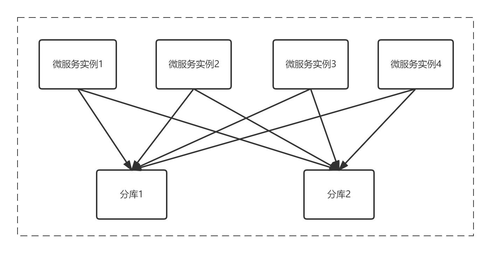
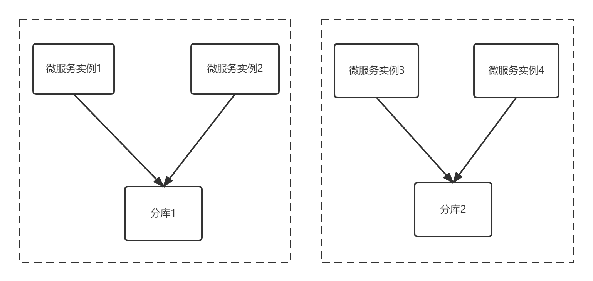
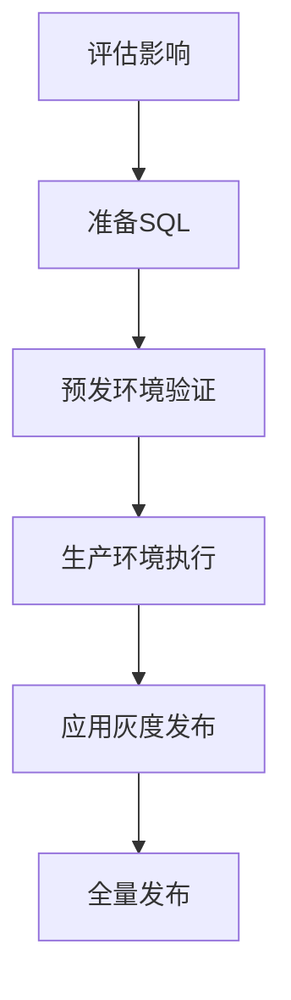
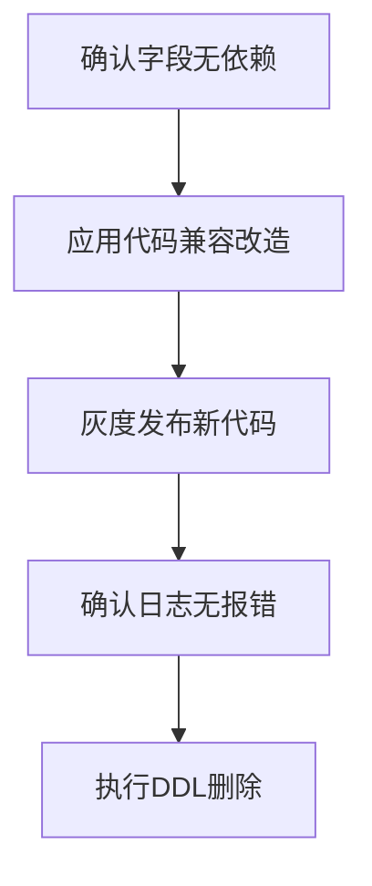
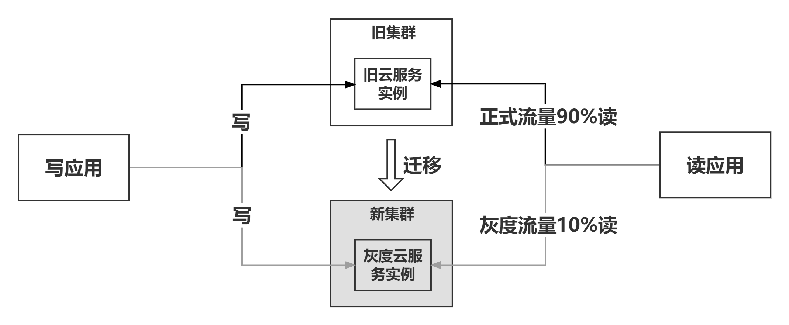
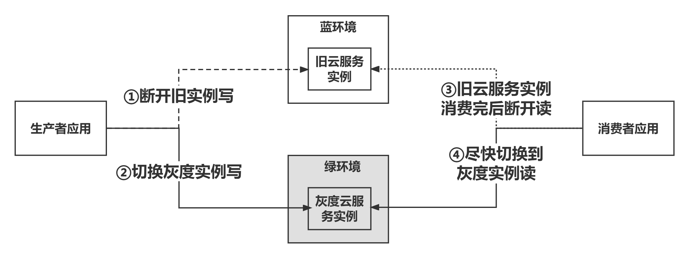

# 系统架构设计
## 微服务部署
### 概念定义
#### 微服务、发布单元、服务单元
微服务（Microservice） 是指“一个基本的、独立的运行单元”。
> 它是是一种**软件架构风格**，其核心思想是将一个大型的单体应用（Monolithic Application）拆分为一组**小型、独立、松耦合**的服务。每个服务专注于完成**单一业务功能**，并通过轻量级的通信机制（如 HTTP/REST、消息队列等）协同工作，共同实现完整的系统功能。

1) 从研发视角来说，一个微服务对应一个发布单元。  
   **发布单元**通常不能直接运行，需要在目标服务器（物理机、虚机、容器）上提供一个环境（又称为本地依赖）供发布单元运行，包括：操作系统、应用容器（如Tomcat）、第三方软件（如数据库驱动、命令行等）、配置文件等。


2) 从运维视角来说，一个微服务可对应一到多个服务单元，微服务的资源申请、部署及运维以服务单元为单位。  
   **服务单元**包含运行发布单元需要的本地依赖，一个发布单元通常会对应一到多个服务单元，这些服务单元分别对应不同的运行环境（DEV、ST、UAT、PRD）、部署平台（X86 VM、Docker）或网络分区（OA、BIZ、DMZ）。
> - 服务单元：是**业务逻辑**上的功能模块划分，代表系统中一个高内聚、低耦合的业务能力。它强调职责的独立性，但不一定对应独立的部署实体。
> - 发布单元：是**运维层面**可独立部署的最小实体，指一次部署操作中更新的代码或资源集合。它是运维层面的概念，关注部署的原子性。
> - 微服务：是**同时满足服务单元和发布单元标准的架构实现**，即：业务上：独立的功能模块（服务单元）。技术上：独立进程、可单独部署（发布单元）。

### 微服务划分的原则
1. 应根据实际需求进行微服务拆分，避免不必要的拆分和合并，确保其相互独立、高内聚低耦合。
2. 不仅要考虑到业务职责的划分，还需要慎重考虑微服务拆分后可能带来的数据一致性问题以及网络调用带来的性能损耗问题。
3. 微服务数量应尽可能少，如非必要，不要增加微服务。
4. 应注意避免微服务之间出现环状依赖关系。
5. 微服务的划分不是一成不变的，而是应该随着业务需求渐进式演进，同时应定期回检划分的合理性。

### 微服务划分的方法
1. 首先考虑模块间调用关系
    - 如果两个模块之间存在高频的相互调用，可划分至同一微服务，以减少调用的通信损耗。
2. 其次考虑“高频-重要”四象限原则
    - 将“高频重要”（即访问量大且重要）象限的所有模块划分为一个或少数（控制数量）几个微服务。
    - 在保障非功能性需求的前提下，经过审慎考量可将“重要不高频”（即访问量不大但重要）和“高频不重要”（即访问量大但不重要）两个象限的所有模块划分至一个微服务。
    - 可将“不高频不重要”（即访问量不大且不重要）象限的模块划分至业务相关性强的微服务（由其他象限划分得到）中，若该象限的模块较多，也可将该象限的模块划分至一个微服务。
3. 最后遵循“数量尽可能少”原则
    - 在实践中，如果一组模块“划分至一个微服务”和“划至两个微服务”都有一定依据，则建议划分至一个微服务。
> 其他微服务拆分方法
> - 基于团队分工
> - 基于业务需求的变化频率（需同时参考四象限原则进一步明确业务变化的频率对业务的影响大小，一般情况下项目足够复杂或者“高频-重要”的业务对变更频率更敏感）
> - 基于技术边界拆分
> - 基于安全边界拆分
> - 基于通用化目的拆分

### 高频不重要和重要不高频为什么可以合并？
1. 资源复用与成本控制
    - **高频不重要模块**虽然访问量大，但通常对**资源的持续消耗较低**（如广告推荐模块可能通过缓存或异步处理减少数据库压力）。
    - **重要不高频模块**虽然业务价值高，但访问量低，若独立部署会导致**资源闲置**（如权限管理系统可能仅在登录时被访问）。
    - **合并后**：两个模块共享同一套基础设施（如CPU、内存、网络带宽），可显著降低资源浪费和运维成本。
2. 开发与维护效率
    - 合并后，两个模块共享同一套部署流程、日志系统和监控工具，可减少重复配置和运维复杂度。
      例如，权限管理和广告推荐模块可能都依赖用户身份信息，合并后可避免跨服务调用的复杂性和延迟。
> 注意点：风险隔离与优先级保障
>  - 高频不重要模块的故障（如推荐算法出错）通常可接受降级或重试，而重要不高频模块的故障（如权限配置错误）可能导致严重后果。
>  - 通过技术手段隔离风险：
     >    - 限流与降级：对高频不重要模块设置访问限流，避免其占用过多资源影响重要模块。
>    - 监控与熔断：对重要模块设置独立的监控指标（如响应时间、错误率），一旦异常立即熔断高频模块的请求。
>    - 资源配额：为两个模块分配不同的资源配额（如CPU、内存），确保重要模块的资源优先级。

合并收益总结：资源利用率高、运维成本低、开发效率提高

### 微服务部署
#### 原则
1. 应按照近半年的业务量预估实例数，不预留半年以上的资源使用量。
2. 应根据微服务对应的服务单元的重要性等级，及其归属的系统、子系统的重要性等级设计本地部署架构及异地灾备架构。
> FTC部署原则：全部需要采用同城双活，B2以内采用异地灾备，B3及以下选做异地灾备。
> ACS部署原则：全部需要采用同城双活（C3可采用同城多活），B2以内业务重保采用异地灾备、科技重保选做异地灾备，B3及以下不做异地灾备。

#### 重要系统（C2以内，无B3）高可用规范
**同城多活、双活部署策略**
1. FTC应用
    - 深圳2AZ部署，且AZ1实例数=AZ2实例数
    - 网关应用：每个AZ至少1个实例
    - 业务应用：每个AZ至少2个实例
2. ACS应用
    - DMZ应用：AZ1实例数=AZ2实例数
    - BIZ应用：AZ1实例数=AZ2实例数=AZ3实例数
3. 传统应用（外购）
    - 建议同城多活、双活 1:1 部署

**异地容灾部署策略**
1. FTC应用
    - 网关应用：上海AZ3的实例数量不少于深圳AZ1+AZ2实例数量的1/4且上海AZ3至少2个实例
    - 业务应用：上海AZ3的实例数量不少于深圳AZ1+AZ2的实例数量的1/4且上海AZ3至少1个实例
   > 注：如果以上海为主生产，深圳的实例数=上海的实例数。
2. ACS 应用
    - DMZ应用:上海AZ4的实例数量=上海AZ5的实例数量=深圳AZ1的实例数量=深圳AZ2的实例数量
    - BIZ应用：上海AZ4的实例数量=上海AZ5的实例数量=上海AZ6的实例数量=深圳AZ1的实例数量=深圳AZ2的实例数量=深圳AZ3的实例数量
    - 降级部署：1AZ部署且上海AZ4实例数量=1
   > 注1：DMZ应用、BIZ应用需多AZ均衡部署。  
   > 注2：如果以上海为主生产：由于深圳上海均是3AZ规划，深圳与上海角色互换即可。
3. 传统应用（外购）
    - 要求异地容灾（双活、热备）1:1部署（各AZ的实例数量一样）

**总结**
1. FTC应用：
    - 业务应用 2:2:1
    - 网关应用 2:2:2
2. ACS应用
    - DMZ应用 1:1:1:1:1
    - BIZ应用 1:1:1:1:1:1


### 过度微服务化
问题定义：  
过度微服务化会导致应用访问层次多、调用链路复杂、交易响应时间过长，增加业务超时、不可用的概率。同时，子系统拆分微服务过多、过细，也会导致资源使用率较低。为提高各研发团队对过度微服务化问题的重视，有效降低此类风险，现启动过度微服务化问题常态化治理工作。

统计口径：  
服务单元满足下述两种特征之一，即会被识别为问题服务单元（数据源为30天内的北斗链路调用情况）：  
（1）服务单元的北斗链路特征为仅被一个调用方调用，且未调用其他服务单元。  
（2）服务单元的北斗链路特征为仅被两个调用方调用，且未调用其他服务单元。

### 微服务拆分不合理
问题定义：  
两个或多个服务单元间的调用链路形成有向环，易扩大生产事件的影响范围、提高投产异常概率。

统计口径：  
若系统或子系统下微服务存在环状依赖问题，则该系统或子系统存在环状依赖问题。

### 灰度发布时，涉及到定时任务修改，需要注意什么？
框架版本为1.8.0及以上，@FrameworkScheduled注解新增executeWhenIsolated属性，支持在实例隔离后不执行，默认true，设置为false则隔离不执行。

### 环状依赖举例
比如
- 柜面出口信用证登记 -> 网银出口信用证交单明细 -> 查询信用证通知通知

- GRS明细 -> 柜面明细 -> 企银明细 -> GRS信贷编号信息

### 微服务环状依赖引发的问题
微服务架构中出现\*\*环状依赖（circular dependency）\*\*会导致一系列严重问题，具体包括：

---

#### ❌ 1. 启动顺序混乱或死锁

* 服务 A 依赖服务 B，B 又依赖 A；
* 启动时可能进入“你等我、我等你”的死锁状态；
* 即使配置服务注册中心，也可能因延迟或不一致导致启动失败或异常。

---

#### ❌ 2. 服务耦合严重，无法独立部署

* 每个服务都被其他服务反向依赖；
* 无法单独开发、测试、上线某个服务；
* 一改一个服务，其他几个服务也要改，丧失微服务的灵活性。

---

#### ❌ 3. 引发连锁故障，系统稳定性差

* 一个服务挂掉，可能导致多个服务连锁异常；
* 环形依赖扩大了故障传播路径；
* 难以实现降级、限流、熔断等容错机制。

---

#### ❌ 4. 调用链难以追踪与治理

* 服务之间调用路径错综复杂；
* 影响日志追踪、链路追踪（如 Zipkin、Jaeger）；
* 也增加了运维排障的复杂度。

---

#### 📌 总结：

> **“微服务一旦形成依赖环，会让微服务变得像“多点耦合的单体”，轻则部署受限，重则全局崩溃。”**


### 如何解决环状依赖

---

#### ✅ 1. 引入消息队列（MQ）打破同步依赖

**关键词：异步解耦、事件驱动架构（EDA）**

* 替代服务之间的直接调用；
* 发布/订阅机制打断调用链，避免循环依赖；
* 提高系统弹性，支持削峰和解耦。

📌 适用：服务 A、B、C 互相通知处理结果或状态更新的场景。

---

#### ✅ 2. 重构服务边界（基于 DDD 的限界上下文）

**关键词：领域职责清晰、服务边界收敛**

* 使用领域驱动设计（DDD）分析业务；
* 将多个互相依赖的服务拆分出核心职责、共享职责；
* 减少交叉访问和逻辑重叠。

📌 适用：服务职责模糊、耦合严重的老旧系统或复杂业务系统。

---

#### ✅ 3. 引入中介服务（协调器/Mediator）

**关键词：流程编排、协调器模式**

* 把多个服务之间的复杂调用逻辑集中到协调服务；
* 参与服务只暴露能力接口，业务流程交给协调器统一处理；
* 避免“你调我我调你”的混乱调用链。

📌 适用：订单处理、审批流、信贷流程等需要编排的业务。

---

#### ✅ 4. 抽取公共服务（共性逻辑下沉）

**关键词：去重逻辑、共享组件**

* 将多个服务都依赖的通用功能（如客户信息、通知推送）抽出来；
* 提供只读接口或最小业务能力，供各服务单向调用；
* 减少互相访问、逻辑交叉。

📌 适用：多个服务依赖相似基础模块的情况（客户中心、通知中心等）。

---

#### 🔚 总结口诀：

> **MQ 解耦、DDD 拆界、中介协调、公共下沉。**

需要我结合你的业务（如融资、授信、报文处理）做个落地示例图吗？

### 设计阶段
#### 什么时候需要拆分微服务
新建系统：依据云开发范式规范
存量系统：
1. 跨室组、跨团队，维护一个微服务，并行开发困难
2. 模块内API流量，在核心链路中的地位越来越重要，将这些API进行分拆

同时也需考虑的问题：数据一致性问题、通讯成本、安全问题、运维成本

#### 拆分路径是怎么样的
新建系统：依据云开发范式规范，如重要高频四象限
存量系统：
1. 增量拆分：小批量增量拆分，难度小、更容易操作风险
2. 拆分顺序：先代码后数据、先数据后代码，结合实际情况
3. 拆分方法：原有微服务充血/模块化划分，或新微服务上重构代码
4. 流量迁移：两套微服务并行，做开关，拦截分发

#### 如何评估微服务拆分的合理性
1. 微服务是否高度自治，是否高内聚、低耦合
2. 微服务是否存在循环依赖
3. 微服务拆分的目的是否达到（生产事件数、跨室组API降低）
4. 微服务拆分后是否引起其他问题（如上文提到数据一致性问题、通讯成本、安全问题、运维成本）

### 落地阶段
#### 数据一致性怎么保证
1. 设计阶段尽量避免数据一致性问题
2. 确认是实时一致性，还是最终一致性问题。最终一致性可以利用Kafka等中间件来控制。
3. 实时一致性，不推荐二阶段提交会产生阻塞，建议TCC模式（Try-Confirm-Cancel）、Saga模式。


> TCC 和 Saga 对比，以 **下单 → 扣库存 → 扣款** 举例
> 1) **Saga 模式**  
     - 下单（成功）。
     - 扣库存（成功）    
     - 扣款（失败） → 触发补偿 → 退库存、取消订单
> 2) **TCC 模式**  
     - Try 阶段：预留库存、冻结金额。  
     -  Confirm 阶段：真正扣减库存、扣款。
     - 如果 Try 阶段某一步失败 → 立刻 Cancel → 释放库存、解冻金额。  
     - 不会出现 Saga 那种“已经扣了库存但没扣款”的短暂不一致。
>
> **Saga** = 简单、适合长流程，**允许短暂不一致，用补偿修正**。  
> **TCC** = 严谨、适合强一致场景，**先锁定资源，确保要么全部成功要么全部取消**。


#### 存量系统对调用方、服务方怎么做屏蔽？上下游依赖梳理？
1. 上下游系统为不同产品：通过网关对协议、路由屏蔽
2. 上下游系统为同一产品：版本号、服务注册发现
#### 上下游梳理
1. 认证登记，如API应用市场订阅服务登陆
2. 全链路，日志清洗
3. 数据中心网络抓包

#### 公共能力应该以SDK，还是服务暴露？
根据实际场景，
1. 如有性能要求可以使用SDK，但依赖的产品多时升级困难。
2. 如没有性能要求，没有相关依赖、也符合微服务的高度自治，可以暴露微服务。

#### 实际项目中微服务之间的协作方式是什么样的？
1. 对性能和处理市场没有特别大的要求，走HTTP+ZA21、ZZ1+ZA24标准规范报文
2. 对性能要求比较高的要求，可以走Absocket（A Better Socket）、JIBC（Java Inter-Blockchain Communication）
3. 处理起来比较耗时，可以引入异步或Kafka削峰平谷

#### 结合具体场景，如何进行容错设计？熔断、限流、降级、弹性伸缩
1. 结合实际场景是否限流（如手机银行承接所有外部流量），但需要过滤攻击性流量
2. 弹性伸缩基于报备

#### 微服务拆分完后，微服务和数据库的连接数会暴增，如何处理
设计阶段，微服务拆分，做好连接数配置评估。其次考虑：
1. 拆库拆表
2. 牺牲一些性能，MyCache数据库代理服务

#### 存量系统的微服务划分
1. 业务维度：考虑将一些支线业务先拆分，循序渐进到主业务
2. 技术维度：先拆基础数据到微服务，以API的形式调用
3. 重新建模：云开发范式业务建模、技术建模全方位的评估
4. 考虑成本：不要为了拆分而拆分

## 数据库
### 表设计概念及规范
#### 事务隔离级别
<span style="color:red;">【强制】</span> 数据库需使用固定的隔离级别，禁止进行个性化调整。各数据库隔离级别要求如下：

| 数据库     | 默认隔离级别          | 脏读 (Dirty Read) | 不可重复读 (Non-Repeatable Read) | 幻读 (Phantom Read) |
| ------- | --------------- | --------------- | --------------------------- | ----------------- |
| Oracle  | Read Committed  | ❌ 禁止            | ✅ 允许                        | ✅ 允许              |
| GaussDB | Read Committed  | ❌ 禁止            | ✅ 允许                        | ✅ 允许              |
| MySQL   | Read Committed  | ❌ 禁止            | ✅ 允许                        | ✅ 允许              |
| TDSQL   | Read Committed  | ❌ 禁止            | ✅ 允许                        | ✅ 允许              |
| TiDB    | Repeatable Read | ❌ 禁止            | ❌ 禁止                        | ✅ 允许              |

**Read Committed**：性能优先，防脏读，允许不可重复读 → 单机 OLTP 场景普遍使用。  
**Repeatable Read**：一致性优先，防脏读和不可重复读 → 分布式或强一致性场景优先使用。

>💡 说明：
>- 脏读：事务只能看到已提交的数据，所有数据库都默认禁止脏读。
>- 不可重复读：同一事务中再次读取可能与第一次不同，Read Committed 允许，Repeatable Read 禁止。
>- 幻读：事务内对满足条件的行集合再次查询可能出现新行，所有数据库默认隔离级别都允许幻读（除 Serializable）。

---

#### 存储引擎
<span style="color:red;">【强制】</span> 数据库需使用固定的存储引擎，禁止创建其他引擎的数据表。各数据库存储引擎要求如下：

| 数据库    | 存储引擎   |
|-----------|------------|
| Oracle    | 无         |
| GaussDB   | Ustore     |
| MySQL     | InnoDB     |
| TDSQL     | InnoDB     |
| TiDB      | 无         |

---

#### 主键
<span style="color:red;">【强制】</span> MySQL、TDSQL 数据表必须定义主键，不可用唯一索引替代。 上线投产后禁止修改主键。  
1、MySQL、TDSQL无主键的表主从同步效率差；  
2、非主键的唯一索引查询需二次回表，会带来额外性能开销；  
3、调整主键会导致数据重新分布，带来锁和大量系统资源开销，严重影响性能；  
4、TDSQL/MySQL主键名称为PRIMARY，不可指定。

> 说明：主键（Primary Key）保证列唯一且非空，通常作为聚簇索引存储行，用于行定位和外键关联；
唯一索引（Unique Index）仅保证唯一性，可包含空值，不一定作为聚簇索引，不能完全替代主键，行定位和事务处理效率较低。
>
> | 数据库          | 主键作用与唯一索引差异                           |
> | ------------ | ------------------------------------- |
> | MySQL/InnoDB | 主键作为聚簇索引，唯一索引仅保证唯一性，无法替代主键            |
> | TDSQL        | 同 MySQL（InnoDB 引擎）规则一致                |
> | OracleDB     | 主键和唯一索引都保证唯一性，聚簇索引可选，唯一索引可为空，不完全依赖主键  |
> | GaussDB      | 主键主要用于约束和优化，聚簇存储可选，唯一索引可保证唯一性，但不等同于主键 |


<span style="color:orange;">【推荐】</span> 主键定义时优先选择有业务含义的字段，如果联合主键字段超过3个，建议使用数据库自增列作为主键。  
1、MySQL、TDSQL非主键索引字段过多、过长时，空间消耗增大，数据分布稀疏，IO效率差；  
2、尽量使用整型字段作为主键，如使用自增列，推荐使用 8 字节 BIG INT，不推荐使用 4 字节 INT；  
3、不推荐将更新频繁的列作为主键，不使用 UUID、MD5、HASH作为主键；  
4、表之间的关联查询尽可能使用主键作为关联字段；
5、MySQL、TDSQL分区表的主键必须包含分区键，否则表创建失败。。

#### 字段类型
- <span style="color:red;">【强制】</span> MySQL、TDSQL 禁止使用 `ENUM`、`SET`、`JSON`、`LOB`、`BLOB`、`CLOB` 类型字段。
- <span style="color:red;">【强制】</span> Oracle、GaussDB 禁止使用 `BLOB`、`CLOB`、`LONG`、`TEXT`、`IMAGE` 类型字段。

- <span style="color:orange;">【推荐】</span> MySQL、TDSQL 尽量避免使用 `TEXT` 类型字段。
- <span style="color:orange;">【推荐】</span> TiDB 不建议使用 `ENUM`、`SET` 类型字段，尽量使用 `TINYINT` 替代。

---

#### 性能
- <span style="color:red;">【强制】</span> 数据库性能要求较高的系统，正式投产前必须经过性能压测评估，避免数据库不可用。
- <span style="color:red;">【强制】</span> 合理控制数据库容量，各数据库单库、单表容量最佳实践如下：

| 指标项                           | 最佳实践 |
|---------------------------------|-------------------------------|
| 单库的最大容量                    | Oracle/GaussDB：≤1500GB<br>TDSQL/MySQL：≤500GB<br>TiDB：≥5TB |
| 数据库对象标识符长度（库名、表名等） | ≤30字节 |
| 单表的最大字段数量                | ≤128个字段 |
| 非分区表的单表记录数（OLTP）       | ≤1000万行（TiDB 无要求） |
| 非分区表的单表存储容量（OLTP）     | ≤10GB（TiDB 无要求） |
| 单表分区的个数                    | ≤1024个 |
| 单库中表与表分区的总个数           | ≤8万个 |
| varchar 字段最大长度              | MySQL/TDSQL：≤2000字节（建议）<br>TiDB：≤2000字节（强制） |
| varchar2 字段最大长度             | Oracle/GaussDB：≤4000字节（强制） |

表数据量发生较大变化时（如批量转历史表、批量增删改数据、促销营销等业务场景），需进行统计信息收集，否则 SQL 执行效率可能降低。  
**注：统计信息收集建议在业务低峰期进行，因为会对表加 MDL 读锁，可能阻塞 DDL 操作。**

| 数据库类型         | 规范级别   | 收集统计信息方法 | 命令 |
|-----------------|-----------|----------------|------|
| Oracle          | <span style="color:red;">【强制】</span>  | 开发人员申请数据库高权限，将命令封装存储过程并授权普通用户执行 | ```plsql begin dbms_stats.gather_table_stats( ownname => upper('CVM'), tabname => upper('BIZINFO'), estimate_percent => dbms_stats.auto_sample_size, method_opt => 'for all columns size auto', degree => 2, granularity => 'AUTO', cascade => TRUE, no_invalidate => TRUE, force => FALSE ); end; / ``` |
| MySQL、TDSQL、TiDB | <span style="color:orange;">【建议】</span> | 使用拥有表 select 和 insert 权限的用户执行 | `ANALYZE TABLE 表名1 [表名2...]` |

### 索引设计概念及规范
### 索引设计规范

设计良好的索引可以提高数据查询性能，增强系统的稳定性。

<span style="color:orange;">【推荐】</span> Oracle、GaussDB 数据库 **分区表不建议建立全局索引**，必须建立 **本地索引**，查询条件必须指定分区键。  
<span style="color:red;">【强制】</span> 避免创建冗余、重复索引，合理创建联合索引。
> 1. **唯一索引与主键**
     >     - 唯一索引不能和主键重复。与主键重复的唯一索引会增加性能与空间开销。
>     - 在 MySQL、TDSQL 中，主键可以代替唯一索引，但唯一索引无法代替主键。
> 2. **联合索引**
     >     - 合理创建联合索引。
>     - 联合索引 `(a, b, c)` 相当于同时包含 `(a)` 、`(a, b)` 、`(a, b, c)` 三个索引，可有效降低索引数量。

<span style="color:red;">【强制】</span> 索引最佳实践

| 指标项        | 最佳实践                                                                                                         |
|------------|--------------------------------------------------------------------------------------------------------------|
| 单张表上的索引总个数 | 不超过 5 个                                                                                                      |
| 主键索引的字段个数  | Oracle、GaussDB、TiDB：不超过 4 个；<br>TDSQL、MySQL：不超过 3 个                                                          |
| 普通索引的字段个数  | TDSQL、MySQL、TiDB：不超过 5 个；<br>GaussDB、Oracle：不超过 3 个                                                          |
| 索引字段总长度    | Oracle、GaussDB：不超过 100 字节；<br>TDSQL、MySQL：建议控制在 50 字节以下，最长不超过 100 字节 <span style="color:orange;">【推荐】</span> |

### SQL设计概念及规范

SQL 设计质量对系统性能和稳定性有直接影响。在事务控制、批量数据处理设计等场景中，需充分预估风险，避免因事务设计不当或复杂 SQL 导致重大生产问题。

---

#### 1. 数据库事务

- <span style="color:red;">【强制】</span> 禁止将非核心业务逻辑加入核心业务的数据库事务中。
- <span style="color:red;">【强制】</span> 业务系统在业务结束时需及时提交或回滚事务，需支持任意时间点回滚，避免因网络中断、连接断开、数据库报错等造成数据不一致。
- <span style="color:red;">【强制】</span> 禁止出现大事务、长事务，大事务、长事务会导致锁超时、主从同步延迟等，影响系统并发与高可用性。

**事务最佳实践**

| 指标项 | 最佳实践 |
| ------ | -------- |
| 大事务处理的最大记录数（OLTP） | Oracle、GaussDB、TiDB：每事务 ≤1w；<br>TDSQL、MySQL：每事务 ≤1000 |
| 大事务处理的最大记录数（批处理） | 每事务 ≤10w |
| 长事务（OLTP） | Oracle、GaussDB：≤30分钟；<br>TDSQL、MySQL、TiDB：≤1分钟 |
| 长事务（批处理） | Oracle、GaussDB：≤1小时；<br>TDSQL、MySQL、TiDB：≤10分钟 |
| 单条查询语句返回记录数（OLTP） | ≤500条 |
| 单事务数据库日志（undo日志）消耗 | Oracle、GaussDB：≤1GB；<br>TDSQL、MySQL、TiDB：≤150MB |
| IN 子句值个数 | ≤300 |
| 多表关联表数量 | ≤3张 |
| 单条 SQL 语句文本长度 | ≤2000字节 |
| load data 文件大小 | MySQL、TDSQL：≤128MB；<br>TiDB：≤1GB；<br>Oracle、GaussDB：≤512MB |

---

#### 2. SQL语句

- <span style="color:red;">【强制】</span> 联机交易禁止出现任何形式的全表扫描。
- <span style="color:red;">【强制】</span> 联机程序谨慎使用 JOIN，批处理禁止使用复杂 JOIN（超过3张表）。
- <span style="color:red;">【强制】</span> JOIN 操作必须有关联条件，避免笛卡尔积。
- <span style="color:red;">【强制】</span> 使用 `SELECT FOR UPDATE` 时，需确保 SQL 命中索引。
- <span style="color:red;">【强制】</span> 禁止使用存储过程、自定义函数、触发器、定时作业、视图。
  > Oracle 分区表的 `TRUNCATE`、`DROP`、`EXCHANGE`、`ADD` 权限无法精确到表级，可通过存储过程封装这些操作以降低误操作风险。
- <span style="color:red;">【强制】</span> 避免出现隐式数据类型转换（字符型、数值型、布尔型等），否则可能导致索引失效或逻辑错误。
- <span style="color:red;">【强制】</span> Oracle、GaussDB 禁止拼接 SQL，避免动态 SQL 与绑定过多变量，防止内存占用过大或产生碎片。
- <span style="color:orange;">【推荐】</span> 查询语句建议显式指定索引，避免因数据量变化导致执行计划改变。


**HINT 指定索引示例**

**MySQL/TDSQL/Oracle**
```sql
SELECT /*+INDEX(WRT_SHARE_PRD_DEF_T WRT_SHARE_PRD_DEF_IDX_1) */
    PRODUCT_CODE, PRODUCT_TYPE, PAY_ORDER
FROM WRT_SHARE_PRD_DEF_T
WHERE PRODUCT_CODE = #{productCode};
```

**Gauss**
```sql
SELECT /*+INDEXSCAN(WRT_SHARE_PRD_DEF_T WRT_SHARE_PRD_DEF_IDX_1) */  
PRODUCT_CODE, PRODUCT_TYPE, PAY_ORDER  
FROM WRT_SHARE_PRD_DEF_T
WHERE PRODUCT_CODE = #{productCode};
```

#### 3. 批量数据处理
<span style="color:red;">【强制】</span> 批量导入或删除数据前，需预估数据量及日志量，并与 DBA 确认归档日志空间。  
<span style="color:red;">【强制】</span> MySQL、TDSQL 进行批量数据导入时，需按主键顺序排序后再导入。

### 数据库产品选型方法
1. 首先考虑单库性能
    - 如果单库数据规模超过5TB，并且不属于A/B类系统1/2级子系统的1/2级服务单元，直接选择TiDB。
2. 其次考虑业务场景
    - 存在分库分表困难，需要支持复杂SQL，选择GaussDB。
      对于简单增删查改场景，无复杂SQL、无批处理，且单库规模在500GB内，优先选择TDSQL。

### 数据库架构
| 数据库架构 | 适用场景                                                                        | 好处                              |
|-------|-----------------------------------------------------------------------------|---------------------------------|
| 单库    | 可接受因数据库故障时导致业务100%中断超过30分钟。                                                 | 架构简单、成本低、运维难度小，适合早期业务或数据量较小的场景。 |
| 读写分离  | 读写比例估计超过4：1，可接受数据最终一致性，对事务一致性要求不高。                                          | 提升查询并发能力，减轻主库压力，扩展性较好。          |
| 切片分库  | 无法接受数据库故障时导致业务100%中断超过30分钟，承载客户、账户、账务交易、账务协议等实时交易数据，对事务一致性要求极高。             | 突破单库性能与容量瓶颈，保障核心交易数据强一致性与高可用性。  |
| 随机多活  | 无法接受数据库故障时导致业务100%中断超过30分钟，适合于无状态类数据（如业务流水、业务日志、渠道类业务等），业务数据可以随机写入任意一个数据库中。 | 节点均可写入，单点故障不影响全局，容错与扩展性最佳。      |

可用性排序：随机多活 > 读写分离 > 切片分库 > 单库
> 读写分离note：
> - 读写分离一般通过主从复制+中间件路由实现：主库负责写入，从库负责查询；应用侧通过数据源路由或中间件（如MyCat、ShardingSphere、ProxySQL）自动将读请求分发到从库，写请求定向到主库，从而实现查询分担与性能提升。
> - 不使用中间件时，读写分离完全靠 应用层路由 + 数据源池配置 + 事务感知 来实现。Spring 提供的 AbstractRoutingDataSource 是最优实践，可集中管理路由逻辑。

> 切片分库、随机多活note：
> - 切片分库：是规则驱动的（数据去哪一开始就确定，也知道从哪查）。
> - 随机多活：如果想能查回来，就必须用规则伪随机（弱“切片”化）或映射表（Redis缓存、Zookeeper保存路由元信息、数据库表兜底），否则只能广播查。
> - 为避免缓存挂了，可以写入时附带冗余信息（写入时就带上“我在哪个分库/节点”，即db_id），后台异步修复缓存、广播查询兜底（最通用）。
>
> **总结：切片分库靠规则直接定位，随机多活若要高效查询，需要映射表或冗余信息（缓存+冗余字段是常用容错策略），否则只能广播查。**

### 数据库架构选型方法
1. 首先考虑业务可用性要求
    - 如果可接受因数据库故障导致业务100%中断超过30分钟，则可选择单库、读写分离；如果不可接受，则可选择随机多活、切片分库、读写分离。
2. 其次考虑业务场景
    - 根据读写比例是否超过4:1、是否是无状态数据等要求，确定最终的架构。

### 数据库实例划分原则
1. 原则上，避免一个微服务独占一个数据库实例，需采用多个微服务共用一个数据库实例的方式（每个微服务对应一个Schema，多个Schema共用一个数据库实例）。
2. 若微服务对数据库性能（比如CPU使用率、内存使用率、磁盘使用率）、可用性（比如业务保障性、隔离性）要求较高，Schema方式无法满足业务要求，经审慎考虑后可独占一个数据库实例。

### 实例规格估算方法
1. 根据业务性能要求预估性能指标（例如TPS），初步确认数据库规格。
2. 进行性能压测评估，最终确认数据库规格。

### 数据库访问架构类型
在随机多活、切片分库、读写分离架构下，微服务需访问多个数据库实例读写数据，根据微服务访问数据库的方式不同，可分为全连接访问架构和单元化访问架构。

#### 原则
原则上，各系统/子系统优先选择单元化访问架构，FTC联机应用必须使用单元化访问架构。

#### 全连接访问架构
全连接访问架构是指每个微服务实例访问多个数据库。  

该架构存在两个明显的缺点：

- 当微服务实例数量不断增多时，单个数据库的连接数会呈倍数增加，容易超出连接数限制，导致数据库不可用，进而影响业务；

- 由于每个微服务实例连接了所有数据库，当某一数据库故障时，可能会影响到所有的微服务，导致系统不可用。

#### 单元化访问架构
单元化访问架构指每个微服务实例只连接一个数据库。  

该架构可有效解决全连接访问架构存在的问题：

- 各个微服务实例之间互相隔离，形成独立部署单元，某一分库故障，只会影响访问该分库的服务，系统整体仍可用，故障隔离效果好；

- 由于连接数据库的实例数变少，在微服务实例个数不变的情况下，可有效降低单个数据库的总连接数。

### 数据库灰度模型
应用做灰度发布过程中涉及到数据库的变更，是比较常见的行为。此时我们建议，当数据库层面变更较小时，可以参考下列方法做灰度变更。而当数据库层面变更较大时，如执行灰度发布较为困难，可不采用灰度发布。

当应用发布的范围涉及到了数据库层面的变化，例如数据库表新增了一个字段，使得新旧版本数据库的表字段不一致，如果新版本的SQL语句使用到了新的字段，那么对新版本做灰度验证时，不能在老版本的数据库进行修改。

为了解决该问题可以采用两类方案：
#### 方案一：变更向后兼容

该方案较容易实现，需要数据库的变更兼容旧版本应用。此时，旧版本应用依然可以正常访问新版本数据库。在数据库接收灰度应用流量前完成数据库变更，灰度应用部署后也可以正常访问新版本数据库。

不是所有数据库变更都可以向后兼容，需要具体分析变更内容。以常见的新增字段、删除字段、修改字段为例，新增字段场景一般向后兼容，需要注意"INSERT "语句如果未声明插入的字段可能会引入问题；删除字段时，可在灰度发布阶段暂缓，等灰度发布完成后再行删除；修改字段可以拆分为新增字段和删除字段两个步骤，同样可以解决。

#### 方案二：灰度数据独立
该方案实现较为复杂，需要单独维护一份灰度数据，例如灰度库或者灰度表。

使用灰度库时，需要单独维护一套独立的灰度库，灰度应用会连接灰度库去访问，以达到数据和正式库的隔离效果；灰度表与灰度库方案较为相似，只是将维护的粒度缩小到具体的表。

两类方案中更推荐采用第一类方案，变更向后兼容的实现方式更为简单。其他查询类云服务也可以采用类似的方式来实现灰度能力。

### 数据库表变更灰度方案设计（字段新增/删除）
#### 一、灰度发布核心原则

1. **最小影响原则**：在满足需求的情况下，尽可能少变更字段
2. **可回滚原则**：确保每一步操作都可逆
3. **兼容性原则**：保证新旧版本代码兼容运行

#### 二、字段新增灰度方案

##### 标准流程（推荐）



##### 具体步骤

1. **评估阶段**
    - 确认字段必要性
    - 确定默认值策略（NULL/默认值）
    - 评估索引需求

2. **SQL准备**
   ```sql
   -- 标准添加语法（Oracle示例）
   ALTER TABLE 表名 ADD (
     新字段名 数据类型 [DEFAULT 默认值] [NULL/NOT NULL]
   );
   
   -- 示例：添加可空字段
   ALTER TABLE users ADD (
     mobile VARCHAR2(20) NULL
   );
   ```

3. **灰度策略**
    - **第一阶段**：仅执行DDL，不修改应用代码
    - **第二阶段**：10%流量使用新字段
    - **第三阶段**：50%流量使用新字段
    - **第四阶段**：全量使用新字段

4. **回滚方案**
   ```sql
   -- 如果发现严重问题
   ALTER TABLE 表名 DROP COLUMN 新字段名;
   ```

#### 三、字段删除灰度方案

##### 标准流程（必须谨慎）



##### 具体步骤

1. **评估阶段**
    - 确认所有应用不再使用该字段
    - 检查外键、索引、视图等依赖对象
    - 备份待删除字段数据（如需）

2. **代码改造**
    - 先修改代码不再使用该字段
    - 保持兼容读取（SELECT语句不报错）

3. **分阶段执行**
    - **阶段1**：发布不依赖该字段的应用版本
    - **阶段2**：监控至少2个完整业务周期
    - **阶段3**：确认无报错后执行删除

4. **删除SQL**
   ```sql
   -- Oracle删除语法
   ALTER TABLE 表名 DROP COLUMN 字段名 [CASCADE CONSTRAINTS];
   
   -- 示例（带约束检查）
   ALTER TABLE users DROP COLUMN old_phone CASCADE CONSTRAINTS;
   ```

5. **回滚方案**
   ```sql
   -- 只能通过备份恢复或重新添加字段
   ALTER TABLE 表名 ADD (
     已删字段名 原数据类型
   );
   -- 然后从备份恢复数据
   ```

##### 安全删除策略

**策略1**：标记废弃而非立即删除
```sql
-- 1. 先重命名字段（保留3个月）
ALTER TABLE 表名 RENAME COLUMN 待删字段名 TO 废弃_字段名;

-- 2. 确认无问题后再删除
```


#### 四、特殊场景处理

#### 场景1：大表变更（亿级数据）
**方案**：
1. 使用在线DDL工具（如Oracle的DBMS_REDEFINITION）
2. 分批次更新
3. 在从库先执行，然后主从切换

#### 场景2：关键业务表变更
**方案**：
1. 创建影子表进行双写
2. 逐步迁移读请求到新表
3. 最终切换表名

```sql
-- 最终切换示例
BEGIN
   EXECUTE IMMEDIATE 'RENAME 表名 TO 表名_old';
   EXECUTE IMMEDIATE 'RENAME 表名_new TO 表名';
END;
```


### Oracle数据库碎片化处理指南
Oracle数据库碎片化主要分为表碎片、索引碎片和表空间碎片三种类型。以下是针对Oracle数据库的碎片化处理方法：

#### 一、碎片检测方法

##### 1. 表碎片检测
```sql
-- 检查表的高水位线(HWM)和实际使用情况
SELECT table_name, 
       ROUND((blocks * 8), 2) "高水位线(KB)",
       ROUND((num_rows * avg_row_len / 1024), 2) "实际使用(KB)",
       ROUND((blocks * 8), 2) - ROUND((num_rows * avg_row_len / 1024), 2) "浪费空间(KB)"
FROM user_tables 
WHERE table_name = '表名';
```

##### 2. 索引碎片检测
```sql
-- 检查索引碎片情况
SELECT index_name, 
       ROUND(100 * del_lf_rows / lf_rows, 2) "碎片率(%)" 
FROM index_stats 
WHERE lf_rows > 0;
```

##### 3. 表空间碎片检测
```sql
-- 检查表空间碎片情况
SELECT tablespace_name, 
       COUNT(*) "碎片数量",
       MAX(block_id) - MIN(block_id) + 1 "总块数",
       SUM(bytes)/1024/1024 "总大小(MB)",
       (MAX(block_id) - MIN(block_id) + 1 - COUNT(*)) / (MAX(block_id) - MIN(block_id) + 1) * 100 "碎片率(%)"
FROM dba_free_space
GROUP BY tablespace_name
ORDER BY 5 DESC;
```

#### 二、碎片处理方法

##### 1. 表碎片处理
```sql
-- 方法1：移动表重建(会重建所有索引)
ALTER TABLE 表名 MOVE TABLESPACE 表空间名;

-- 方法2：在线重定义(不影响业务)
BEGIN
  DBMS_REDEFINITION.start_redef_table(
    uname => '用户名',
    orig_table => '原表名',
    int_table => '中间表名');
  DBMS_REDEFINITION.finish_redef_table(
    uname => '用户名',
    orig_table => '原表名',
    int_table => '中间表名');
END;
/

-- 方法3：收缩表(需要开启行移动)
ALTER TABLE 表名 ENABLE ROW MOVEMENT;
ALTER TABLE 表名 SHRINK SPACE CASCADE;
```

##### 2. 索引碎片处理
```sql
-- 方法1：重建索引
ALTER INDEX 索引名 REBUILD TABLESPACE 表空间名;

-- 方法2：联机重建索引(10g及以上)
ALTER INDEX 索引名 REBUILD ONLINE;

-- 方法3：合并索引碎片
ALTER INDEX 索引名 COALESCE;
```

##### 3. 表空间碎片处理
```sql
-- 方法1：重组表空间(需要停机)
-- 导出所有对象，删除表空间，重建表空间，导入数据

-- 方法2：使用可传输表空间
-- 适用于大表空间的重组
```

#### 三、自动维护策略

##### 1. 定期收集统计信息
```sql
-- 自动收集统计信息(默认已开启)
-- 手动收集：
EXEC DBMS_STATS.GATHER_SCHEMA_STATS('用户名', estimate_percent=>DBMS_STATS.AUTO_SAMPLE_SIZE);
```

##### 2. 设置自动段空间管理
```sql
-- 创建表空间时指定自动段空间管理
CREATE TABLESPACE 表空间名 
DATAFILE '数据文件路径' SIZE 大小
EXTENT MANAGEMENT LOCAL 
SEGMENT SPACE MANAGEMENT AUTO;
```

##### 3. 定期执行碎片整理脚本
```sql
-- 自动检测并重建高碎片率对象
-- 可结合DBMS_SCHEDULER创建定期任务
```

#### 四、注意事项

1. **操作时间窗口**：MOVE和REBUILD操作会锁表，建议在维护窗口进行
2. **空间需求**：重建操作需要额外空间，确保有足够空间
3. **权限要求**：需要相应系统权限
4. **依赖对象**：重建表会导致所有依赖对象失效，需要重新编译
5. **RAC环境**：在RAC环境中需特别注意锁定机制

#### 五、预防措施

1. 合理设置PCTFREE和PCTUSED参数
2. 使用本地管理的表空间(LMT)
3. 启用自动段空间管理(ASSM)
4. 定期维护和监控
5. 对大表考虑使用分区表

通过以上方法可以有效管理和减少Oracle数据库中的碎片，保持数据库性能稳定。

### 数据库大事务和长事务
在数据库中，**大事务**（Large Transaction）和**长事务**（Long Transaction）是两个不同的概念，它们有不同的关注点和影响。

#### 1. 大事务（Large Transaction）

大事务通常是指那些涉及大量数据操作的事务，通常是 **数据量较大** 或 **操作复杂的事务**。这类事务可能包含很多更新、插入、删除等操作，或者涉及很多表的数据。常见的特点包括：

* **数据量大**：涉及的数据行数多，或者单个操作的数据量非常大。
* **I/O 开销高**：因为处理的数据量大，导致磁盘读写操作频繁。
* **锁资源多**：会占用更多的锁资源，可能会影响并发执行，导致其他事务的等待。
* **可能导致性能瓶颈**：事务的执行过程中，需要消耗较多的系统资源（CPU、内存、I/O等），可能会导致系统性能下降。

##### 判断条件
基于过去24小时数据，对OLTP系统事务执行使用回滚段超过6400块（即对于默认8k的数据块大小，事务产生超过50M的回滚记录）的SQL语句将生成大事务问题。

##### 优化建议：
- 将复杂大事务拆分为多个小的批处理事务，比如每1万条记录就提交一次；
- GCH结合业务事务特性控制批处理事务的大小。

#### 2. 长事务（Long Transaction）

长事务是指事务 **持续的时间较长**，通常由于某些原因，该事务未能及时提交或回滚。长事务的特点是：

* **执行时间长**：事务可能会占用数据库连接和资源很长时间，造成阻塞。
* **资源占用**：长时间持有锁，可能会阻止其他事务的执行，导致**死锁**或**锁竞争**问题。
* **日志文件增大**：由于事务没有及时提交，会增加数据库的日志文件大小，可能影响数据库的性能和存储空间。
* **影响可用性**：长事务会影响数据库的响应时间，降低并发能力，可能导致性能瓶颈。

##### 判断条件：
基于过去24小时数据，对OLTP系统事务执行超过2分钟的SQL语句将生成长事务问题。

##### 优化建议
- 事务及时提交；
- 对被阻塞的事务，结合应用分析处理阻塞源头（KILL掉阻塞的会话或催促阻塞会话提交等方式），释放阻塞资源；
- 如果事务执行的确需要较长时间，请结合业务的事务特性，通过拆分事务、优化事务SQL、优化事务对象等方式提高事务执行效率。

#### 总结区别

* **大事务**侧重于**操作的数据量**，它可能包含大量的数据更新或插入，且通常会消耗大量的系统资源。
* **长事务**侧重于**事务的持续时间**，即事务占用数据库资源的时间较长，可能是由于网络延迟、业务逻辑复杂或人为因素导致事务未及时提交。

### 慢SQL问题
#### 判断条件
基于T-1日业务时段（08:00-20:00）的数据，对OLTP系统平均执行时间超过2秒且执行超过100次的高频SQL语句，或单次执行时间超过50秒的SQL语句，将生成慢SQL问题。

#### 问题级别
- 高（总执行次数>=100000）；
- 中（总执行次数>=10000 且 总执行次数<100000）；
- 低（总执行次数<10000）。

#### 优化建议
- 如果SQL有多个执行计划，执行计划发生变化，可考虑绑定执行计划或使用hint等优化方式；
- 优化数据库对象设计、改写SQL、优化业务逻辑。

### 平均返回行数过多
#### 问题判断条件
基于T-1日业务时段（08:00-20:00）的数据，分析OLTP系统执行较频繁的SQL（执行次数超过100次且平均执行时间超过100ms），对于平均返回行数超过100的SQL语句将生成平均返回行数过多问题。

#### 问题级别
- 高（平均返回行数>=100000）；
- 中（平均返回行数>=10000 且 平均返回行数<100000）；
- 低（平均返回行数>100 且 平均返回行数<10000）。

#### 优化建议
对于此类高频、高数据返回的SQL，需分析业务场景，进行合理的业务设计。如果无法避免一次查询大量数据，可考虑分页查询。

### 绑定变量过多（语句过长）问题
#### 判断条件
基于过去24小时数据，监控查询视图V$SQLTEXT，SQL语句的长度达到500分片将生成绑定变量过多或语句过长问题。

#### 优化建议
- 应用程序避免在同一个绑定变量中传入不同数据类型或同数据类型不同长度的值，从而导致SQL语句产生不必要的过多子游标；
- 应用程序修改SQL语句处理方式，规避在SQL中使用大量绑定变量以及PGA使用过多问题。例如，insert into xx(…) (select … from xxx …)可以考虑采用insert into xx(…) values(…)的方式，结合PreparedStatement的addBatch()方法，并合理控制批次大小来进行处理；
- 应用程序避免在代码中根据大量不同条件拼接SQL，导致SQL语句过多问题。

### 产生全表扫描的原因？
#### 1. **缺乏有效索引**
- 查询条件列没有建立索引
- 现有索引不匹配查询条件(如未遵循最左前缀原则)

#### 2. **SQL编写问题**
- 使用了`!=`、`NOT IN`、`NOT EXISTS`等否定操作符
- 对索引列使用了函数或运算：`WHERE UPPER(name) = 'ABC'`
- 使用了`OR`条件但未优化：`WHERE col1 = 1 OR col2 = 2`
- 隐式类型转换：`WHERE varchar_col = 123`(数字与字符串比较)

#### 3. **查询需求特性**
- 确实需要访问大部分数据(如报表查询)
- 小表查询(优化器认为全表扫描比索引更快)

#### 4. **统计信息不准确**
- 表数据量变化但统计信息未更新
- 直方图缺失导致优化器误判


### 如何解决全表扫描问题

#### 一、索引优化
1. **创建合适索引**
    - 为高频查询条件创建索引
    - 对复合查询创建组合索引，注意列顺序

2. **使用覆盖索引**
   ```sql
   -- 原查询
   SELECT id, name FROM users WHERE age > 20;
   
   -- 创建覆盖索引
   CREATE INDEX idx_age_name ON users(age, name);
   ```

#### 二、SQL重写
1. **避免否定操作**
   ```sql
   -- 不佳
   SELECT * FROM orders WHERE status != 'COMPLETED';
   
   -- 改进
   SELECT * FROM orders WHERE status IN ('PENDING', 'CANCELLED');
   ```

2. **避免索引列运算**
   ```sql
   -- 不佳(索引失效)
   SELECT * FROM sales WHERE YEAR(sale_date) = 2023;
   
   -- 改进
   SELECT * FROM sales 
   WHERE sale_date BETWEEN '2023-01-01' AND '2023-12-31';
   ```

#### 三、数据库优化
1. **使用查询提示(Hint)**
   ```sql
   -- 强制使用索引
   SELECT /*+ INDEX(users idx_age) */ * FROM users WHERE age > 20;
   ```

2. **分区表设计**
    - 对大表按范围/列表分区，减少扫描范围

3. **更新统计信息**
   ```sql
   ANALYZE TABLE users COMPUTE STATISTICS;
   -- 或
   EXEC DBMS_STATS.GATHER_TABLE_STATS('SCHEMA', 'TABLE');
   ```

### 何时允许全表扫描？

1. 查询需要访问超过20-30%的表数据时
2. 表本身数据量很小（如小于1000行）
3. 数据仓库/报表查询等分析型场景

通过`EXPLAIN`或执行计划工具可确认是否发生全表扫描，应重点关注高频查询和大表的全表扫描情况。

### 什么是回表？
数据库回表（又称“回主表”）是指在使用非覆盖索引进行查询时，数据库先通过索引查找到记录的主键或 rowid，然后再根据这个主键或 rowid 去主表中查找完整的数据行的过程。

与全表扫描对比如下：

| 对比项    | 回表             | 全表扫描            |
| ------ | -------------- | --------------- |
| 定位方式   | 通过索引定位，再查主表    | 顺序扫描整张表         |
| 读取数据量  | 只读取满足条件的记录     | 扫描所有行           |
| 触发条件   | 查询字段未包含在索引中    | 无索引可用 / 查询数据太多  |
| 典型适用场景 | 索引过滤精确、小批量数据访问 | 表小、或返回大批量数据时更合适 |
| 性能（大表） | 快（小量访问）        | 慢（需扫整个表）        |

### 数据库大表定义是什么？
在OracleDB和GaussDB中，大表的定义与优化策略因架构设计及功能特性的不同而有所差异。以下是两者的对比分析：

---

#### **一、OracleDB对大表的定义**
##### **1. 核心标准**
- **数据量阈值**：
    - 传统经验值认为，记录数超过 **100万行** 的表可视为大表，超过 **1000万行** 则可能需分区优化性能。
    - 物理存储大小超过 **10GB** 的表通常也被归类为大表。
- **内部参数**：
    - Oracle通过 `_small_table_threshold` 参数动态界定大小表，该参数默认值为 **Buffer Cache总量的2%**。若表大小超过此阈值，则视为大表，其全表扫描会被标记为“Long Table Scan”，并可能触发不同的缓存管理策略。

##### **2. 性能影响**
- **全表扫描风险**：大表的全表扫描可能导致 `db file scattered read` 等待事件显著增加，影响整体数据库性能。
- **维护成本**：大表的DDL操作（如ALTER TABLE）耗时较长，且备份恢复困难。

##### **3. 优化策略**
- **分区表**：按范围、列表或哈希分区，减少单分区数据量。
- **索引设计**：优先使用复合索引或覆盖索引，减少回表操作。
- **多缓冲池管理**：通过设置 `KEEP` 或 `RECYCLE` 缓冲池，优化内存使用。

---

#### **二、GaussDB对大表的定义**
##### **1. 核心标准**
- **分布式架构特性**：
    - GaussDB作为分布式数据库（MPP架构），大表定义与数据分布策略强相关。通常采用 **哈希分布（Hash）** 的表被视为大表，而 **复制表（Replication）** 适用于小表。
    - 哈希分布表的典型场景是 **数据量大的事实表**（如订单表），需通过分片分散到多个节点处理。
- **存储模型**：
    - **行存储表**：适用于频繁更新或点查询的大表。
    - **列存储表**：适用于统计分析类大表（如数仓场景），通过列压缩和向量化计算提升性能。

##### **2. 性能影响**
- **数据倾斜问题**：若哈希分布列选择不当，可能导致节点间数据分布不均，影响并行效率。
- **存储冗余**：复制表虽然避免跨节点通信，但会导致全量数据冗余，仅适用于小维度表。

##### **3. 优化策略**
- **分布列选择**：优先选择离散度高且常用于关联查询的列作为哈希分布列，避免数据倾斜。
- **局部聚簇（Partial Cluster Key）**：在列存表中通过稀疏索引加速过滤，适用于高频过滤字段。
- **Delta表**：针对列存表的小批量写入场景，通过行存Delta表减少小CU生成，提升写入性能。

---

#### **三、对比总结**
| **维度**         | **OracleDB**                            | **GaussDB**                              |
|------------------|----------------------------------------|------------------------------------------|
| **定义依据**     | 行数（100万+）、物理大小、内部缓存参数  | 分布策略（哈希表为主）、存储模型（行/列存） |
| **典型场景**     | OLTP高频事务处理                       | 分布式分析型场景（如数仓）               |
| **优化核心**     | 分区、索引、缓冲池                     | 分布列设计、局部聚簇、Delta表            |
| **数据分布**     | 单机存储，依赖分区                     | 多节点哈希分布，支持横向扩展             |

---

#### **四、实践建议**
1. **OracleDB**：
    - 监控 `V$SYSSTAT` 中的 `table scans (long tables)` 统计，识别大表扫描频率。
    - 对超过1000万行的表优先采用分区，并结合复合索引减少回表。

2. **GaussDB**：
    - 使用 `SELECT xc_node_id, COUNT(1) FROM 表名 GROUP BY xc_node_id` 检查数据倾斜，偏差超过5%需调整分布列。
    - 混合使用行存与列存表，分别处理点查询和分析型查询。

通过上述策略，可有效管理大表性能问题。具体实施需结合业务场景和实际数据特征进一步调整。

### 如何处理切片分库对全量数据的查询？
切片分库下全量查询（查询不含分片键或需要整库数据）无法单库完成，通常采用以下策略：

1. **多库并行查询**：应用同时向所有分库/分表发起查询，再在应用层或中间层聚合结果，性能随分片数量下降。
2. **映射表定位**：通过维护 `主键 → shard_id/db_id` 映射（Redis、Zookeeper 或数据库表），先定位分片，再查询，避免全库扫描。
3. **缓存 + 冗余字段**：写入数据时带 `db_id/shard_id`，查询可优先从缓存获取定位信息，缓存挂掉可回退映射表或广播查询。
4. **数据汇总/ETL**：定期将分片数据汇总到汇总库或数据仓库，供全量分析查询，避免在线全库扫描。

> 核心原则：尽量减少全库扫描，通过分片定位或离线汇总保证性能和查询完整性。

### timeBetweenEvictionRunsMillis、validationInterval：默认值分别为5s、3s，两者之和须不大于210s，避免连接池中出现ACS 240s无效连接问题。
| 参数                            | 作用             | 默认值                  |
|-------------------------------|----------------|----------------------|
| timeBetweenEvictionRunsMillis | 空闲连接回收线程运行间隔   | 5s                   |
| validationInterval            | 同一连接最小验证间隔     | 3s                   |
| 两者之和                          | 空闲连接可能被检测的最长延迟 | 8s（示例默认值，可调，但 ≤210s） |

#### 为什么取 210 秒，而不是直接 240 秒？

- 数据库端空闲连接超时为 240 秒，超过此时间无活动连接会被断开。
- 210 秒是为留出约 30 秒安全边距，保证回收/验证线程在数据库断开前完成检测。
- 如果两者之和超过 240 秒，空闲连接可能在回收/验证前就被关闭，应用获取时会出现无效连接异常。

> **核心原则**：确保连接池的空闲检测周期小于数据库端超时时间，留出安全边距，避免死连接。

### 你的项目中使用的是切片分库，请问如果是搞2个单库，双活备份，能不能满足你的需要？
> 切片分库：数据拆分到多个库，每个库只存一部分数据；扩展方便，但路由逻辑复杂。  
> 双活单库：每个库存全量数据，扩展性差，但高可用性好（一个宕机另一个顶上）。

如果项目改为 **2个单库、双活备份**，原则上可以满足部分需求，但存在局限：

* **数据可用性**：双活备份可以在一库宕机时由另一库提供服务，保证高可用。
* **读写分离与性能**：如果负载不高，双活架构可以支撑基本业务，但无法像切片分库那样水平拆分数据，每个库都承载全量数据，单库压力大时性能容易成为瓶颈。
* **扩展性**：切片分库支持按业务维度或数据量水平扩展，而双活仅能做**备份冗余**，面对大规模数据增长，扩容灵活性差。
* **路由与一致性**：双活需要解决主备同步延迟和冲突写入问题，而切片分库通过分片键天然定位数据，读写路由更简单。

**总结**：双活备份可以满足高可用需求，但在性能、扩展性和大规模数据处理上不如切片分库灵活，适合中小规模业务场景，大规模高并发仍推荐切片分库方案。

## SQL
### select for update涉及锁等待3秒，这个时间与数据库连接池的connectTimeout、socketTimeout的关系是什么？
| 项目                   | 说明                                                                        | 对 `SELECT … FOR UPDATE` 的影响                             |
|----------------------|---------------------------------------------------------------------------|---------------------------------------------------------|
| **锁等待时间（Lock Wait）** | 数据库层面控制事务等待锁的时间（如 InnoDB 的 `innodb_lock_wait_timeout`，Oracle 的 `WAIT` 参数） | 当查询的行被其他事务锁定时，如果超过锁等待时间，会抛出锁超时异常；和连接池无关                 |
| **connectTimeout**   | 应用连接数据库时的建立连接超时时间                                                         | 仅在获取新连接时生效，如果连接已建立，不影响锁等待                               |
| **socketTimeout**    | JDBC 等待数据库响应的最大时间                                                         | 当数据库响应超过此时间，客户端会报超时异常；如果锁等待时间超过 socketTimeout，也会在客户端抛超时 |

数据库平台默认connectTimeout为 2s，socketTimeout默认为 600s。

> 小结：
> 1. 获取连接时超时，与锁等待时间无关。
> 2. 假设锁等待为 3s，如果数据库`innodb_lock_wait_timeout` > 3s 且 socketTimeout = 2s，客户端会先报超时；
> 3. 假设锁等待为 3s，如果 socketTimeout > 3s，则等待锁超时或获取锁成功再返回。

### 复杂sql和简单sql的衡量标准
可以从业务逻辑本身、事务大小、多表JOIN产生临时表等等方面回答

| 类型     | 特征                                           |
| ------ | -------------------------------------------- |
| 简单 SQL | 单表查询、少量列、无子查询、无聚合函数、无 JOIN                   |
| 复杂 SQL | 多表 JOIN、嵌套子查询、UNION/INTERSECT、聚合函数、窗口函数、多层嵌套 |


## 性能调优
### 支持一户多币
- 客户的户口信息存储在户口层，币种信息存储在账号层。一个客户存在多个户口号，一个户口号下又存在多个账号。

- 最开始只有户口层支持批量查户口号，查账号层信息是循环遍历去查的，非常的慢。
    - 一方面，找业务提需求给账号层，支持使用批量户口查批量账号。
    - 另一方面，提供本地缓存，支持查询缓存数据。

### SQL性能调优
- 代码层面 分页、缓存

- 数据库层面 合适的索引，比如列表查询多条件

- sql层面 善用explain 避免索引失效

- 性能监测工具？QPS、TPS

## 云服务
### redis
#### redis 场景问题
##### 缓存穿透
**问题说明：**
缓存击穿指的是大量请求查询缓存中不存在的数据，导致这些请求直接访问备用数据源（如数据库或外部服务），从而造成系统资源浪费和性能问题。

**解决方案：**
1) 参数校验：通过校验拦截非法请求，避免不必要的查询。
2) 缓存空值：当数据源查询结果为空时，将Redis缓存值设置为特殊值（如`NULL`），标识记录不存在。
3) 布隆过滤器：检测记录ID是否存在，但实现较复杂，建议优先考虑前两种方案。
>布隆过滤器（Bloom Filter） 是一种高效的空间数据结构，用于快速判断某个元素是否一定不存在于一个集合中。它通过极小的存储空间和常数级时间复杂度（O(k)，k为哈希函数数量）实现大规模数据的检索，但存在一定的误判率（可能误报存在，但绝不会漏报不存在）。

##### 缓存击穿
**问题说明：**
指在高并发情况下，一个热点key失效或未缓存时，大量请求同时访问备用数据源（如数据库、外部服务等），导致备用数据源压力过大甚至岩机的情况。

**解决方案：**
“控制并发量”、“二级缓存”、“后台刷新热数据”、“双Key”等。优先考虑控制并发量，对响应时间较敏感的情况可考虑二级缓存。
1) 控制并发量：redis层面：分布式锁、java层面：互斥锁、限制连接池的最大连接数。
2) 二级缓存：分布式和本地缓存缓存按需设置先后。
3) 后台刷新热数据：通过定时任务后台刷新，避免热点数据丢失。该方案需考虑区分业务上的热点数据和非热点数据，且要设置合理的过期时间，不推荐使用。
4) 双key: 是指分别缓存“缓存过期时间”和“缓存数据”。只有第一个线程会触发数据库查询，其他线程直接返回旧数据。
   > 其解决其他线程等待的问题具体流程为：  
   1）检查“缓存过期时间”Key是否过期，如果过期则更新该Key；（利用setnx实现原子操作）  
   2）若某个线程成功更新“缓存过期时间”Key，该线程将会从数据源获取数据并更新“缓存数据”Key；  
   3）其他线程将会直接获取”缓存数据”Key的旧数据并返回。

##### 缓存雪崩
**问题说明：**
指因Redis故障、操作不当等原因导致缓存中大量的键同时失效，导致所有相关的请求都落到了备用数据源（比如数据库），从而造成备用数据源瞬间压力过大甚至岩机的情况。

**解决方案：**
有“控制并发量”、“设置适当的过期时间”、“拷贝缓存”、“熔断”4种方案。通常采用“熔断”方案，对于采用双活实例部署架构的场景可同时考虑双活实例的“拷贝缓存”。 具体方案如下：
1) “控制并发量”：参考“缓存击穿”部分中的“控制并发量”方案，控制请求备用数据源的并发量;
2) "设置适当的过期时间”：为Key的过期时间合理设置随机偏移量以打散过期时间;
3) "拷贝缓存”：对于采用“双活实例”部署架构提升Redis缓存层高可用的场景，可考虑拷贝缓存以降低Redis雪崩的概率；
4) “熔断"：可根据错误率、响应时间等设置熔断机制。

##### 缓存一致性问题
**问题说明**：此处特指备用数据源（比如数据库）更新后，没有及时同步至Redis缓存，导致缓存与备用数据源的不一致。  
**解决方案**：在数据发生变化需保存数据时，需及时同步缓存数据。根据同步方式、操作顺序的不同，共四种方式可降低缓存和数据源一致性的概率。 其中<font color = 'red'> **“先更新数据库，再删除缓存”（简称后删缓存）** </font>方式发生不一致的概率最低，因此推荐使用。 同时可配套 <font color = 'red'>**“延迟双删”（即延迟一段时间后再次删除缓存）**</font>，进一步降低不一致发生的概率。其中延迟时间需结合具体业务场景、数据库操作时间、同步延迟进行评估。

四种处理缓存不一致问题的方式如下：

| 同步方式 | 操作顺序          | 优缺                                                         | 说明                                                                                                                            |
|------|---------------|------------------------------------------------------------|-------------------------------------------------------------------------------------------------------------------------------|
| 删除缓存 | 先更新数据库，再删除缓存  | 优点：操作简单，不需要复杂的计算逻辑，直接删除即可；不一致发生概率相对较低。<br>缺点：短期内访问数据需重新加载。 | 存在不一致的场景：<br>1.[A]Cache.get<br>2.[A]DB.select<br>3.[B]DB.update<br>4.[B]Cache.delete<br>5.[A]Cache.set<br>结果：缓存中为旧的值，数据库为新的值。 |
|      | 先删除缓存，再更新数据库  | 优点：操作简单，逻辑清晰。<br>缺点：缓存可能会长时间失效。                            | 存在不一致的场景：<br>1.[A]Cache.delete<br>2.[B]Cache.get<br>3.[B]DB.select<br>4.[B]Cache.set<br>5.[A]DB.update<br>结果：缓存中为旧的值，数据库为新的值。 |
| 更新缓存 | 先更新缓存，再更新数据库  | 优点：短期内再次访问不需要重新加载。<br>缺点：缓存值计算开销，不一致发生概率较高。                | 并发场景下，缓存值依赖更新缓存请求到达Redis的先后顺序，不一致发生概率相对较高，一般不推荐。                                                                              |
|      | 先更新数据库，再更新缓存  | 同上                                                         | 同上                                                                                                                            |


##### Redis多活同步复制与四种缓存更新策略的协同总结

| **策略**                     | **不一致概率** | **实现复杂度** | **适用场景**                                          | **Redis多活同步复制协同逻辑**                                                                 |
|------------------------------|----------------|----------------|---------------------------------------------------|---------------------------------------------------------------------------------------------|
| **先更新数据库，再更新缓存** | 中等           | 中等           | **推荐**：需减少缓存重建延迟的高并发场景（如商品库存更新）。                  | - **同步复制**：确保所有Redis实例同步更新缓存，减少多活架构下的不一致风险。                 |
| **先更新数据库，再删除缓存** | 低             | 低             | **推荐**：对一致性要求高、可容忍缓存重建延迟的场景（如订单状态更新）。             | - **同步复制**：删除缓存操作同步到所有实例，确保缓存失效后查询会重新加载最新数据。           |
| **先删除缓存，再更新数据库** | 高             | 低             | **慎用**：低并发或可容忍短暂不一致的场景（如静态配置更新）。                  | - **异步复制**：缓存删除后数据库更新可能滞后，需结合版本号或重试机制修复不一致。             |
| **先更新缓存，再更新数据库** | 高             | 高             | **不推荐**：需结合事务或补偿机制，适合缓存值计算成本低且需即时响应的场景（如实时排行榜更新）。 | - **同步复制**：需确保缓存更新与数据库更新的原子性（如分布式事务），否则可能引入脏数据。     |


#### redis 降级处理
##### 解决思路
1） **提升Redis可用性**，侧重于提高Redis可用性，如果对Redis依赖性高，Redis单实例无法满足业务连续性需求，可考虑采用如下方案进一步提高Redis的可用性：

- 双活实例：适用于对Redis依赖性较强、且重要性较高，单实例无法满足其业务连续性要求的业务场景。

- 主备实例：相比双活实例，优势在于不需要双写，且适用于具有全局单一控制要求的情况，但故障时切换有延迟时间。

> 注：全局单一控制要求，即只能使用同一份数据。如Redis分布式锁的场景，同时写入两个实例并无意义。

2） **结合业务场景降级**，侧重于结合业务场景设计方案：

- 备用数据源：一般用于查询缓存类场景，Redis不可用、缓存丢失时查询备用数据源。
> 注：通过本地缓存进行降级，在 Redis 正常时将数据同步写入到本地缓存，本地缓存可设置较短时间，在短期故障时返回本地缓存中的数据作为兜底。 该情况只适用于对数据的实时性和准确性要求不高、以及数据量不大的应用场景，要避免本地内存过大影响应用服务稳定性。

3） **兜底降级方案**，侧重于构建最后防线、或对不重要的场景采用一些简单的降级措施：

- 默认值历史数据兜底：Redis完全不可用时，返回默认值、历史缓存等静态内容作为响应。适用于：对数据的实时性和准确性要求不高的应用场景，或者为了防止Redis服务不可用导致数据库发生雪崩等现象的场景。

##### Redis 作为缓存使用应遵循的原则
- **应做好缓存数据丢失时的降级**，无数据时可降级到数据库进行查询。
- **应对Redis的操作异常进行捕获**, 当 Redis 操作发生异常时，应用可降级到数据库进行查询。
- **应对Redis的操作时长进行降级处理**, 当 Redis 操作耗时异常增加时，应用须快速失败降级到备用数据源，避免请求耗时影响整个服务的性能, 可以结合业务请求和 QPS 情况设置最大超时时间, 包括连接超时和操作超时。
- **Redis的降级处理应考虑数据库的性能压力**, 避免 Redis 故障时降级到数据库出现数据库被打崩的情况，保证降级策略有效。
    - 在低峰期可以评估 QPS 情况， 直接将流量降级到数据库，须随时关注数据库的性能。
    - 在 QPS 较高时，直接降级会导致数据库性能不足的问题，须结合请求限流或者数据库扩容一起进行。
- **应通过降级演练保证降级策略有效**，云服务降级演练相关原则如下：
    - 须针对上述数据丢失、操作异常等所有故障情况进行演练，其中性能问题可以通过混沌工程平台进行故障注入。
    - 须覆盖云服务长时间故障和短时间故障两种情况，其中长时间故障演练时长必须持续 30 分钟以上。
    - 须同步演练降级策略的恢复时长，如果涉及到人员手动切换的也要演练手动处理的流程和耗时。
    - 须保证服务单元相关的配置与生产环境保持对应的一致性，例如服务自身的配置（如线程池的参数、连接池的参数、超时时间等）、以及部署的配置（例如健康探针的配置、弹性伸缩的配置等）。
    - 须考虑测试环境和生产环境的资源差异， 通过相同规格的资源或者同比例计算对应的资源规格进行演练，包括服务单元的 pod 数量、资源规格，以及云服务和降级资源的资源规格等。
    - 须模拟生产环境的流量情况进行验证，根据测试环境的资源情况同比例计算并模拟生产环境流量，再进行对应云服务的降级演练。

##### 降级切换方案
Redis 降级方案可以选择自动或者手动，优先选择自动切换方案，如果评估自动切换可能会影响业务正确性，可以采用手动切换，但必须提供一键切换的应急方案。

- 自动切换：自动探测 Redis 实例状态或者拦截 Redis请求，当 Redis 实例不可用或者长时间超时情况下自动切换。
    - 设置切换阈值避免抖动造成的频繁切换；
    - 切换Redis 实例时，可能会存在数据不一致等问题，需要结合业务场景进行评估。
- 手动切换：如果评估无法进行自动切换，可以设计手动切换方案，但要提供一键切换方案，并且尽可能提供办公网甚至招乎移动端可快速操作的通道，以便快速应急。手动切换的场景必须配合及时的告警，避免由于告警不及时导致切换时间滞后，并且要设置合理的应急处理 SOP，在处理故障达到时间阈值时必须进行切换，避免影响时间较长。

#### redis 代码问题
1. 单例部署超卖（可以synchronized解决）
2. 多实例部署超卖（以分布式锁来解决）
3. 分布式锁，但实例中途宕机问题（以超时锁来解决，注意与分布式锁的原子性）
4. 误删他人锁的问题（使用额外的判锁和删锁代码）
5. 判锁和删锁代码的原子性问题（以lua脚本或redis事务来解决）
6. 业务未完成但锁过期问题（以redissonLock+删锁校验来解决）


### kafka
#### Kafka如何保证消息只能被消费一次呢？

##### 核心逻辑：记笔记 + 防手抖**
1. **记笔记（Offset）**  
   Kafka 用 `__consumer_offsets` 这个“笔记本”记录每个消费者组（Consumer Group）的消费进度。  
   **下次消费时，直接翻笔记接着读，不会重读旧消息。**

2. **防手抖（Exactly-Once 配置）**
    - **生产者防重发**：开启 `enable.idempotence=true`（默认开），相同消息只发一次。
    - **消费者防重复**：
        - **手动提交 Offset**（代码中调用 `commitSync()`）
        - 配置 `isolation.level=read_committed`（只读已提交的消息）

---

##### 首次消费时怎么办？
- **`auto.offset.reset=earliest`**：从最早的消息开始读（可能读到历史数据）
- **`auto.offset.reset=latest`**：只读**新消息**（忽略历史，推荐常用）

---

##### 一句话总结
Kafka 通过记录消费进度（Offset）+ 生产者/消费者的防重配置，保证消息只被消费一次。首次启动时，用 `latest` 可避免消费旧数据。

### 云服务灰度策略
#### 查询类云服务
##### 灰度方案总体架构图


##### 主要步骤
1. **部署新实例**：根据需求部署新的云服务实例。

2. **数据同步**：若无需同步则跳过,否则可使用云服务方提供的数据同步方案。
3. **实现双写**：双写方案核心步骤，确保写入数据时同时写入新旧ES或Redis。
4. **灰度流量切换**：将读流量分批进行迁移。例如，可先切换百分之十流量到灰度云服务实例，验证无误后再逐步增大流量比例。
5. **关闭双写**：当所有应用程序流量已百分百切换到新ES或Redis实例后，可停止双写策略，并关闭旧实例。

##### 关键点
在实施双写方案时，需要考虑以下四点以确保迁移的成功：

- **逐步切换**：逐步切换读请求并监控新实例性能，降低灰度ES或Redis故障时的影响范围。

- **降级方案**：设计好相应查询类云服务的降级方案，防范生产事故。
- **双写数据一致性**：确保双写数据一致性，发现不一致时排查原因并进行修复。
- **应对读写压力**：提前布局以应对双写给应用程序带来的读写压力。

#### 消息类云服务
##### 灰度方案总体架构图


##### 原生缺陷
需要指出的是，在消息队列场景中，灰度迁移方案存在一定的原生缺陷，主要原因有以下几点：

1. **顺序性**：许多消息队列场景要求保持消息的顺序性。迁移中若同时操作新旧消息队列，很难保证消息的顺序性，可能导致消费者消费消息时出现问题。

2. **消费者状态**：迁移时消费者通常需要维护自身的消费状态（如Kafka的消费者位移），从而增加了迁移的复杂性。

3. **数据一致性**：由于消息队列的实时性和动态特点，很难保证在迁移过程中数据完全一致，可能导致消费者收到重复或丢失的消息。

4. **生产者与消费者的协同**：如果生产者和消费者分别连接到新旧队列系统，可能导致消息处理延迟或消息堆积，影响系统性能。

5. **特定场景下的限制**：在一些特定场景下，如Kafka的事务处理和RabbitMQ的死信队列，灰度迁移可能会导致更复杂的问题，需要额外的处理和维护。

因此，在消息队列场景下，灰度迁移方案可能不适合所有场景。但通过谨慎规划和实施迁移策略，仍然可以实现灰度迁移。在进行迁移时，需要充分评估可能的风险，并确保在迁移过程中尽可能减小对系统性能和可用性的影响。

##### 主要步骤
1. **准备绿环境**：部署新的云服务实例（绿环境），确保其配置、网络、性能与原生产环境（蓝环境）相匹配。

2. **模拟流量测试**：对绿环境云服务实例进行模拟流量读写测试，确保绿环境实例可用性。

3. **先切换写**：更新生产者应用程序配置，先一次切换生产者应用流量到绿环境。

4. **后切换读**： 等待蓝环境云服务实例消费完成后，再更新消费者应用程序配置，一次切换消费者应用流量到绿环境，然后验证应用和业务是否正常，也可联系云服务方帮忙协助确认消息类云服务的服务端流量状态。

5. **监控与验证**：关注绿环境的性能和稳定性，确保新实例能正常处理消息读写压力，并确保消息一致性和顺序性。

6. **关闭蓝环境**：当所有生产者和消费者应用都切换到绿环境后，经严格检查旧消息队列没有应用使用的情况下，一段时间（例如一周）后可关闭蓝环境，节省资源。

注意：该方案中最大风险点为，确认蓝环境云服务实例消费完成后需尽快完成切换，以避免绿环境中消息堆积。

### 为什么云服务原则只能使用Kafka/Redis？
以 Kafka 和 RabbitMQ 对比举例：

| 对比项      | Kafka（推荐）                                  | RabbitMQ（不推荐）               |
|----------|--------------------------------------------|-----------------------------|
| **性能**   | 高吞吐、可水平扩展，支持持久化与消息回放                       | 吞吐较低，扩展性有限                  |
| **适用场景** | 日志采集、事件流处理、实时计算等大规模场景                      | 中小规模任务调度为主                  |
| **管理运维** | 云托管成熟，合规认证齐全，降低运维复杂度                       | 托管能力有限，运维成本高                |
| **合规性**  | 主流云厂商（阿里云、华为云、AWS 等）提供托管服务，已完成等保测评和金融级审计认证 | 云端托管服务不成熟，缺乏金融等保认证，审计合规难以保障 |

Redis 在国内云环境下和 Kafka 类似，也具备官方托管服务和合规背书，适合银行项目使用。

> RabbitMQ 云托管能力有限举例
> 1. **扩展性差**
>
>   * RabbitMQ 托管集群节点扩容通常需要手动干预，不能像 Kafka 一样自动增加分区和副本。
>   * 对于高峰业务流量，扩容操作复杂且容易影响业务。
>
> 2. **高可用能力有限**
> 
>   * RabbitMQ 云托管集群通常采用镜像队列（mirrored queue）保证 HA，但镜像队列数量有限，节点故障切换速度慢。
>   * Kafka 云托管集群通过副本机制，故障切换透明且可水平扩展，运维负担小。
>
> 3. **监控和告警支持不足**
>
>   * RabbitMQ 云托管一般只提供基础监控（CPU、内存、队列长度），复杂指标如消息延迟、吞吐量趋势需用户自建监控方案。
>   * Kafka 云托管服务提供完整的指标监控、报警和日志分析，运维便捷。


## 架构红线
### 一、牵引项
要求 1：办公环境 30 分钟内定位设备级故障  
要求 2：应遵守重要系统架构红线

### 二、强制项
要求 3：【监控】应规范对接北斗  
要求 4：【切流】重要系统应使用灰度发布和迁移  
要求 5：【容错】部署架构应符合分级部署原则  
要求 6：【解耦】避免等级不匹配的依赖  
要求 7：【其他】遵循数据库开发规范，完成高级别问题的整改

### 三、观察项
要求 8：【切流】应设计合理的灰度发布和迁移方案，确保灰度流量覆盖高频调用的 API  
要求 9：【切流】发布、迁移异常时，应在尽可能短的时间内完成回退并生效  
要求 10：【切流】重要系统每年均应开展充分的应急切换演练  
要求 11：【容错】数据库、云服务单个节点切换后应用要能正常访问数据库、云服务  
要求 12：【容错】有必要的数据库、云服务访问异常处理机制  
要求 13：【解耦】项目发布要解耦  
要求 14：【解耦】避免非必要的跨区域（DMZ、BIZ、Region）访问数据库、云服务  
要求 15：【解耦】避免非必要的跨环境访问应用服务单元、数据库、云服务  
要求 16：【解耦】避免“业务代码”紧耦合外部技术组件  
要求 17：【解耦】避免跨多个系统、多个团队的复杂循环依赖

（架构）须充分检视直接依赖D 类系统和3 级服务单元的降级策略。
（代码）严格控制事务时间，避免出现长事务抢占数据库连接，影响其他交易。
（代码）自建线程池应合理设置线程池等待队列大小和拒绝策略。
（代码）所有日志均须对接统一日志平台，错误码须上报北斗且应根据业务处理结果区分成功或失败，两者均不可阻塞系统正常运行。
（运维）须全面梳理系统中的所有切换开关等技术参数，规范这类参数的修改流程，定期对参数进行核对校验。

## 赋能相关
### 灰度部署赋能问题
灰度发布，异步任务流量处理。
熔断：账户总览：外系统TPS2000、本系统10+，外系统缓存挂了不要调本系统。   
限流：FTC配置。  
动态伸缩：OAM（附件上传）、FTC，注意对下游和数据库的影响。

### 数据库赋能问题
没有主键，国产化迁移无法反向会写
循环调用数据库，没有提供批量接口
Oracle 和 Gauss 对比
> GCH 迁移
> - 关键字不区分大小写
> - 表名、schema名区分大小写，大写注意用双引号引起来，否则会被自动转为小写
> - GaussDB没有systimestamp这个函数，建议以current_timestamp(n)，其中n代表时间位数
> - pageHelper问题

### SQL性能调优赋能
长事务治理：下游调用失败  
全表扫描：代码层面、索引层面、SQL层面

### 场景问题
实际场景举例：户口号查询导致OOM。
流量激增问题思路：上游流量突然变大，redis缓存、限流、熔断  
双写灰度切换思路：逐步切换、降级策略、一致性问题、应对双写压力  
数据库发布思路：最小影响、可回滚、新旧代码兼容  
SQL性能回答思路：定义 -> 危害 -> 场景举例 -> 解决方案 -> 如何防范

### 云服务赋能问题
redis 解决一户多币问题  
redis 查参数和配置信息  
redis 查币种允许最大交易金额

### 赋能分享
分享如何拆解长事务，TCC、SAGA
月度生产问题运维