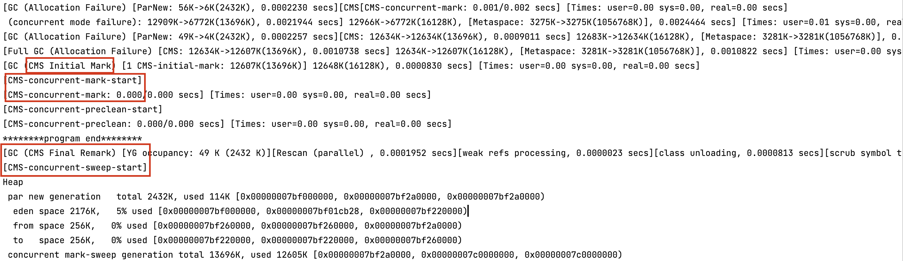

###垃圾回收器
垃圾回收器粗分的话有四种，即
1) 串行垃圾回收器（Serial）：它为单线程环境设计并且只使用一个线程进行垃圾回收，会暂停所有的用户线程。所以不适合服务器环境。  
2) 并行垃圾回收器（Parallel）：多个垃圾回收线程并行工作，此时用户线程是暂停的，适用于科学计算/大数据处理等弱交互场景。  
3) 并行垃圾回收器（CMS）：用户线程和垃圾收集线程同时执行（不一定是并行，可能交替执行），不需要停顿用户线程。互联网公司多用它，适用于对响应时间有要求的场景。  
4) G1垃圾回收器：G1垃圾回收器将堆内存分割成不同的区域然后并发的对其进行垃圾回收。  
<font color = 'red'>注：串行垃圾回收器和并行垃圾回收器，会进行 STW (Stop The World) 操作，即停下手中所有事。</font>

>串行垃圾回收器：类似于客人坐在一张桌子，来了一个服务员过来收拾桌子，但需要客人先离开桌子  
并行垃圾回收器：类似于客人坐了一张桌子，来了一群服务员来收拾桌子，客人也需要离开桌子，但收拾的速度比单个服务员快  
并发垃圾回收器：类似于客人拼桌，其中一个客人走了，一边有客户继续吃饭、一边有服务员收拾桌子

垃圾回收器细分的话有七种，即
`UseSerialOldGC`，UseSerialGC, UseParallelGC, UseConcMarkSweepGC, UseParNewGC, UseParallelOldGG, UseG1GC。其中UseSerialOldGC随着Java8以后升级的，已经被废弃淘汰了。类似于GC中引用计数算法已经被淘汰了，但是介绍知识体系的时候会提到。

#####查看垃圾回收器
```java
java -XX: +PrintCommandLineFlags -version
```
输出结果实例：
```java
-XX:ConcGCThreads=2 -XX:G1ConcRefinementThreads=8 -XX:GCDrainStackTargetSize=64 -XX:InitialHeapSize=134217728 -XX:MarkStackSize=4194304 -XX:MaxHeapSize=2147483648 -XX:MinHeapSize=6815736 -XX:+PrintCommandLineFlags -XX:ReservedCodeCacheSize=251658240 -XX:+SegmentedCodeCache -XX:+UseCompressedClassPointers -XX:+UseCompressedOops -XX:+UseG1GC 
openjdk version "18.0.2" 2022-07-19
OpenJDK Runtime Environment (build 18.0.2+9-61)
OpenJDK 64-Bit Server VM (build 18.0.2+9-61, mixed mode, sharing)

```
#####配置垃圾回收器
```java
-XX:+UseParallelGC
```

输出结果示例：
```java
-XX:InitialHeapSize=134217728 -XX:MaxHeapSize=2147483648 -XX:+PrintCommandLineFlags -XX:+UseCompressedClassPointers -XX:+UseCompressedOops -XX:+UseParallelGC 
openjdk version "1.8.0_362"
OpenJDK Runtime Environment Corretto-8.362.08.1 (build 1.8.0_362-b08)
OpenJDK 64-Bit Server VM Corretto-8.362.08.1 (build 25.362-b08, mixed mode)
```
#####新生代老年代垃圾回收算法概览

新生代：Serial、ParNew、Parallel Scavenge、G1
老年代：CMS、Serial Old、Parallel Old、G1
此外，新生代/老年代算法通常是按图上线条成对出现，比如新生代使用Serial算法、老年代使用Serial Old算法

#####垃圾收集器参数说明
DefNew: Default New Generation
Tenured: Old Generation
ParNew: Parallel New Generation
PSYoungGen: Parallel Scavenge
ParOldGen: Parallel Old Generation

####Serial垃圾收集器


####Serial Old收集器
serial Old 是Serial垃圾收集器老年代版本，它同样是个单线程的收集器，使用标记-整理算法，这个收集器也主要是运行在Client默认的java虚拟机默认的年老代垃圾收集器。
在Server模式下，主要有两个用途（了解，版本已经到Java8及以后）
1. 在JDK1.5之前版本中与新生代的Parallel Scavenge 收集器搭配使用。 (Parallel Scavenge + Serial old）
2. 作为老年代版中使用CMS收集器的后备垃圾收集方案。

####ParNew垃圾收集器

常用对应JVM参数：<font color='red'>-XX:+UseParNewGC（启用ParNew收集器，只影响新生代的收集，不影响老年代）</font>
开启上述参数后，会使用：ParNew(Young区用) + Serial Old的收集器组合，新生代使用复制算法，老年代采用标记-整理算法。但是，**ParNew+Tenured这样的搭配，java8己经不再被推荐。**
>OpenJDK 64-Bit Server VM warning: Using the ParNew young collector with the Serial old collector is deprecated and will likely be removed in a future release

如果想控制并行回收的线程数，可使用以下命令
>-XX:ParallelGCThreads=N（N为限制线程数量，默认开启和CPU数目相同的线程数）

cu>8 N= 5/8 ？？？
Cpu<8 N=实际个数

####Parallel Scavenge收集器
Parallel Scavenge收集器类似ParNew也是一个新生代垃圾收集器，使用复制算法，也是一个并行的多线程的垃圾收集器，俗称吞吐量优先收集器。简言之：串行收集器在新生代和老年代的并行化。


它重点关注的是：可控制的吞吐量（Thoughput=运行用户代码时间/(运行用户代码时间+垃圾收集时间)，也即比如程序运行100分钟，垃圾收集时间1分钟，吞吐量就是99%）。高吞吐量意味着高效利用CPU的时间，**它多用于在后台运算而不需要太多交互的任务**。

常用JVM参数：-XX:+UseParallelGC或-XX:+UseParallelOldGC（可互相激活）使用Parallel Scanvenge收集器。

>自适应调节策略是Parallel Scavenge收集器与ParNew收集器的一个重要区别。自适应调节策略：虚拟机会根据当前系统的运行情况收集性能监控信息，动态调整这些参数以提供最合适的停顿时间（-XX:MaxGCPauseMillis）或最大的吞吐量。

####Parallel Old收集器
Parallel Old收集器是Parallel Scavenge的老年代版本，使用多线程的标记-整理算法，Parallel Old收集器在JDK1.6才开始提供。
JVM常用参数：-XX:+UseParallelOldGC使用Parallel Old收集器，设罝该参数后，新生代Parallel + 老年代Parallel Old。

- 在JDK1.6之前，新生代使用Parallel Scavenge收集器只能搭配年老代的Serial Old收集器，只能保证新生代的吞吐量优先，无法保
  证整体的吞吐量。

- <font color = 'blue'>Parallel Old正是为了在老年代同样提供吞吐量优先的垃圾收集器</font>，如果系统对吞吐量要求比较高，JDK1.8后可以优先考虑新生代Parallel Scavenge和老年代Parallel Old收集器的搭配策略。

即：
在JDK1.6之前（Parallel Scavenge + Serial Old）  
在JDK1.8及后（Parallel Scavenge + Parallel Old）

>注：开启了-XX:+UseParallelOldGC，会同时开启新生代Parallel Scavenge收集器。开启了-XX:+UseParallelGC，会同时开启老年代ParallelOld收集器。


####CMS垃圾收集器
Concurrent Mark Sweep并发标记清除，并发收集低停顿，并发指的是与用户线程一起执行。


开启该收集器的JVM参数：-XX:+UseConcMarkSweepGC开启该参数后会自动将-XX:+UseParNewGC打开。使用ParNew（Young区用）+ CMS（Old区 用）+ Serial Old的收集器组合，<font color='blue'>Serial Old将作为CMS出错的后备收集器</font>。
>由于并发进行，CMS在收集与应用线程会同时会增加对堆内存的占用，也就是说，<font color = 'red'>CMS必须要在老年代
堆内存用尽之前完成垃圾回收</font>，否则CMS回收失败时，将触发担保机制，串行老年代收集器将会以
STW的方式进行一次GC，从而造成较大停顿时间。

#####CMS算法概述

注意：<font color = 'red'>Initial Mark和Remark仍需要STW(Stop The World)</font>。但由于耗时最长的Concurrent Mark并发标记和Concurrent Sweep并发清除过程，垃圾收集线程可以和用户现在一起并发工作，所以总体上来看CMS收集器的内存回收和用户线程是一起并发地执行。

#####CMS运行实测


####G1垃圾收集器
G1之前的垃圾收集器的特点：
- 年轻代和老年代是各自独立且连续的内存块：
- 年轻代收集使用単Eden+S0+S1进行复制算法：
- 老年代收集必须扫描整个老年代区域；
- 都是以尽可能少而快速地执行GC为设计原则。

####G1收集器
#####什么是G1垃圾收集器
参考官网：https://www.oracle.com/technetwork/tutorials/tutorials-1876574.html
The Garbage-First (G1) collector is a server-style garbage collector, targeted for multi-processor machines with large memories. It meets garbage collection (GC) pause time goals with a high probability, while achieving high throughput. The G1 garbage collector is fully supported in Oracle JDK 7 update 4 and later releases. The G1 collector is designed for applications that:

- Can operate concurrently with applications threads like the CMS collector.
- Compact free space without lengthy GC induced pause times.
- Need more predictable GC pause durations.
- Do not want to sacrifice a lot of throughput performance.
- Do not require a much larger Java heap.

#####G1垃圾收集器的特点
1. G1能充分利用多CPU、多核环境硬件优势，尽量缩短STW。
2. G1整体上采用标记-整理算法，局部是通过复制算法，<font color = 'blue'>不会产生内存碎片</font>。
3. 宏观上看G1之中不再区分年轻代和老年代。`把内存划分成多个独立的子区域（Region）`，可以近似理解为一个围棋的棋盘。
4. G1收集器里面讲整个的内存区都混合在一起了，`但其本身依然在小范围内要进行年轻代和老年代的区分`，保留了新生代和老年代。但它们不再是物理隔离的，而是一部分Region的集合且不需要Region是连续的，也就是说依然会采用不同的GC方式来处理不同的区域。
5. G1虽然也是分代收集器，但`整个内存分区不存在物理上的年轻代与老年代的区别`，也不需要完全独立的survivor(to space)堆做复制淮备。`G1只有逻辑上的分代概念`，或者说每个分区都可能随G1的运行在不同代之问前后切换。

<font color = 'red'>G1收集器的设计目标是取代CMS收集器</font>，它同CMS相比，在以下方面表现的更出色：
1. G1是一个有整理内存过程的垃圾收集器，不会产生很多内存碎片。
2. G1的Stop The World(STW)更可控，G1在停顿时间上添加了预测机制，`用户可以指定期望停顿时间`。

#####G1收集器的核心思想
核心思想是将整个堆内存区域分成大小相同的子区域(Region)，在JVM启动时会自动设置这些子区域的大小，在堆的使用上，G1并不要求对象的存储一定是物理上连续的只要逻辑上连续即可，每个分区也不会固定地为某个代服务，可以按需在年轻代和老年代之间切换。

启动时可以通过参数-XX:G1HeapRegionSize=n可指定分区大小(1MB～32MB，且必须是2的幂)，默认将整堆划分为2048个分区。大小范围在1MB~32MB，最多能设置2048个区域，也即能够支持的最大内存为：32MB * 2048=65536MB=64G内存。

#####G1收集器下的Young GC
针对Eden区进行收集，Eden区耗尽后会被触发，主要是小区域收集 ＋形成连续的内存块，避免内存碎片
- Eden区的数据移动到Survivor区，假如出现Survivor区空间不够，Eden区数据会晋升到Old区。
- Survivor区的数据移动到新的Survivor区，部会数据晋升到Old区
- 最后Eden区收拾干净了，GC结束，用户的应用程序继续执行。
  
  

#####G1收集器运行图
初始标记：只标记GC Roots 能直接关联到的对象
并发标记：进行GC Roots Tracing的过程
最终标记：修正并发标记期间，因程序运行导致标记发生变化的那一部分对象
筛选回收：根据时间来进行价值最大化的回收
形如：


实际运行效果：
.png)

#####G1常用参数（了解）
- -XX:+UseG1GC
- -XX:G1HeapRegionSize=n: 设置G1区域的大小。值是2的幂，范围是1M到32M。目标是根据最小的Java堆大小划分出约2048个区域
- -XX:MaxGCPauseMillis=n: 最大停顿时间，这是个软目标，JVM将尽可能（但不保证）停顿时间小于这个时间
- -XX:InitiatingHeapOccupancyPercent=n: 堆占用了多少的时候就触发GC，默认是45
- -XX:ConcGCThreads=n: 并发GC使用的线程数
- -XX:G1ReservePercent=n: 设置作为空闲空间的预留内存百分比，以降低目标空间溢出的风险，默认值是10%

####垃圾收集器总结
#####各垃圾收集器使用场景
- 单CPU或小内存，单机程序
    ```
    -XX:+UseSerialGC
    ```
- 多CPU，需要最大吞吐量，如后台计算型应用
    ```
    -XX:+UseParallelGC或者-XX:+UseParallelOldGC
    ```
- 多CPU，追求低停顿时间，需快速响应如互联网应用
    ```
    -XX:+UseConcMarkSweepGC  
    -XX:+ParNewGC
    ```

#####垃圾收集器配置参数及算法汇总


#### JVMGC结合SpringBoot微服务优化
1.使用mvn celan package打包
2.在有包的路径下，运行jar命令，公式如下：
java -server jvm的各种参数 -jar 第1步上面的jar/war包名宇
>java -server -Xms1024m -Xmx1024m -XX:+UseG1GC - jar springboot2019-1.0-SNAPSHOT.war