### Linux命令
#### 整机命令
```
top
```
运行效果：

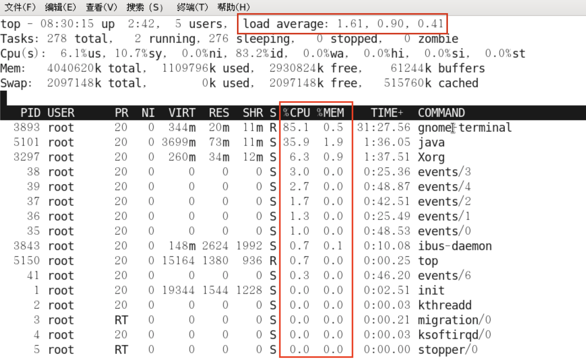
一般主要看图上标红框的几个参数：CPU、MEM、Load average，其中负载均衡Load average后的三个数字分别代表系统1分钟、5分钟、15分钟的负载值，`如果三个值的和 / 3 * 100% > 60%，代表系统的压力重`。

按键盘数字1后的效果，可查看CPU使用详情：

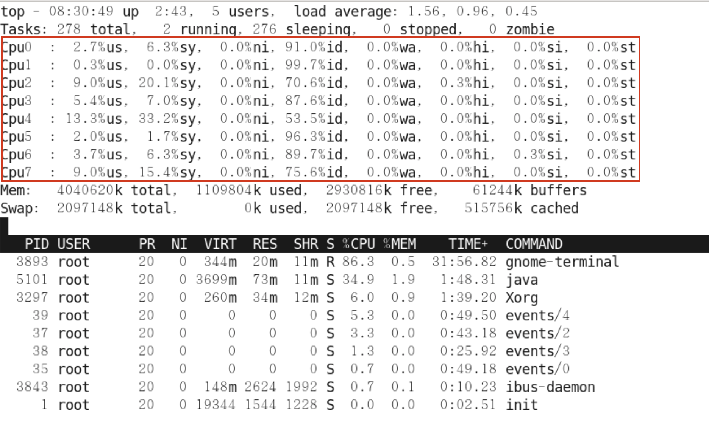
注：用苹果电脑未复现，展不开数据

```
uptime
```
uptime是top命令的精简版，运行效果如下：

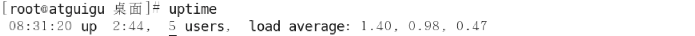

#### CPU命令
```
vmstat -n 采样间隔秒数 采样次数
```
一股vmstat工具的使用是通过两个数字参数来完成的，第一个参数是采样的时间间隔数单位是秒，第一个参数是采样的次数。主要关注下图红框处参数值：

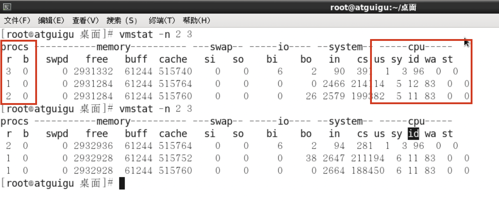
其中，
- procs
  - r：运行和等待CPU时间片的进程数，原则上1核的CPU的运行队列不要超过2，整个系统的运行队列不能超过总核数的2倍
  否则代表系统压力过大。
  - b：等待资源的进程数，比如正在等待磁盘I/O、网络I/O等。
- cpu
  - us：用户进程消耗CPU时间百分比，us值高，用户进程消托CPU时间多，如果长期大于50%，优化程序。
  - sy：内核进程消耗CPU时间百分比。
  - us + sy参考值为80%，如果us + sy大于80%，说明可能存在CPU不足。
  - id：处于空闲的CPU百分比。
  - wa：系统等待IO的CPU时间百分比。
  - st：来自于一个虚拟机偷取的CPU时间的百分比。

``` 
mpstat -P ALL 采样间隔秒数
```
mpstat用于查看所有CPU核信息。它要相比vmstat，可以查看到额外的CPU信息。
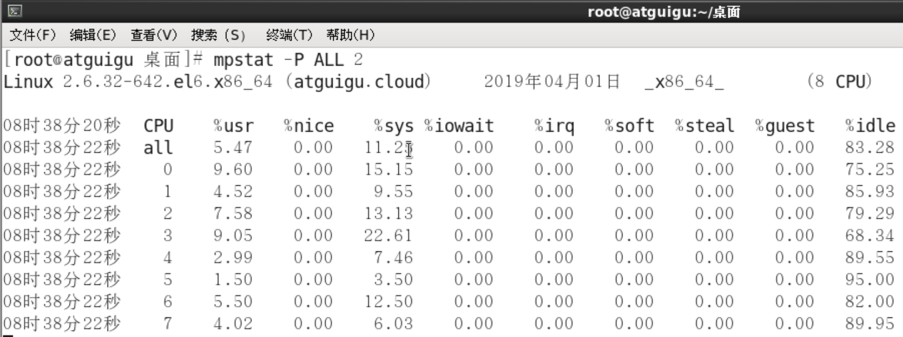

``` 
pidstat -u 采样间隔秒数 -p 进程号
```
pidstat用于查看进程使用CPU用量分解信息。
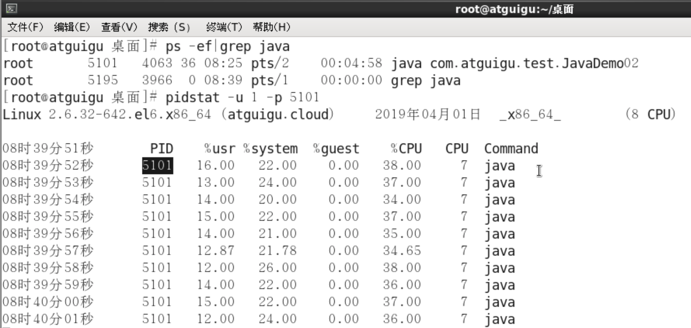

#### 内存
``` 
free
```
free主要用于查看Linux机器的内存信息。  

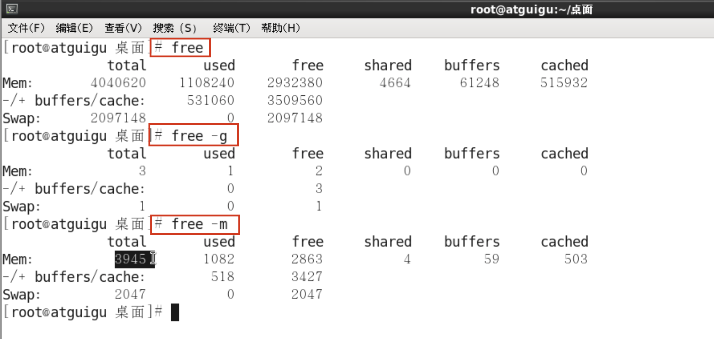
其中，free查询的结果以字节形式展示；free -g查询的结果以GB形式展示，会进行四舍五入；**free -m查询结果以MB形式展示，最为常用**。

``` 
pidstat -p 进程号 -r 采样间隔秒数
```
pidstat主要用于查看进程占用内存信息。  

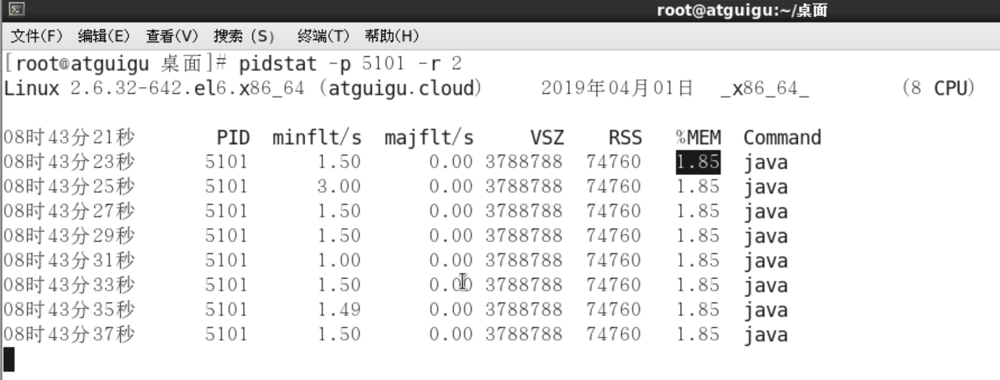

#### 磁盘
``` 
df
```
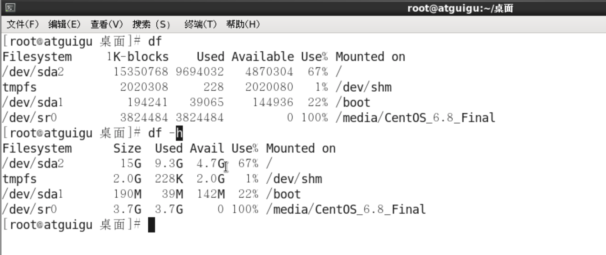
其中，df查询的即过以字节形式展示；df -h以GB、KB、GB形式展示，更加清晰、明了。

#### 磁盘IO
``` 
iostat -xdk 采样次数 采样间隔秒数
```
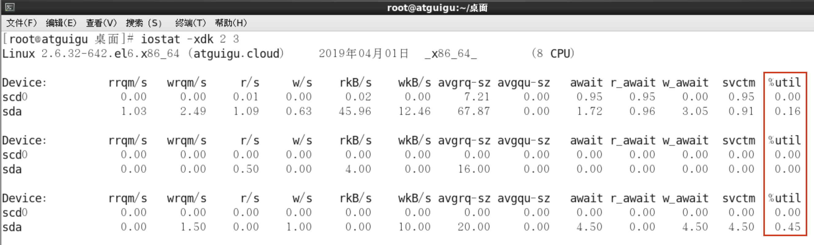
其中，  
rkB/s 每秒读取数据量kB；  
wkB/s 每秒写入数据量kB；  
svctm I/O请求的平均服务时间，单位毫秒；  
await I/O请求的平均等待时间，单位毫秒；值越小，性能越好；  
<font color='red'>util 一秒中有百分几的时间用于I/O操作。接近100%时，表示磁盘带宽跑满，需要优化程序或者增加磁盘；</font>  
rkB/s、wkB/s根据系统应用不同会有不同的值，但有规律遵循：长期、超大数据读写，肯定不正常，需要优化程序读取；   
svctm的值与await的值很接近，表示几乎没有I/O等待，磁盘性能好，如果await的值远高于svctm的值，则表示I/O队列等待太长，需要优化程序或更换更快磁盘。

```
pidstat -d 采样间隔数 -p 进程号
```
使用pidstat也可以用于查看进程的IO读写情况。  
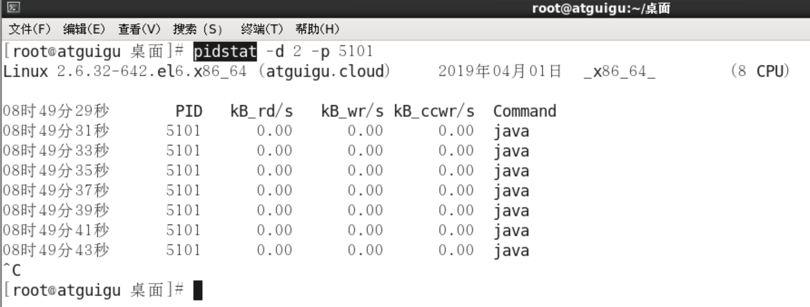

#### 网络IO
```
ifstat
```
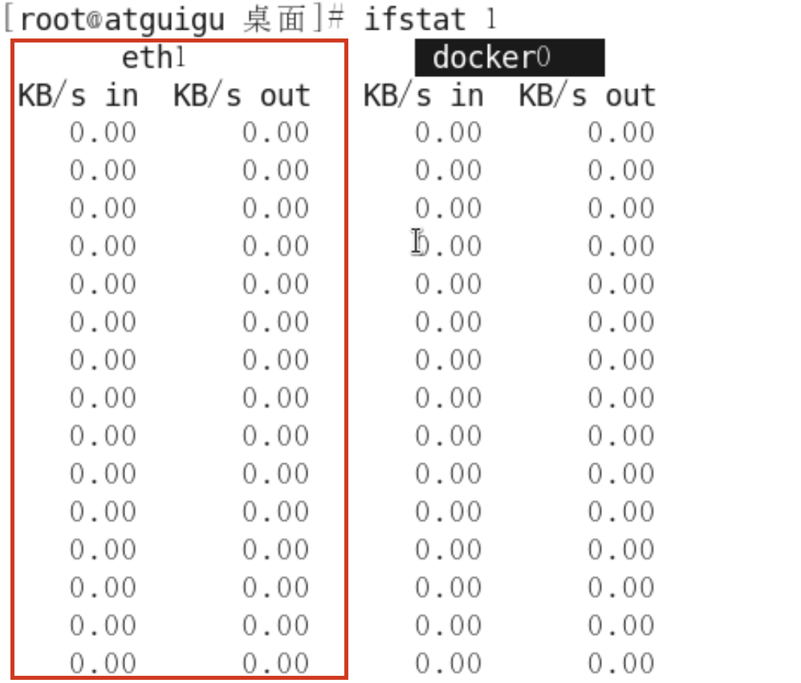
该命令默认本地没有，需安装
>wget http://gael.roualland.free.fr/ifstat/ifstat-1.1.tar.gz  
tar xzvf ifstat-1.1.tar.gz  
cd ifstat-1.1   
./configure   
make   
make install

##### 假如生产环境出现CPU占用过高，请谈谈你的分析定位思路（🌟待实测）
1. 先用top命令找出CPU占比最高的
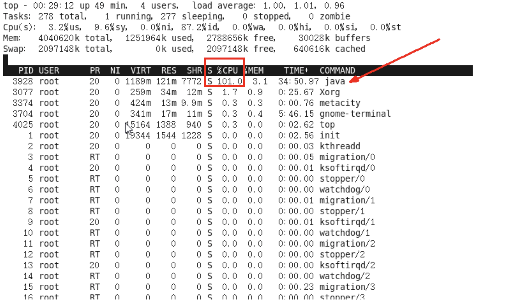
2. ps -ef或者jps进一步定位，得知是一个怎么样的一个后台程序
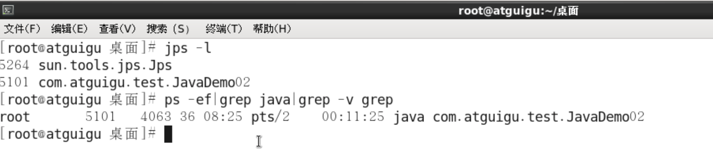
3. <font color='red'>定位到具体线程或者代码</font>
    ```
    ps -mp 进程号 -o THREAD, tid, time
    ```
   >-m 显示所有的线程  
    -p pid 进程使用cpu的时间  
    -o 该参数后是用户自定义格式  
   
    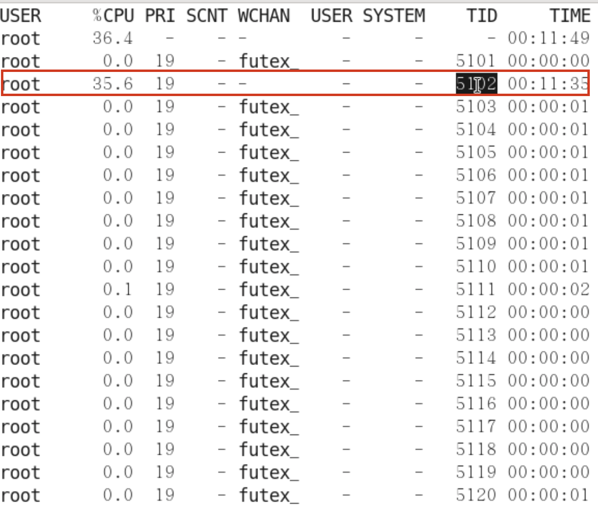
   
4. 将需要的<font color='red'>线程ID</font>转换为16进制格式(英文小写格式）
    >lijunxin@lijunxins-Air ~ % printf “%x” 5102  
     “13ee”%
5. jstack <font color='red'>进程ID</font> | grep tid(16进制线程ID小写英文)-A60
    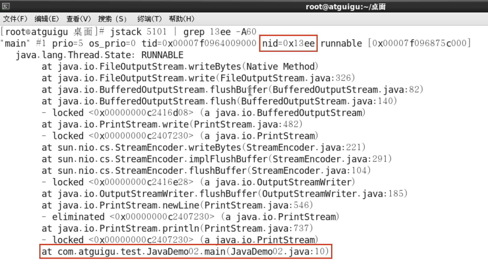
    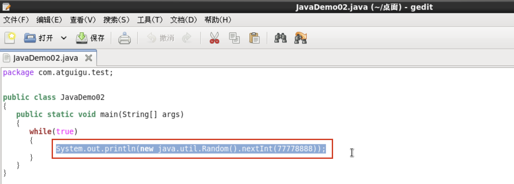