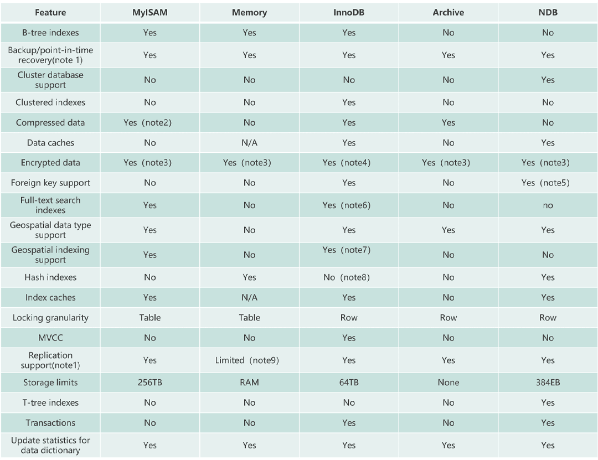

### NULL 和 '' 的区别是什么？  
NULL 跟 ''(空字符串)是两个完全不一样的值，区别如下：
- NULL 代表一个不确定的值,就算是两个 NULL,它俩也不一定相等。例如，SELECT NULL=NULL的结果为 false，但是在我们使用DISTINCT,GROUP BY,ORDER BY时,NULL又被认为是相等的。
- 空字符串''的长度是 0，是不占用空间的，而NULL在某些数据库中可能是需要占用空间的。
- NULL 会影响聚合函数的结果。例如，SUM、AVG、MIN、MAX 等聚合函数会忽略 NULL 值。 COUNT 的处理方式取决于参数的类型。如果参数是 *(COUNT(*))，则会统计所有的记录数，包括 NULL 值；如果参数是某个字段名(COUNT(列名))，则会忽略 NULL 值，只统计非空值的个数。
- 查询 NULL 值时，必须使用 IS NULL 或 IS NOT NULLl 来判断，而不能使用 =、!=、 <、> 之类的比较运算符。而''是可以使用这些比较运算符的。 

另外一个高频面试题：“为什么 MySQL 不建议使用 NULL 作为列默认值？”，也是同理。

### MyISAM 和 InnoDB 有什么区别？
MySQL 5.5 之前，MyISAM 引擎是 MySQL 的默认存储引擎；
MySQL 5.5 版本之后，InnoDB 是 MySQL 的默认存储引擎。
- InnoDB 支持行级别的锁粒度，MyISAM 不支持，只支持表级别的锁粒度。
- MyISAM 不提供事务支持。InnoDB 提供事务支持，实现了 SQL 标准定义了四个隔离级别。
- MyISAM 不支持外键，而 InnoDB 支持。
- MyISAM 不支持 MVCC（Multi Version Concurrency Control），而 InnoDB 支持。
- MyISAM 引擎和 InnoDB 引擎都是使用 B+Tree 作为索引结构，但是两者的实现方式不太一样。
- MyISAM 不支持数据库异常崩溃后的安全恢复，而 InnoDB 支持。
- InnoDB 的多核性能利用率比 MyISAM 更高。

几种常见数据库引擎对比

### 事务的四个特性
- 原子性（Atomicity）：事务是最小的执行单位，不允许分割。事务的原子性确保动作要么全部完成，要么完全不起作用；  
- 一致性（Consistency）：执行事务前后，数据保持一致，例如转账业务中，无论事务是否成功，转账者和收款人的总额应该是不变的；  
- 隔离性（Isolation）：并发访问数据库时，一个用户的事务不被其他事务所干扰，各并发事务之间数据库是独立的；  
- 持久性（Durability）：一个事务被提交之后。它对数据库中数据的改变是持久的，即使数据库发生故障也不应该对其有任何影响。  

### 并发事务存在的问题
- 脏读（Dirty Read）： 当一个事务读取了另一个事务尚未提交的数据时发生。如果这个事务之后回滚了，读取的数据就是无效的，这可能会导致错误的结果。
- 不可重复读（Non-Repeatable Read）： 在一个事务内，同一条记录在不同的时间点被读取，但是它们的值不一样。这可能会导致事务在两次读取间看到不一致的数据。
- 幻读（Phantom Read）： 在一个事务内，同样的查询多次执行，但是返回的结果集不一致。这可能是由于其他事务插入了新的数据或删除了数据所致。
- 丢失更新（Lost Update）： 两个事务同时对同一条记录进行修改，其中一个事务的更新可能会被另一个事务覆盖，导致部分更新丢失。

### 共享锁和排他锁
不论是表级锁还是行级锁，都存在共享锁（Share Lock，S 锁）和排他锁（Exclusive Lock，X 锁）这两类：  
共享锁（Share Lock，S锁）：又称读锁，事务在读取记录的时候获取共享锁，允许多个事务同时获取（锁兼容）。  
排他锁（Exclusive Lock，X锁）：又称写锁/独占锁，事务在修改记录的时候获取排他锁，不允许多个事务同时获取。如果一个记录已经被加了排他锁，那其他事务不能再对这条事务加任何类型的锁（锁不兼容）。排他锁与任何的锁都不兼容，共享锁仅和共享锁兼容。

|  隔离级别   | S 锁 | X 锁 | 
|  ----  | ----  |-----|
| S 锁  | 不冲突 | 冲突 |
| X 锁  | 冲突 | 冲突   |
