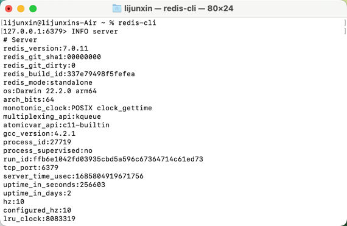
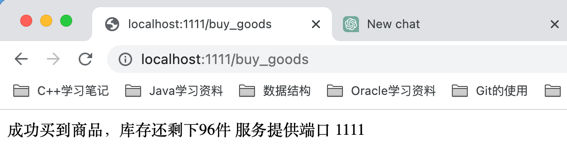
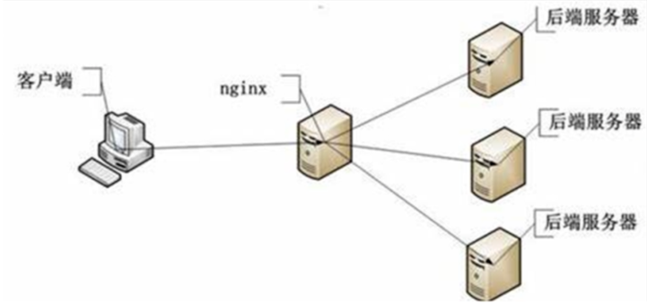
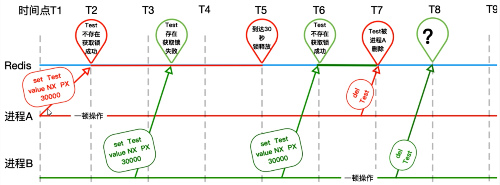
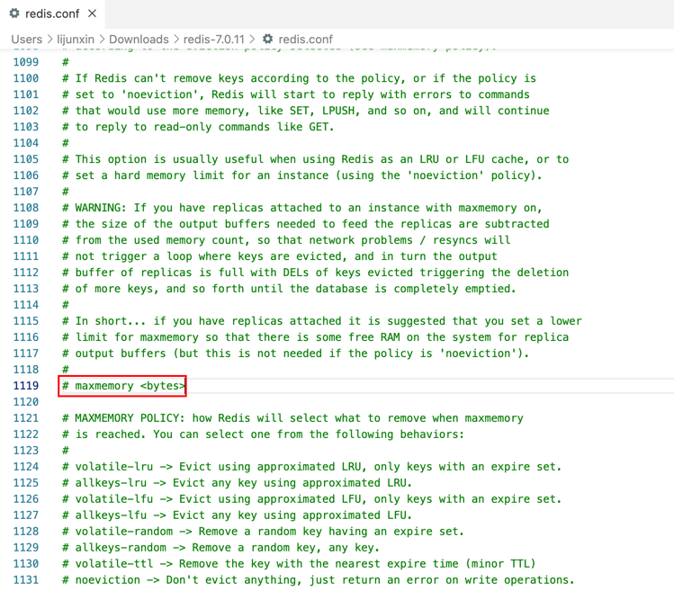
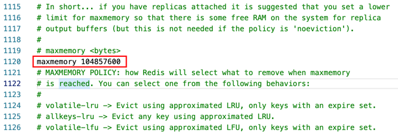
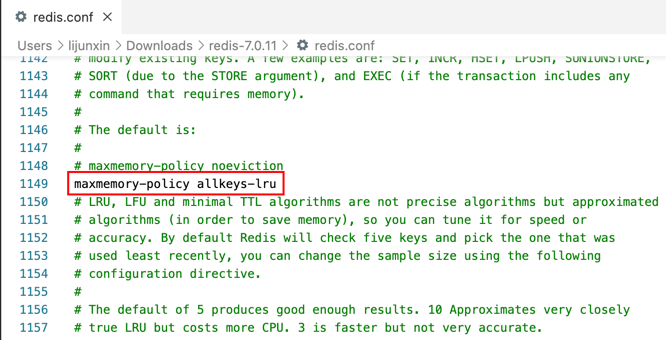

### mac 电脑 redis 的安装
1. 安装 redis
```
brew install redis
```
一般安装成功后，程序文件存放目录: /usr/local/opt/redis，配置文件存放目录: /usr/local/etc/...。
2. 添加 path 
```
vim ~/.bash_profile
```
如果使用的是默认安装路径，一般安装在/usr/local/opt/redis。

```
export REDIS = /usr/local/opt/reids/bin;
export = $REDIS:$PATH
```
3. 启动 redis-server  
```
brew services start redis
```
未进入 redis 命令行前，可通过查看如下代码查看 redis 版本
``` 
redis-server --version
```
4. 进入 redis 命令行
```
redis-cli
```
进入 redis 命令行后，可通过查看如下代码查看 redis 版本
``` 
INFO server
```




| 商品操作                          | redis命令                               |
|:------------------------------|:--------------------------------------|
| 商品编号1001的销量是9，商品编号1002的销量是15  | zadd goods:sellsort 9 1001 15 1002    |
| 有一个客户又买了2件商品1001，商品编号1001销量加2 | zincrby goods:sellsort 2 1001         |
| 求商品销量前10名                     | zrange goods:sellsort 0 10 withscores |

```
127.0.0.1:6379> zadd goods:sellsort 9 1001 15 1002
(integer) 2
127.0.0.1:6379> zrange goods:sellsort 0 10 withscores
1) "1001"
2) "9"
3) "1002"
4) "15"
127.0.0.1:6379> zincrby goods:sellsort 2 1001
"11"
127.0.0.1:6379> zrange goods:sellsort 0 10 withscores
1) "1001"
2) "11"
3) "1002"
4) "15"
```

### redis实践
```java {.line-numbers}
/**
 * @author andy_ruohan
 * @description springBoot整合redis进行商品售卖
 * 此例在高并发环境下会出现超卖、超售的情况
 * @date 2023/6/4 12:54
 */
@RestController("GoodsController1")
@RequestMapping("/factory1")
public class GoodsController {
    @Autowired
    private StringRedisTemplate stringRedisTemplate;

    @Value("${server.port}")
    private String severPort;

    @GetMapping("/buy_goods")
    public String buyGoods() {
        String result = stringRedisTemplate.opsForValue().get("goods:001");
        int goodsNumber = result == null ? 0: Integer.parseInt(result);

        if (goodsNumber > 0) {
            int realNumber = goodsNumber - 1;
            stringRedisTemplate.opsForValue().set("goods:001", String.valueOf(realNumber));
            System.out.println("成功买到商品，库存还剩下" + realNumber + "件" + "\t服务提供端口 " + severPort);

            return "成功买到商品，库存还剩下" + realNumber + "件" + "\t服务提供端口 " + severPort;
        } else {
            System.out.println("商品已经售完/活动结束/调用超时，欢迎下次光临" + "\t服务提供端口 " + severPort);
        }
        return "商品已经售完/活动结束/调用超时，欢迎下次光临" + "\t服务提供端口 " + severPort;
    }
}
```
运行结果：


以上代码在高并发环境会出现的问题：
##### 问题1：18~19行非原子性
##### 问题2：20行条件会被越过

###### 错误优化：加synchronized（18行）
```java {.line-numbers}
/**
 * @author andy_ruohan
 * @description springBoot整合redis进行商品售卖
 * 试图以synchronized解决并发问题，单例部署没问题，但实际生产【Nginx+多实例】的方式部署，一样会出问题
 * @date 2023/6/4 12:54
 */
@RestController("GoodsController2")
@RequestMapping("/factory2")
public class GoodsController {
    @Autowired
    private StringRedisTemplate stringRedisTemplate;

    @Value("${server.port}")
    private String severPort;

    @GetMapping("/buy_goods")
    public String buyGoods() {
        synchronized (this) {
            String result = stringRedisTemplate.opsForValue().get("goods:001");
            int goodsNumber = result == null ? 0: Integer.parseInt(result);

            if (goodsNumber > 0) {
                int realNumber = goodsNumber - 1;
                stringRedisTemplate.opsForValue().set("goods:001", String.valueOf(realNumber));
                System.out.println("成功买到商品，库存还剩下" + realNumber + "件" + "\t服务提供端口 " + severPort);

                return "成功买到商品，库存还剩下" + realNumber + "件" + "\t服务提供端口 " + severPort;
            } else {
                System.out.println("商品已经售完/活动结束/调用超时，欢迎下次光临" + "\t服务提供端口 " + severPort);
            }
            return "商品已经售完/活动结束/调用超时，欢迎下次光临" + "\t服务提供端口 " + severPort;
        }
    }
}
```
在18行处添加synchronized (this)，实际生产环境解决不了高并发问题：因为服务器端会通过nginx代理多台服务器，高并发的请求还是会进来，处理不了`超卖`、`多卖`的情况。


> 加锁场景拓展补充：  
> synchronized：不见不散，适用场景：等不到就一直等
reentrantLock：过时不候，适用场景：等了一段时间不想等了

###### 正确优化：redis分布式锁（19～23行）
```java {.line-numbers}
/**
 * @author andy_ruohan
 * @description springBoot整合redis进行商品售卖
 * 试图以redis分布式锁来解决并发问题，但没有考虑异常导致释放锁失败
 * @date 2023/6/4 12:54
 */
@RestController("GoodsController3")
@RequestMapping("/factory3")
public class GoodsController {
    public static final String REDIS_LOCK = "redisLock";
    @Autowired
    private StringRedisTemplate stringRedisTemplate;

    @Value("${server.port}")
    private String severPort;

    @GetMapping("/buy_goods")
    public String buyGoods() {
        String value = UUID.randomUUID().toString() + Thread.currentThread().getName();
        Boolean flag = stringRedisTemplate.opsForValue().setIfAbsent(REDIS_LOCK, value);
        if (Boolean.FALSE.equals(flag)) {
            return "抢锁失败，请稍后重试";
        }

        String result = stringRedisTemplate.opsForValue().get("goods:001");
        int goodsNumber = result == null ? 0: Integer.parseInt(result);

        if (goodsNumber > 0) {
            int realNumber = goodsNumber - 1;
            stringRedisTemplate.opsForValue().set("goods:001", String.valueOf(realNumber));
            System.out.println("成功买到商品，库存还剩下" + realNumber + "件" + "\t服务提供端口 " + severPort);
            stringRedisTemplate.delete(REDIS_LOCK);
            return "成功买到商品，库存还剩下" + realNumber + "件" + "\t服务提供端口 " + severPort;
        } else {
            System.out.println("商品已经售完/活动结束/调用超时，欢迎下次光临" + "\t服务提供端口 " + severPort);
        }
        return "商品已经售完/活动结束/调用超时，欢迎下次光临" + "\t服务提供端口 " + severPort;
    }
}
```

##### 问题3：出现异常的话，无法释放锁，必须在代码层面finally释放锁  
解决：加锁解锁，lock/unlock必须同时出现并保证调用（38~40行）
``` java {.line-numbers}
/**
 * @author andy_ruohan
 * @description springBoot整合redis进行商品售卖
 * 试图【以redis分布式锁+异常释放锁】来解决并发问题，但没有考虑实例中途宕机不能释放锁的情况
 * @date 2023/6/4 12:54
 */
@RestController("GoodsController4")
@RequestMapping("/factory4")
public class GoodsController {
    public static final String REDIS_LOCK = "redisLock";
    @Autowired
    private StringRedisTemplate stringRedisTemplate;

    @Value("${server.port}")
    private String severPort;

    @GetMapping("/buy_goods")
    public String buyGoods() {
        String value = UUID.randomUUID().toString() + Thread.currentThread().getName();
        try {
            Boolean flag = stringRedisTemplate.opsForValue().setIfAbsent(REDIS_LOCK, value);
            if (Boolean.FALSE.equals(flag)) {
                return "抢锁失败，请稍后重试";
            }

            String result = stringRedisTemplate.opsForValue().get("goods:001");
            int goodsNumber = result == null ? 0: Integer.parseInt(result);

            if (goodsNumber > 0) {
                int realNumber = goodsNumber - 1;
                stringRedisTemplate.opsForValue().set("goods:001", String.valueOf(realNumber));
                System.out.println("成功买到商品，库存还剩下" + realNumber + "件" + "\t服务提供端口 " + severPort);
                return "成功买到商品，库存还剩下" + realNumber + "件" + "\t服务提供端口 " + severPort;
            } else {
                System.out.println("商品已经售完/活动结束/调用超时，欢迎下次光临" + "\t服务提供端口 " + severPort);
            }
            return "商品已经售完/活动结束/调用超时，欢迎下次光临" + "\t服务提供端口 " + severPort;
        } finally {
            stringRedisTemplate.delete(REDIS_LOCK);
        }
    }
}
```

##### 问题4：部署了微服务jar包的实例挂了，代码层面根本没有走到finally，没办法保证解锁，这个key没有被删除，需要加入一个过期时间限定key  
解决：需要对LockKey有过期时间的限定（22行）
```java {.line-numbers}
/**
 * @author andy_ruohan
 * @description springBoot整合redis进行商品售卖
 * 试图【以redis分布式锁+异常释放锁+超时释放锁】来解决并发问题，但没有考虑加锁和超时解锁分开了，没有考虑原子性
 * @date 2023/6/4 12:54
 */
@RestController("GoodsController5")
@RequestMapping("/factory5")
public class GoodsController {
    public static final String REDIS_LOCK = "redisLock";
    @Autowired
    private StringRedisTemplate stringRedisTemplate;

    @Value("${server.port}")
    private String severPort;

    @GetMapping("/buy_goods")
    public String buyGoods() {
        String value = UUID.randomUUID().toString() + Thread.currentThread().getName();
        try {
            Boolean flag = stringRedisTemplate.opsForValue().setIfAbsent(REDIS_LOCK, value);
            stringRedisTemplate.expire(REDIS_LOCK, 10L, TimeUnit.SECONDS);

            if (Boolean.FALSE.equals(flag)) {
                return "抢锁失败，请稍后重试";
            }

            String result = stringRedisTemplate.opsForValue().get("goods:001");
            int goodsNumber = result == null ? 0: Integer.parseInt(result);

            if (goodsNumber > 0) {
                int realNumber = goodsNumber - 1;
                stringRedisTemplate.opsForValue().set("goods:001", String.valueOf(realNumber));
                System.out.println("成功买到商品，库存还剩下" + realNumber + "件" + "\t服务提供端口 " + severPort);
                return "成功买到商品，库存还剩下" + realNumber + "件" + "\t服务提供端口 " + severPort;
            } else {
                System.out.println("商品已经售完/活动结束/调用超时，欢迎下次光临" + "\t服务提供端口 " + severPort);
            }
            return "商品已经售完/活动结束/调用超时，欢迎下次光临" + "\t服务提供端口 " + severPort;
        } finally {
            stringRedisTemplate.delete(REDIS_LOCK);
        }
    }
}
```

##### 问题5：设置key+过期超时分开了，不具备原子性  
解决：必须要合并成一行，具备原子性（21行）
```java {.line-numbers}
/**
 * @author andy_ruohan
 * @description springBoot整合redis进行商品售卖
 * 试图【以redis分布式锁+异常释放锁+超时释放锁(原子性)】来解决并发问题，但没有考虑错删他人锁的情况
 * @date 2023/6/4 12:54
 */
@RestController("GoodsController6")
@RequestMapping("/factory6")
public class GoodsController {
    public static final String REDIS_LOCK = "redisLock";
    @Autowired
    private StringRedisTemplate stringRedisTemplate;

    @Value("${server.port}")
    private String severPort;

    @GetMapping("/buy_goods")
    public String buyGoods() {
        String value = UUID.randomUUID().toString() + Thread.currentThread().getName();
        try {
            Boolean flag = stringRedisTemplate.opsForValue().setIfAbsent(REDIS_LOCK, value, 10L, TimeUnit.SECONDS);

            if (Boolean.FALSE.equals(flag)) {
                return "抢锁失败，请稍后重试";
            }

            String result = stringRedisTemplate.opsForValue().get("goods:001");
            int goodsNumber = result == null ? 0: Integer.parseInt(result);

            if (goodsNumber > 0) {
                int realNumber = goodsNumber - 1;
                stringRedisTemplate.opsForValue().set("goods:001", String.valueOf(realNumber));
                System.out.println("成功买到商品，库存还剩下" + realNumber + "件" + "\t服务提供端口 " + severPort);
                return "成功买到商品，库存还剩下" + realNumber + "件" + "\t服务提供端口 " + severPort;
            } else {
                System.out.println("商品已经售完/活动结束/调用超时，欢迎下次光临" + "\t服务提供端口 " + severPort);
            }
            return "商品已经售完/活动结束/调用超时，欢迎下次光临" + "\t服务提供端口 " + severPort;
        } finally {
            stringRedisTemplate.delete(REDIS_LOCK);
        }
    }
}
```


##### 问题6：张冠李戴，删除了别人的锁

解决：只能删除自己的，不能删除别人的（40~42行）  
```java {.line-numbers}
/**
 * @author andy_ruohan
 * @description springBoot整合redis进行商品售卖
 * 试图【以redis分布式锁+异常释放锁+超时释放锁(原子性)+判断是否删错锁】来解决并发问题，但没有考虑判删锁和删锁代码的原子性
 * @date 2023/6/11 14:58
 */
@RestController("GoodsController8")
@RequestMapping("/factory7")
public class GoodsController {
    public static final String REDIS_LOCK = "redisLock";
    @Autowired
    private StringRedisTemplate stringRedisTemplate;

    @Value("${server.port}")
    private String severPort;

    @GetMapping("/buy_goods")
    public String buyGoods() {
        String value = UUID.randomUUID().toString() + Thread.currentThread().getName();
        try {
            Boolean flag = stringRedisTemplate.opsForValue().setIfAbsent(REDIS_LOCK, value, 10L, TimeUnit.SECONDS);

            if (Boolean.FALSE.equals(flag)) {
                return "抢锁失败，请稍后重试";
            }

            String result = stringRedisTemplate.opsForValue().get("goods:001");
            int goodsNumber = result == null ? 0: Integer.parseInt(result);

            if (goodsNumber > 0) {
                int realNumber = goodsNumber - 1;
                stringRedisTemplate.opsForValue().set("goods:001", String.valueOf(realNumber));
                System.out.println("成功买到商品，库存还剩下" + realNumber + "件" + "\t服务提供端口 " + severPort);
                return "成功买到商品，库存还剩下" + realNumber + "件" + "\t服务提供端口 " + severPort;
            } else {
                System.out.println("商品已经售完/活动结束/调用超时，欢迎下次光临" + "\t服务提供端口 " + severPort);
            }
            return "商品已经售完/活动结束/调用超时，欢迎下次光临" + "\t服务提供端口 " + severPort;
        } finally {
            if (stringRedisTemplate.opsForValue().get(REDIS_LOCK).equals(value)) {
                stringRedisTemplate.delete(REDIS_LOCK);
            }
        }
    }
}
```

##### 问题7：判删锁和删锁代码需具备原子性
- 解决方案1：使用lua脚本40~58行（理论可参考redis官网：https://redis.io/commands/set/  ）

    ```java{.line-numbers}
    /**
    * @author andy_ruohan
    * @description springBoot整合redis进行商品售卖
    * 试图【以redis分布式锁+异常释放锁+超时释放锁(原子性)+Lua脚本删除锁】来解决并发问题，但仍余业务未完成而锁过期问题
    * @date 2023/6/11 15:01
    */
    @RestController
    @RequestMapping("/factory8_1")
    public class GoodsController {
        public static final String REDIS_LOCK = "redisLock";
        @Autowired
        private StringRedisTemplate stringRedisTemplate;

        @Value("${server.port}")
        private String severPort;

        @GetMapping("/buy_goods")
        public String buyGoods() throws Exception {
            String value = UUID.randomUUID().toString() + Thread.currentThread().getName();
            try {
                Boolean flag = stringRedisTemplate.opsForValue().setIfAbsent(REDIS_LOCK, value, 10L, TimeUnit.SECONDS);

                if (Boolean.FALSE.equals(flag)) {
                    return "抢锁失败，请稍后重试";
                }

                String result = stringRedisTemplate.opsForValue().get("goods:001");
                int goodsNumber = result == null ? 0 : Integer.parseInt(result);

                if (goodsNumber > 0) {
                    int realNumber = goodsNumber - 1;
                    stringRedisTemplate.opsForValue().set("goods:001", String.valueOf(realNumber));
                    System.out.println("成功买到商品，库存还剩下" + realNumber + "件" + "\t服务提供端口 " + severPort);
                    return "成功买到商品，库存还剩下" + realNumber + "件" + "\t服务提供端口 " + severPort;
                } else {
                    System.out.println("商品已经售完/活动结束/调用超时，欢迎下次光临" + "\t服务提供端口 " + severPort);
                }
                return "商品已经售完/活动结束/调用超时，欢迎下次光临" + "\t服务提供端口 " + severPort;
            } finally {
                try (Jedis jedis = RedisUtils.getJedis()) {
                    // 定义Lua脚本
                    String luaScript = "if redis.call(\"get\",KEYS[1]) == ARGV[1]\n" +
                            "then\n" +
                            "    return redis.call(\"del\",KEYS[1])\n" +
                            "else\n" +
                            "    return 0\n" +
                            "end";

                    // 执行Lua脚本
                    Object object = jedis.eval(luaScript, Collections.singletonList(REDIS_LOCK), Collections.singletonList(value));

                    // 处理执行结果
                    if ("1".equals(object)) {
                        System.out.println("Lock acquired successfully");
                    } else {
                        System.out.println("Failed to acquire lock");
                    }
                }
            }
        }
    }
    ```

    ```java
    /**
    * @author andy_ruohan
    * @description Redis工具类
    * @date 2023/6/17 21:23
    */
    public class RedisUtils {
        private static JedisPool jedisPool;

        static {
            JedisPoolConfig jedisPoolConfig = new JedisPoolConfig();
            jedisPoolConfig.setMaxTotal(20);
            jedisPoolConfig.setMaxIdle(10);
            jedisPool = new JedisPool(jedisPoolConfig, "127.0.0.1", 6379);
        }

        public static Jedis getJedis() throws Exception {
            if (null != jedisPool) {
                return jedisPool.getResource();
            }
            throw new Exception("Jedispool is not ok");
        }
    }
    ```

- 解决方案2: 利用redis事务40～53行（理论可参考下文redis事务介绍）
    ```java{.line-numbers}
    /**
    * @author andy_ruohan
    * @description springBoot整合redis进行商品售卖
    * 试图【以redis分布式锁+异常释放锁+超时释放锁(原子性)+Redis事务控制删除锁】来解决并发问题，但仍余业务未完成而锁过期问题
    * @date 2023/6/11 14:58
    */
    @RestController("GoodsController8_2")
    @RequestMapping("/factory8_2")
    public class GoodsController {
        public static final String REDIS_LOCK = "redisLock";
        @Autowired
        private StringRedisTemplate stringRedisTemplate;

        @Value("${server.port}")
        private String severPort;

        @GetMapping("/buy_goods")
        public String buyGoods() {
            String value = UUID.randomUUID().toString() + Thread.currentThread().getName();
            try {
                Boolean flag = stringRedisTemplate.opsForValue().setIfAbsent(REDIS_LOCK, value, 10L, TimeUnit.SECONDS);

                if (Boolean.FALSE.equals(flag)) {
                    return "抢锁失败，请稍后重试";
                }

                String result = stringRedisTemplate.opsForValue().get("goods:001");
                int goodsNumber = result == null ? 0: Integer.parseInt(result);

                if (goodsNumber > 0) {
                    int realNumber = goodsNumber - 1;
                    stringRedisTemplate.opsForValue().set("goods:001", String.valueOf(realNumber));
                    System.out.println("成功买到商品，库存还剩下" + realNumber + "件" + "\t服务提供端口 " + severPort);
                    return "成功买到商品，库存还剩下" + realNumber + "件" + "\t服务提供端口 " + severPort;
                } else {
                    System.out.println("商品已经售完/活动结束/调用超时，欢迎下次光临" + "\t服务提供端口 " + severPort);
                }
                return "商品已经售完/活动结束/调用超时，欢迎下次光临" + "\t服务提供端口 " + severPort;
            } finally {
                while (true) {
                    stringRedisTemplate.watch(REDIS_LOCK);
                    if (stringRedisTemplate.opsForValue().get(REDIS_LOCK).equalsIgnoreCase(value)) {
                        stringRedisTemplate.setEnableTransactionSupport(true);
                        stringRedisTemplate.multi();
                        stringRedisTemplate.delete(REDIS_LOCK);
                        List<Object> list = stringRedisTemplate.exec();
                        if (CollectionUtils.isEmpty(list)) {
                            continue;
                        }
                    }
                    stringRedisTemplate.unwatch();
                    break;
                }
            }
        }
    }
    ```
    实际生产中，更推荐方案1：lua脚本来解决，方案2仅是针对面试提供的不同思路。

##### 问题8：出现业务代码未完成，但锁过期的情况
解决方案：使用redissonLock（重新洗牌，无需在此前旧代码上更改）
```java{.line-numbers}
/**
 * @author andy_ruohan
 * @description springBoot整合redis进行商品售卖
 * 试图【以redis分布式锁+异常释放锁+超时释放锁(原子性)+redissonLock删除锁】来解决并发问题，但未解决如下报错问题：
 *  * IllegalMonitorStateException: attempt to unlock lock, not locked by current thread by node id: oda6385f-81a5-4e6c-b8c0
 * @date 2023/6/17 23:04
 */
@RestController("GoodsController9_1")
@RequestMapping("/factory9_1")
public class GoodsController {
    public static final String REDIS_LOCK = "redisLock";
    @Autowired
    private StringRedisTemplate stringRedisTemplate;
    @Autowired
    private Redisson redisson;

    @Value("${server.port}")
    private String severPort;

    @GetMapping("/buy_goods")
    public String buyGoods() {
        RLock redissonLock = redisson.getLock(REDIS_LOCK);
        redissonLock.lock();

        try {
            String result = stringRedisTemplate.opsForValue().get("goods:001");
            int goodsNumber = result == null ? 0: Integer.parseInt(result);

            if (goodsNumber > 0) {
                int realNumber = goodsNumber - 1;
                stringRedisTemplate.opsForValue().set("goods:001", String.valueOf(realNumber));
                System.out.println("成功买到商品，库存还剩下" + realNumber + "件" + "\t服务提供端口 " + severPort);
                return "成功买到商品，库存还剩下" + realNumber + "件" + "\t服务提供端口 " + severPort;
            } else {
                System.out.println("商品已经售完/活动结束/调用超时，欢迎下次光临" + "\t服务提供端口 " + severPort);
            }
            return "商品已经售完/活动结束/调用超时，欢迎下次光临" + "\t服务提供端口 " + severPort;
        } finally {
            redissonLock.unlock();
        }
    }
}
```
注意上述代码，仍有几率出现如下报错：
> IllegalMonitorStateException: attempt to unlock lock, not locked by current thread by node id: oda6385f-81a5-4e6c-b8c0

终极解决方案：使用redissonLock+删锁校验（39～41行）
```java{.line-numbers}
/**
 * @author andy_ruohan
 * @description springBoot整合redis进行商品售卖
 * redissonLock+删锁校验
 *
 * @date 2023/6/18 22:30
 */
@RestController("GoodsController9_2")
@RequestMapping("/factory9_2")
public class GoodsController {
    public static final String REDIS_LOCK = "redisLock";
    @Autowired
    private StringRedisTemplate stringRedisTemplate;
    @Autowired
    private Redisson redisson;

    @Value("${server.port}")
    private String severPort;

    @GetMapping("/buy_goods")
    public String buyGoods() {
        RLock redissonLock = redisson.getLock(REDIS_LOCK);
        redissonLock.lock();

        try {
            String result = stringRedisTemplate.opsForValue().get("goods:001");
            int goodsNumber = result == null ? 0 : Integer.parseInt(result);

            if (goodsNumber > 0) {
                int realNumber = goodsNumber - 1;
                stringRedisTemplate.opsForValue().set("goods:001", String.valueOf(realNumber));
                System.out.println("成功买到商品，库存还剩下" + realNumber + "件" + "\t服务提供端口 " + severPort);
                return "成功买到商品，库存还剩下" + realNumber + "件" + "\t服务提供端口 " + severPort;
            } else {
                System.out.println("商品已经售完/活动结束/调用超时，欢迎下次光临" + "\t服务提供端口 " + severPort);
            }
            return "商品已经售完/活动结束/调用超时，欢迎下次光临" + "\t服务提供端口 " + severPort;
        } finally {
            if (redissonLock.isLocked() && redissonLock.isHeldByCurrentThread()) {
                redissonLock.unlock();
            }
        }
    }
}
```


## Redis事务
### 事务介绍
- Redis的事务是通过<font color = 'orange'>MULTI，EXEC，DISCARD和WATCH</font>这四个命令来完成。
- Redis的单个命令都是<font color = 'orange'>原子性</font>的，所以这里确保事务性的对象是<font color = 'orange'>命令集合</font>。
- Redis将命令集合序列化并确保处于一事务的<font color = 'orange'>命令集合连续且不被打断</font>的执行。
- Redis<font color = 'orange'>不支持回滚</font>的操作。
### 相关命令
- MULTI 
  - 注：<font color = 'orange'>用于标记事务块的开始</font>。
  - Redis会将后续的命令逐个放入队列中，然后使用<font color = 'orange'>EXEC</font>命令原子化地执行这个命令序列。
  - 语法：<font color = 'orange'>MULTI</font>
- EXEC
  - 在一个<font color = 'orange'>事务中执行所有先前放入队列的命令</font>，然后恢复正常的连接状态。
  - 语法：<font color = 'orange'>EXEC</font>
- DISCARD
  - 清楚所有先前在一个事务中放入队列的命令，然后恢复正常的连接状态。
  - 语法：<font color = 'orange'>DISCARD</font> 
- WATCH
  - 当某个<font color = 'orange'>事务需要按条件执行</font>时，就要使用这个命令将给定的<font color = 'orange'>键设置为受监控</font>的<font color = 'orange'>状态</font>。
  - 语法：<font color = 'orange'>WATCH key [key...]</font>

### MUTI并发脚本实例


``` redis脚本1
127.0.0.1:6379> MULTI
OK
127.0.0.1:6379(TX)> set key1 v11
QUEUED
127.0.0.1:6379(TX)> set key2 v22
QUEUED
```
redis在上一个线程执行上述MULTI命令未执行完前，另一个线程先执行完下述命令：
``` redis脚本2
127.0.0.1:6379> set key1 aa
OK
127.0.0.1:6379> get key1
"aa"
127.0.0.1:6379> set key2 bb
OK
127.0.0.1:6379> get key2
"bb"
```
最终当第一个线程执行完MULTI后，最终的数据结果为<font color = 'blue'> key1 和 key2 被更新成功了</font>
``` 最终执行结果
127.0.0.1:6379(TX)> EXEC
1) OK
2) OK
127.0.0.1:6379> get key1
"v11"
127.0.0.1:6379> get key2
"v22"
```

### WATCH并发脚本示例
``` redis脚本1
127.0.0.1:6379> WATCH key1
OK
127.0.0.1:6379> MULTI
OK
127.0.0.1:6379(TX)> set key1 v11
QUEUED
127.0.0.1:6379(TX)> set key2 v22
QUEUED
```
redis在上一个线程执行上述MULTI命令未执行完前，另一个线程先执行完下述命令：
``` redis脚本2
127.0.0.1:6379> set key1 aa
OK
127.0.0.1:6379> set key2 bb
OK
```
最终当第一个线程执行完MULTI后，最终的数据结果为<font color = 'red'> key1 和 key2 都没有被更新</font>
``` 最终执行的结果
127.0.0.1:6379(TX)> EXEC
(nil)
127.0.0.1:6379> get key1
"aa"
127.0.0.1:6379> get key2
"bb"
127.0.0.1:6379> 
```

CAP 是分布式系统中的三个核心属性，它是由计算机科学家 Eric Brewer 提出的，代表一致性（Consistency）、可用性（Availability）、分区容错性（Partition tolerance）。

具体含义如下：

- 一致性（Consistency）：指系统在数据写入操作完成后，所有的数据副本都具有相同的值，保持数据的一致性。
- 可用性（Availability）：指系统能够在正常运行状态下提供服务，对于用户的请求可以及时响应。
- 分区容错性（Partition tolerance）：指系统能够继续工作并提供服务，即使系统内部发生了网络分区或者节点故障。    

CAP 原则指出，在一个分布式系统中，无法同时满足一致性、可用性和分区容错性这三个属性，最多只能满足其中的两个。这是由于在分布式系统中，网络通信的延迟和不确定性，以及节点故障等因素的存在，会导致在面临网络分区的情况下，要么保证一致性和分区容错性，但可用性降低（CP），要么保证可用性和分区容错性，但一致性降低（AP）。

参考样例：  
redis：AP  
zookeeper：CP

Redisson
https://redis.io/docs/manual/patterns/distributed-locks/

## redis常见面试题
一些面试题举例：
1) 生产上redis内存设置多少
2) 如何配置、修改redis的内存大小
3) 如果内存满了你怎么办  
4) redis清理内存的方式？定期删除和惰性删除了解过吗
5) redis缓存淘汰策略
6) redis的LRU了解过吗？可否手写一个LRU算法


### redis默认内存多少？在哪里查看？如何修改设置？
#### 如何查看redis最大占用内存？
##### 方法1：redis.conf里看



注意maxmemory单位是bytes字节类型，注意转换。  
附注：如何找到redis.conf文件（不一定准确，待考究，默认不一定走这里）
```
redis-cli config get dir
```
> 1) "dir"
> 2) "/Users/lijunxin"

``` 
find /Users/lijunxin -name redis.conf
```
> /Users/lijunxin/Downloads/redis-7.0.11/redis.conf  

#### redis默认内存多少可以用？
如果不设置最大内存大小或者设置最大内存大小为0，`在64位操作系统下不限制内存大小`，在32位操作系统下最多使用3GB
内存  

#### 一般生产上你如何配置？
一般推荐Redis设置内存为最大物理内存的四分之三

#### 如何修改redis内存设置
- **通过修改配置文件**（永久生效）
  

  配置前
  ``` 
  127.0.0.1:6379> config get maxmemory
  1) "maxmemory"
  2) "0"
  ```
  配置后
  ```
  127.0.0.1:6379> config get maxmemory
  1) "maxmemory"
  2) "0"
  ```
- **通过命令修改**（动态生效）
  ```
  config set maxmemory 1024
  ```
  配置前
  ``` 
  127.0.0.1:6379> config get maxmemory
  1) "maxmemory"
  2) "0"
  ```
  配置后
  ```
  127.0.0.1:6379> config get maxmemory
  1) "maxmemory"
  2) "1024"
  ```

#### 什么命令可以查看redis使用情况？
进入redis以后，使用命令：
``` 
info memory
```

### redis内存真的打满了怎么办
redis内存打满后，实测会产生OOM：
``` 
127.0.0.1:6379> config set maxmemory 1
OK
127.0.0.1:6379> set k1 v1
(error) OOM command not allowed when used memory > 'maxmemory'.
```

#### redis缓存淘汰策略
redis键过期后，并不会立即被删除。常见的处理思想有：
- **定时删除**：能保证内存中所有数据的最大新鲜度，但对CPU不友好（`以CPU时间换空间`）
- **惰性删除**：访问数据过期才删除，但存在数据过期一直未被访问不会被删除，对内存不友好（`以空间换CPU时间`）
- **定期删除**：二者结合，每隔一段时间执行一次删除过期键操作。但这种方案只是一种妥协方案，`上述两点的缺陷其依旧也存在`。

但上述方案都不能很好地解决键值过期问题，因此 redis 缓存 8 大过期策略也由此诞生：  
1) noeviction：不会驱逐任何key
2) allkeys-lru: 对所有key使用LRU算法进行删除
3) volatile-ru：对所有设置了过期时间的key使用LRU算法进行删除
4) allkeys-random:对所有key随机删除
5) volatile-random：对所有设置了过期时间的kev随机删除
6) volatile-tt：删除马上要过期的kev
7) allkevs-lfu:对所有key使用LFU算法进行删除
8) volatile-lfu：对所有设置了过期时间的key使用LFu算法进行删除  
>总结：
>- 2 个维度（过期键中筛选、所有键中筛选）
>- 4 个方面（LRU、LFU、random、ttl）  

redis默认的清除策略是noeviction，但其不能作为生产的清除策略，实际工作中第 2 种 `allkeys-lru最常用`。

##### 如何修改redis缓存清除策略（与配置内存类似）
- 修改redis的conf配置文件（永久生效）

- 通过redis命令（动态生效）
  ```
  config set maxmemory-policy allkeys-lru
  ```

