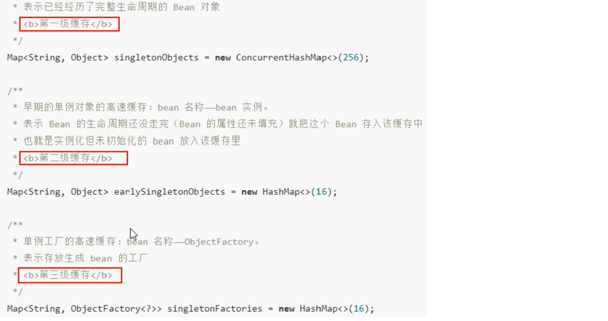

## Spring循环依赖
> <div style="text-align: center; font-weight: bold">Circular dependencies</div>
> If you use predominantly constructor injection, it is possible to create an unresolvable circular dependency scenario.   
>    
> For example: Class A requires an instance of class B through constructor injection, and class B requires an instance of class A through constructor injection. If you configure beans for classes A and B to be injected into each other, the Spring IoC container detects this circular reference at runtime, and throws a BeanCurrentlyInCreationException.
>  
> <font color = 'blue'>One possible solution is to edit the source code of some classes to be configured by setters rather than constructors. </font>Alternatively, avoid constructor injection and use setter injection only. In other words, although it is not recommended, you can configure circular dependencies with setter injection.
>  
> Unlike the typical case (with no circular dependencies), a circular dependency between bean A and bean B forces one of the beans to be injected into the other prior to being fully initialized itself (a classic chicken-and-egg scenario).  
  
参考Spring官网：https://docs.spring.io/spring-framework/reference/core/beans/dependencies/factory-collaborators.html

### 何种方式可解决循环依赖
#### 构造方法不能解决循环依赖
```java
ObjectA objectA = new ObjectA(new ObjectB(new ObjectA(...)));
```

#### 使用setter可解决循环依赖
```java
ObjectA objectA = new ObjectA();
ObjectB objectB = new ObjectB();
objectA.setB(objectB);
objectB.setA(objectA);
```

### 实测代码
#### 构造器注入
```java
@Service("ServiceA1")
public class ServiceA {
    private ServiceB serviceB;

    @Autowired
    public ServiceA(ServiceB serviceB) {
        System.out.println("ServiceA created success!");
    }
}

@Service("ServiceB1")
public class ServiceB {
    private ServiceA serviceA;

    @Autowired
    public ServiceB(ServiceA serviceA) {
        System.out.println("ServiceB created success!");
    }
}

@SpringBootConfiguration
public class SpringContainer1 {
    private static ApplicationContext applicationContext;

    public static void main(String[] args) {
        applicationContext = SpringApplication.run(ServerApplication.class, args);

        ServiceA serviceA = applicationContext.getBean(ServiceA.class);
        ServiceB serviceB = applicationContext.getBean(ServiceB.class);
    }
}
```

出现循环依赖，会直接报错：
``` 
***************************
APPLICATION FAILED TO START
***************************

Description:

The dependencies of some of the beans in the application context form a cycle:

┌─────┐
|  ServiceA1 defined in file [/Users/lijunxin/IdeaProjects/JavaStudy/target/classes/spring/cicleDependency/springStyle/constructorInjection/ServiceA.class]
↑     ↓
|  ServiceB1 defined in file [/Users/lijunxin/IdeaProjects/JavaStudy/target/classes/spring/cicleDependency/springStyle/constructorInjection/ServiceB.class]
└─────┘

```
<br>

#### 字段注入
```java
@Service("ServiceA2")
public class ServiceA {
    @Autowired
    private ServiceB serviceB;

    public ServiceA() {
        System.out.println("ServiceA created success!");
    }
}

@Service("ServiceB2")
public class ServiceB {
    @Autowired
    private ServiceA serviceA;

    public ServiceB() {
        System.out.println("ServiceB created success!");
    }
}

@SpringBootConfiguration
public class SpringContainer2 {
    private static ApplicationContext applicationContext;

    public static void main(String[] args) {
        applicationContext = SpringApplication.run(ServerApplication.class, args);

        ServiceA serviceA = applicationContext.getBean(ServiceA.class);
        ServiceB serviceB = applicationContext.getBean(ServiceB.class);
    }
}
```
不会报循环依赖错误，由Spring三级缓存解决循环依赖问题。但需注意：如果循环依赖链过长，可能会超出 Spring 容器的处理能力，从而导致循环依赖报错（不知平时项目里报的循环依赖，是否由此引起的）。
``` 
ServiceA created success!
ServiceB created success!
```
<br>

#### Setter注入
```java
@Service("ServiceA3")
public class ServiceA {
    private ServiceB serviceB;

    @Autowired
    public void setServiceB(ServiceB serviceB) {
        this.serviceB = serviceB;
        System.out.println("A里面设置了B");
    }

    public ServiceA() {
        System.out.println("ServiceA created success!");
    }
}

@Service("ServiceB3")
public class ServiceB {
    private ServiceA serviceA;

    @Autowired
    public void setServiceA(ServiceA serviceA) {
        this.serviceA = serviceA;
        System.out.println("B里面设置了A");
    }

    public ServiceB() {
        System.out.println("ServiceB created success!");
    }
}

@SpringBootConfiguration
public class SpringContainer3 {
    private static ApplicationContext applicationContext;

    public static void main(String[] args) {
        applicationContext = SpringApplication.run(ServerApplication.class, args);

        ServiceA serviceA = applicationContext.getBean(ServiceA.class);
        ServiceB serviceB = applicationContext.getBean(ServiceB.class);
    }
}
```
不会报循环依赖错误，由Spring三级缓存解决循环依赖问题。
```
ServiceA created success!
ServiceB created success!
B里面设置了A
A里面设置了B
```

### Spring三级缓存
#### 三级缓存的主要数据结构

第一层，singletonObjects 存放的是已经初始化好了的 Bean；  
第二层，earlySingletonObjects 存放的是实例化了，但是未初始化的 Bean；  
第三层，singletonFactories 存放的是 FactoryBean 。假如 A 类实现了 FactoryBean ，那么依赖注入的时候不是 A 类，而是 A 类产生的 Bean。

#### 三级缓存的主要方法

1. A 创建过程中需要 B，于是 A 将自己放到三级缓里面，去实例化 B 。
2. B 实例化的时候发现需要 A，于是 B 先查一级缓存，没有再查二级缓存，还是没有再查三级缓存，找到了 A 然后把三级缓存里面的这个 A 放到二级缓存里面，并删除三级缓存里面的 A 。
3. B 顺利初始化完毕，将自己放到一级缓存里面（此时 B 里面的 A 依然是创建中状态）。然后回来接着创建 A ，此时 B 已经创建结束，直接从一级缓存里面拿到 B，然后完成创建，并将 A 自己放到一级缓存里面。

#### 注意点
1. 默认的单例(singleton)的场景是支持循环依赖的，不报错。
2. 原型(Prototype)的场景是不支持循环依赖的，会报错。

### 一些好的总结

参考连接：https://blog.csdn.net/bjweimengshu/article/details/121186870?spm=1001.2101.3001.6650.2&utm_medium=distribute.pc_relevant.none-task-blog-2%7Edefault%7ECTRLIST%7ERate-2-121186870-blog-116119502.235%5Ev38%5Epc_relevant_sort_base2&depth_1-utm_source=distribute.pc_relevant.none-task-blog-2%7Edefault%7ECTRLIST%7ERate-2-121186870-blog-116119502.235%5Ev38%5Epc_relevant_sort_base2&utm_relevant_index=3

## Spring作用域
### Spring作用域之间的区别
可以通过scope属性来指定bean的作用域
- singleton：默认值。当IOC容器一创建就会创建bean的实例，而且是单例的，每次得到的都是同一个。
- prototype：原型的。当IOC容器一创建不再实例化该bean，每次调用getBean方法时再实例化该bean，而且每调一次创建一个对象。
- request：每次请求实例化一个bean。
- session：在一个会话中共享一个bean。

## Spring事务
### Spring事务传播属性
事务的传播行为可以由传播属性指定。Spring定义了7种类传播行为。

|  传播属性   | 描述  |
|  ----  | ----  |
| REQUIRED  | 如果有事务在运行，当前的方法就在这个事务内运行，否则，就启动一个新的事务，并在自己的事务内运行 |
| REQUIRES_NEW  | 当前的方法必须启动新事务，并在它自己的事务内运行，如果有事务正在运行，应该将它挂起 |
| SUPPORTS | 如果有事务在运行，当前的方法就在这个事务内运行，否则它可以不运行在事务中
| NOT_SUPPORTED | 当前的方法不应该运行在事务中，如果有运行的事务，将它挂起
| MANDATORY | 当前的方法应该运行在事务内部，如果没有正在运行的事务，就抛出异常
| NEVER | 当前的方法不应该运行在事务中，如果有运行的事务，就抛出异常
| NESTED | 如果有事务在运行，当前的方法就应该在这个事务的嵌套事务内运行。否则，就启动一个新的事务，并在它自己的事务内运行
事务传播属性可以在@Transactional注解的propagation属性中定义。

各事务隔离级别解决并发问题的能力：

|  隔离级别   | 脏读 | 不可重复读 | 幻读 |
|  ----  | ----  |-----| --- |
| READ UNCOMMITTED  | √ | √   | √ |
| READ COMMITTED  | × | √   | √ |
| REPEATABLE READ | × | ×   | √ |
| SERIALIZABLE | × | ×   | × |

### Spring数据库隔离级别
各种数据库产品对事务隔离级别的支持程度：

|  隔离级别   | Oracle  | MySQL |
|  ----  | ----  | ---- |
| READ UNCOMMITTED  | x | √ |
| READ COMMITTED  | √（默认） | √ | 
| REPEATABLE READ | x | √（默认） | 
| SERIALIZABLE | √ | √ | 
事务隔离级别可以在@Transactional注解的ioslation属性中定义。

## SpringMVC的工作流程


