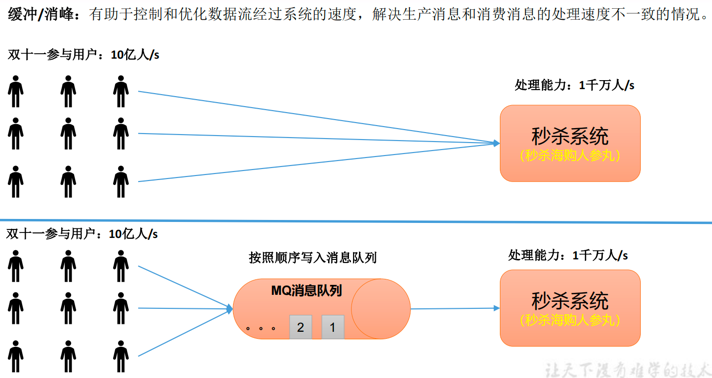
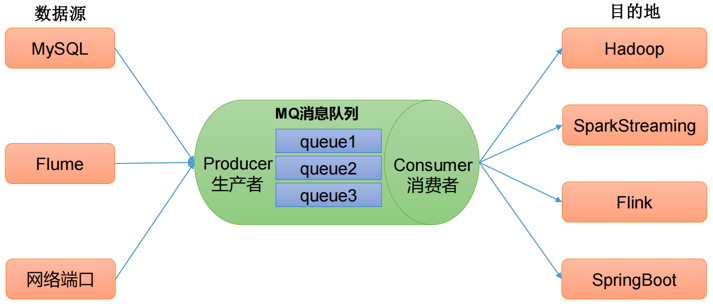
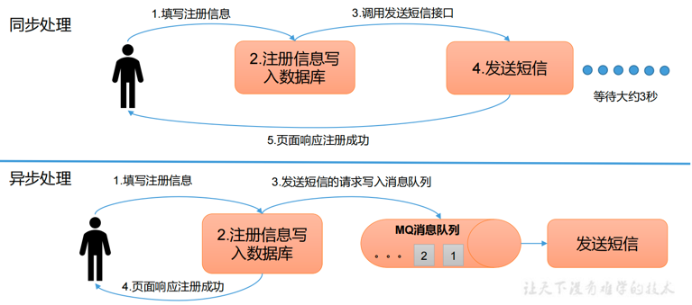
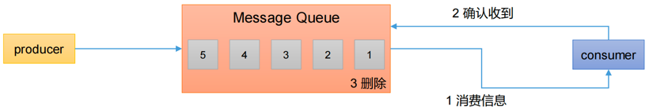
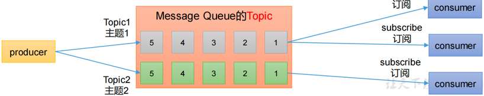

## Kafka的定义
Kafka传统定义：Kafka是一个`分布式`的基于`发布/订阅`模式的`消息队列`(MessageQueue)，主要应用于大数据实时处理领域。

发布/订阅：消息的发布者不会将消息直接发送给特定的订阅者，而是`将发布的消息分为不同的类别`，订阅者`只接收感兴趣的消息`。

Kafka最新定义：Kafka是一个开源的`分布式事件流平台`(Event Streaming Platform)，被数千家公司用于高性能`数据管道`、`流分析`、`数据集成`和`关键任务应用`。

## 消息队列
### 消息队列的应用场景
传统的消息队列的主要应用场景包括：缓存/消峰、解耦和异步通信。

#### 缓冲/削峰
有助于控制和优化数据流经过系统的速度，解决生产消息和消费消息的处理速度不一致的情况。

#### 解耦
允许你独立的扩展或修改两边的处理过程，只要确保它们遵守同样的接口约束。

#### 异步通信
允许用户把一个消息放入队列，但并不立即处理它，然后在需要的时候再去处理它们。

### 消息队列的两种模式
#### 点对点模式
消费者主动拉取数据，消息收到后清除消息

#### 发布/订阅模式
- 可以有多个topic主题（浏览、点赞、收藏、评论等）
- 消费者消费数据之后，不删除数据
- 每个消费者相互独立，都可以消费到数据
